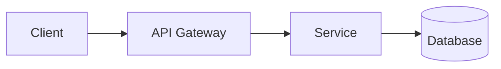
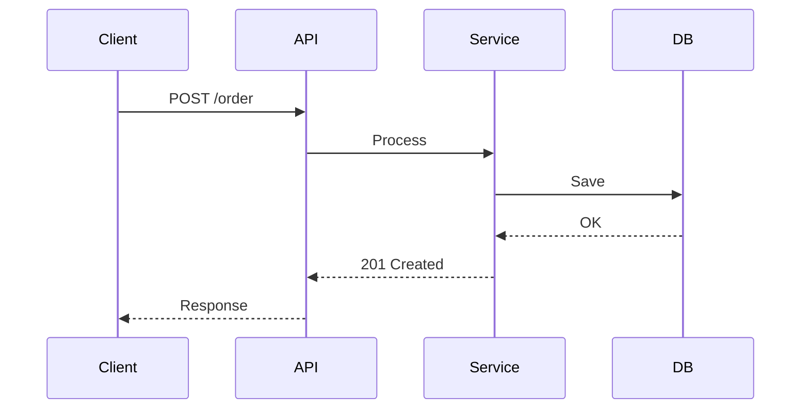
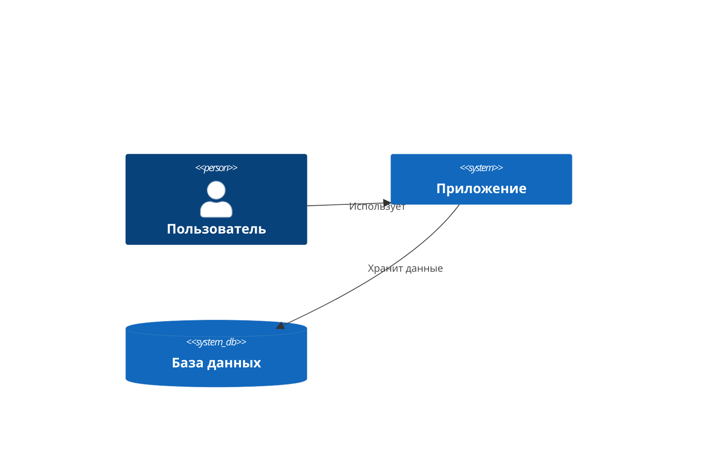
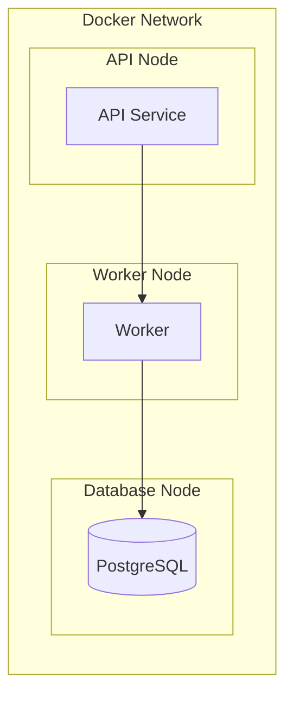
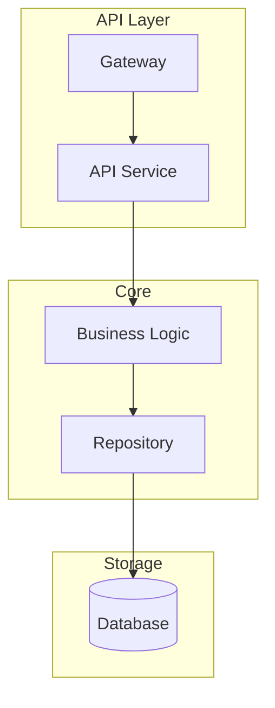

# Mermaid Diagrams

Стандартные диаграммы для архитектурной документации.

## Выбор типа диаграммы

| Ситуация                              | Тип диаграммы     |
|---------------------------------------|-------------------|
| Компоненты и связи между ними         | flowchart         |
| Последовательность запросов/операций  | sequenceDiagram   |
| Система в контексте внешнего мира     | C4Context         |
| Инфраструктура и деплой               | flowchart (subgraph) |
| Слои архитектуры (API, Core, Storage) | flowchart (subgraph) / C4Component |

## Flowchart — компоненты и связи

## Sequence — последовательность операций

## C4 Context — система в целом

## Deployment — инфраструктура

Для отображения инфраструктуры используйте `flowchart` с `subgraph` для группировки по узлам/контейнерам:

## Architecture — компоненты

Для отображения слоёв архитектуры используйте `flowchart` с `subgraph` или `C4Component`:

## Чеклист

- [ ] Все связи подписаны
- [ ] Нет пересечений линий
- [ ] Компоненты одного уровня на одном уровне
- [ ] Цвета однотипных компонентов одинаковые
