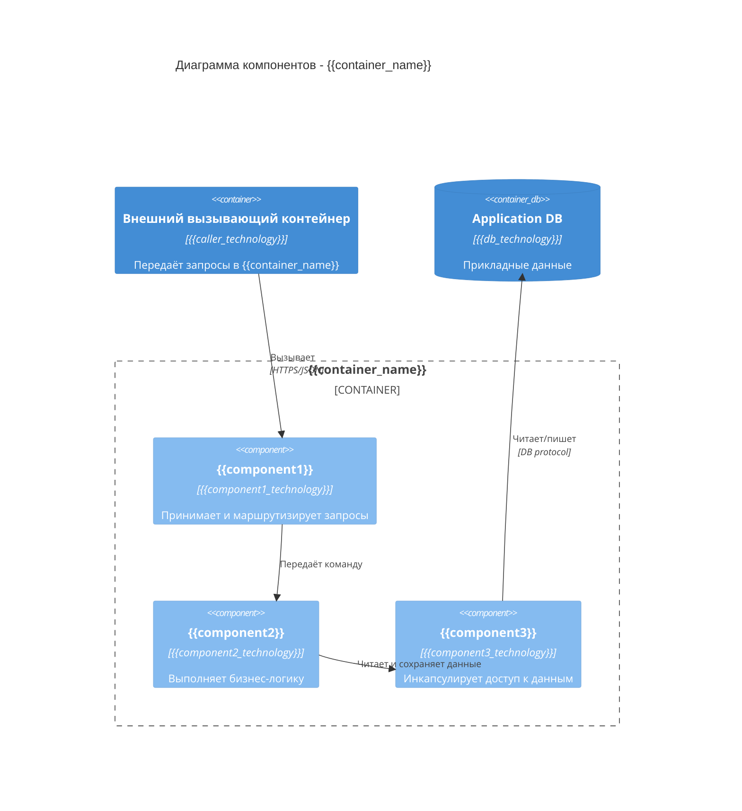

# TARGET DIRECTORY: docs/03-architecture/c4/
# TARGET FILENAME: C4_COMPONENT.md (single file, edit if exists)

# Диаграмма компонентов C4 - уровень 3

## Контейнер: {{container_name}}

Диаграмма компонентов описывает внутренние элементы выбранного контейнера и их зависимости.

{{interactions}}
