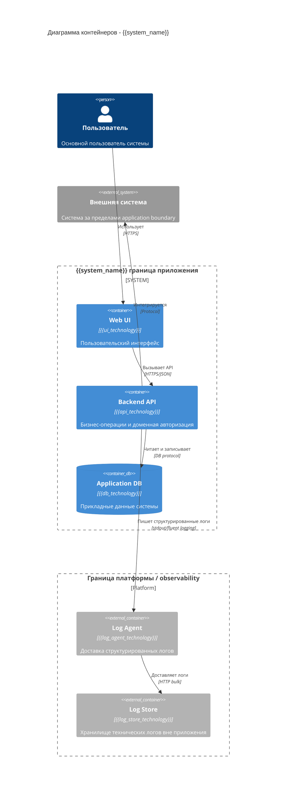

# TARGET DIRECTORY: docs/03-architecture/c4/
# TARGET FILENAME: C4_CONTAINER.md (single file, edit if exists)

# Диаграмма контейнеров C4 - уровень 2

## Система: {{system_name}}

Диаграмма контейнеров описывает границы приложения, внешние системы и платформенные контуры.

{{additional_containers}}
