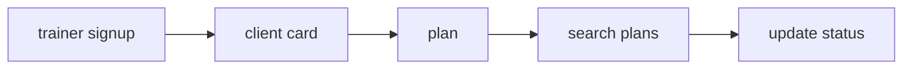

# FitBridge Business Vision Document

## 1. Product Overview
FitBridge — B2B2C SaaS-платформа для независимых фитнес-тренеров, малых студий и их клиентов.

Продукт решает две связанные задачи:
- даёт клиенту постоянный цифровой профиль тренировок и доступа к данным;
- даёт тренеру лёгкую вертикальную CRM для ведения клиентов и тренировочных планов.

Ключевая стратегическая гипотеза продукта: на рынке есть незакрытая ниша между тяжёлыми club-CRM и англоязычными coach apps. Долгосрочно FitBridge занимает её за счёт trainer-first рабочего контура, будущей модели **client-owned data**, сценария **multi-specialist collaboration** и локализации под русскоязычный рынок.

Утверждённый MVP-кандидат — trainer-first MVP дневника тренера: сначала проверяется узкая B2B-ценность для тренера без клиентского доступа и без полноценной модели прав.

### Проблема
1. Данные клиента о тренировках, привычках и прогрессе фрагментированы между чатами, таблицами, фото и заметками.
2. Независимые тренеры часто работают без специализированной вертикальной системы.
3. При смене тренера клиент фактически теряет накопленную историю и baseline.
4. При работе с несколькими специалистами нет единой точки прав доступа и координации.

### Решение
FitBridge в целевом видении объединяет:
- личный дневник клиента;
- панель тренера;
- выдачу и отзыв доступа;
- назначения программ;
- аналитику прогресса;
- совместную работу нескольких специалистов.

MVP дневника тренера проверяет один базовый рабочий цикл:
1) **Trainer-first сценарий дневника тренера**: тренер регистрируется, создаёт минимальную клиентскую карточку, создаёт тренировочный план, ищет и фильтрует планы, обновляет статус выполнения.

Регистрация клиента, клиентский кабинет, `AccessGrant`, solo-client PLG, переносимость истории, аналитика, замеры, фото/медиа, биллинг и multi-specialist остаются расширением после подтверждения MVP-гипотезы.

### Problem statement тренера для MVP

Независимый тренер уже ведёт клиентов в мессенджерах и таблицах, но не видит быстрый и проверяемый статус выполнения плана без ручных сообщений. Его проблема в MVP — не отсутствие большой CRM, а отсутствие лёгкого контура «карточка клиента → план → поиск → обновление статуса», который можно запустить без принуждения клиента к регистрации.

### Проверяемые гипотезы MVP

1. **Гипотеза активации тренера:** тренер готов создать `ClientCard` и `TrainingPlan`, если путь до первого плана занимает не больше одного рабочего дня.
2. **Гипотеза низкого friction:** тренер чаще создает планы в системе, если ему не нужно заставлять клиента регистрироваться.
3. **Гипотеза ценности статуса:** тренеру достаточно базового статуса выполнения, чтобы почувствовать снижение ручной операционки и вернуться к продукту.
4. **Гипотеза управления доступом:** отсутствие клиентского доступа покрывает MVP-потребность контроля доступа без внедрения `AccessGrant`.
5. **Гипотеза monetization validation:** после прохождения критического пути часть пилотных тренеров подтверждает готовность платить за trainer-first рабочий контур.

### Воронка MVP

Эта воронка является аналитической рамкой MVP. Любые шаги про регистрацию клиента, клиентский кабинет, `AccessGrant`, переносимую историю и multi-specialist не добавляются в MVP-воронку и рассматриваются только как Phase 2.

## 2. Business Goals
1. Доказать trainer-first B2B-ценность минимального рабочего контура тренера до инвестиций в полную client-owned модель.
2. Выйти на устойчивую выручку от подписок тренеров и малых студий.
3. Занять нишу русскоязычного trainer-first SaaS для независимых специалистов.
4. Построить гибридную GTM-модель: trainer-first acquisition и partner-led demand generation → лёгкая активация тренера → будущий client-owned expansion.
5. Сформировать барьеры выхода через накопленную историю клиента, workflow команды и доступы.
6. Подготовить платформу к расширению в смежные роли: нутрициологи, реабилитологи, wellness-специалисты.

## 3. Market Size
### Широкий адресуемый revenue pool при FitBridge pricing ≈ ₽1,15 млрд в год
Это не внешний рынок, «доказанный ценой FitBridge», а внутренняя рамка addressable revenue pool при рабочем прайсинге FitBridge:
- **Допущение A1:** около 32 000 русскоязычных покупающих единиц в широком контуре FitBridge: независимые тренеры, онлайн-коучи и микро-студии.
- **Допущение A2:** для sizing используется рабочий чек FitBridge **₽2 990/мес** на аккаунт как ориентир monetization-модели, а не как независимый внешний рынок.
- **Расчёт:** 32 000 × ₽2 990 × 12 = **₽1 148 160 000 ≈ ₽1,15 млрд/год**.

### SAM ≈ ₽323 млн в год
Стартовый сегмент, который реально можно адресовать в первые 2–3 года: независимые тренеры, онлайн-коучи, микро-студии и small teams до 10 специалистов, готовые к self-service внедрению.
- **Допущение A3:** в этом wedge-сегменте около 9 000 покупающих единиц.
- **Расчёт:** 9 000 × ₽2 990 × 12 = **₽322 920 000 ≈ ₽323 млн/год** при том же рабочем прайсинге FitBridge.

### SOM ≈ ₽22–36 млн ARR за 3 года
SOM считается от base-case/downside/upside траектории платящих аккаунтов и того же рабочего чека monetization-модели:
- downside: 750 × ₽2 490 × 12 = **₽22,4 млн ARR**;
- base-case: 1 000 × ₽2 490 × 12 = **₽29,9 млн ARR**;
- upside: 1 200 × ₽2 490 × 12 = **₽35,9 млн ARR**.

## 4. Key Metrics

### Метрики MVP

#### North Star Metric
Количество активных trainer-first связок «клиентская карточка + план + поиск» с еженедельной активностью.

#### Product metrics
- WAU/MAU тренеров;
- среднее число активных клиентов на платящего тренера;
- time-to-first-plan;
- доля созданных планов, к которым возвращаются;
- 30-day retention тренеров.

#### Leading indicators MVP
- доля зарегистрированных тренеров, создавших первую `ClientCard`;
- доля тренеров, создавших первый `TrainingPlan` после карточки;
- доля планов, которые тренер искал или фильтровал;
- доля планов, переиспользуемых для других клиентов;
- доля планов с обновленным статусом;
- доля тренеров, вернувшихся к поиску клиентов/планов;
- доля тренеров, удаливших карточку клиента после завершения работы.

#### Business metrics
- free-to-paid conversion тренеров;
- MRR/ARR.

#### Целевые ориентиры base-case
- median time-to-first-plan ≤ 1 день с момента регистрации тренера;
- activation rate тренеров: ≥ 55% достигают «клиентская карточка + план + поиск» в течение 7 дней;
- доля созданных планов, к которым возвращаются ≥ 50% в течение 14 дней;
- ≥ 60% активированных тренеров возвращаются к поиску клиентов/планов в течение 14 дней;
- willingness-to-pay: ≥ 5 пилотных тренеров подтверждают готовность платить после прохождения сценария дневника тренера;
- ≤ 10% пилотных клиентов требуют регистрацию или личный кабинет как блокер первого использования.

#### Риски интерпретации метрик MVP
- Создание плана зависит от привычки тренера вести планы в других местах, поэтому plan creation rate нельзя трактовать только как качество продукта.
- Отсутствие возврата к планам может означать, что тренер использует продукт только как архив.
- Высокая активность одного тренера не доказывает масштабируемость на весь ICP; нужны пилоты в нескольких сегментах.
- Willingness-to-pay из интервью не равен фактической оплате после появления биллинга; до Phase 2 это только validation signal.
- Запросы клиентов на регистрацию или кабинет фиксируются как сигнал Phase 2, но не расширяют MVP scope автоматически.

#### Out-of-scope аналитические темы
- cohort-аналитика клиентов, retention клиентского кабинета и переносимость истории между тренерами;
- аналитика `AccessGrant`, granular permissions и multi-specialist взаимодействий;
- отчёты по adherence, замерам, body metrics, фото/видео и health-related динамике;
- биллинговая аналитика, paywall conversion, dunning и тарифные лимиты;
- чат, lifecycle communications и продвинутые notification funnels.

#### Связь с Phase 2 client-owned моделью
MVP с публичной ссылкой не отменяет стратегию client-owned данных. Он проверяет более узкий вход: готов ли тренер получать ценность и платить до того, как продукт инвестирует в клиентский аккаунт, управление доступами и переносимую историю. Phase 2 рассматривается только после подтверждения метрик воронки публичной ссылки и отдельного решения по scope.

### Метрики масштабирования (Phase 2)

#### Product metrics
- доля клиентов с 2+ специалистами;
- 90-day retention тренеров и клиентов.

#### Business metrics
- CAC payback;
- ARPU/ARPA;
- gross churn и net revenue retention;
- доля выручки от expansion и add-ons.

## 5. Competitive Analysis

### Карта конкурентов
| Конкурент | География/тип | Модель | Сильные стороны | Слабые стороны относительно FitBridge |
|---|---|---|---|---|
| Trainerize | международный | B2B app для тренеров и студий | бренд, экосистема, white-label | высокая сложность, слабее ownership данных клиента |
| TrueCoach | международный | coaching software | понятные тарифы, сильный workout workflow | trainer-centric модель, слабее multi-specialist |
| Everfit | международный | freemium coaching app | современный UX, старт с free | англоязычный фокус, меньше локальной адаптации |
| My PT Hub | международный | all-in-one для PT | зрелый продукт, шаблоны | меньше дифференциации по client-owned data |
| PT Distinction | международный | coaching platform | кастомизация, брендирование, AI-модули | сложнее ценовая логика, менее прозрачный wedge для клиента |
| CoachAccountable | международный | coaching ops platform | гибкость, масштабирование, сильная админка | не фитнес-first, выше когнитивная сложность |
| 1С:Фитнес клуб | Россия | club CRM | сильная локальная позиция, автоматизация клуба | тяжёлый клубный контур, не trainer-first |
| FitBase | Россия | облачная CRM для фитнес-студий | известность в РФ, локальные процессы | фокус на студии, а не на переносимом профиле клиента |
| Mobifitness | Россия | CRM для клубов/студий | платежи, расписание, автоматизация | ориентир на объект/клуб, а не на data ownership клиента |
| YCLIENTS | Россия | универсальная сервисная CRM | широкая база, записи и расписание | не специализирована под длительный фитнес-прогресс |

### Сравнение по критериям
| Критерий | FitBridge | International coach apps | Российские club CRM |
|---|---|---|---|
| Клиент владеет данными | Да | Частично | Обычно нет |
| Бесплатный слой для клиента | Да | Иногда | Редко |
| Несколько специалистов в одном профиле | Да | Нечасто | Не core-сценарий |
| Русскоязычная локализация | Да | Ограниченно | Да |
| Оптимально для solo-тренера | Да | Да, но часто дороже | Слабее |
| Оптимально для микро-студии | Да | Частично | Да |
| GTM через PLG | Гибридный: trainer-first acquisition + client-led expansion | Обычно trainer-led | Обычно sales-led |

### Вывод по позиции
FitBridge не должен конкурировать лоб в лоб с full-club ERP. Позиция продукта — «сервис, где клиент не теряет фитнес-историю, а тренер получает профессиональный рабочий контур без тяжёлого внедрения».

## 6. SWOT Analysis
| Сильные стороны | Слабые стороны |
|---|---|
| Отличимая модель client-owned data | Необходимо объяснять новую для рынка модель |
| Нативный PLG через клиента и тренера | Ограниченные ресурсы ранней команды |
| Fit для независимых тренеров и small teams | Нужен аккуратный контроль экономики бесплатного публичного доступа и будущего клиентского слоя Phase 2 |
| Хороший фундамент для multi-specialist сценариев | Доверие к хранению чувствительных данных надо зарабатывать |

| Возможности | Угрозы |
|---|---|
| Рост фитнес-рынка и подписочной модели | Ускорение локальных конкурентов |
| Рост digital coaching и гибридного тренинга | Давление международных игроков |
| Выход в нутрициологию и rehab | Регуляторные ограничения по данным о здоровье |
| Партнёрства с фитнес-школами и студиями | Слабая конверсия free → paid при плохой активации |

## 7. Revenue Model

FitBridge монетизируется через подписку тренеров и малых команд. Для MVP с публичной ссылкой проверяется только платящий контур тренера; клиентский бесплатный слой в виде аккаунта и личного кабинета не входит в MVP и рассматривается как следующий шаг после подтверждения trainer-first ценности.

Канонический источник тарифной логики, ARPU, прогноза выручки и определения активного клиента: [MONETIZATION_STRATEGY.md](MONETIZATION_STRATEGY.md). Термин «активный клиент» также закреплён в [GLOSSARY.md](GLOSSARY.md).

## 8. Go-To-Market Playbook

### Приоритетный wedge
Независимые тренеры, ведущие 10–40 клиентов в гибридной или онлайн-модели. Первичное привлечение идёт через тренеров и партнёров, а клиентский вход в MVP максимально облегчён через публичную ссылку без регистрации.

Канонический источник каналов, playbook, этапов и GTM-экспериментов: [GTM_PLAN.md](GTM_PLAN.md).

## 9. Partnership Strategy
Приоритетные типы партнёров:
1. фитнес-школы и сертификационные программы;
2. сети микро-студий и ассоциации тренеров;
3. сервисы онлайн-эквайринга и подписок;
4. производители wearables и трекеров;
5. нутрициологи и rehab-эксперты как источник смежного expansion.

### Принципы партнёрств
- быстрый time-to-market;
- измеримая лидогенерация;
- совместный контент вместо дорогих спонсорств;
- без глубокой технической зависимости на ранней стадии.

## 10. Regulatory Considerations

FitBridge работает с персональными и health-adjacent данными, поэтому privacy/legal boundaries являются обязательной частью продукта: законное основание обработки, отдельное информирование о чувствительных данных, контроль доступа, безопасное логирование, отзыв согласия и удаление/архивация профиля. Продукт не должен позиционироваться как медицинское изделие или сервис диагностики без отдельной юридической проработки.

Канонические источники деталей: [BR-009-consent-privacy-deletion.md](BR/BR-009-consent-privacy-deletion.md) и [DATA_CLASSIFICATION_MATRIX.md](../02-analysis/DATA_CLASSIFICATION_MATRIX.md).

## 11. Risk Matrix
Ниже — краткая сводка для vision-документа; мастер-реестр рисков ведётся в `RISK_REGISTER.md`.

| Риск | Вероятность | Влияние | Срок митигации | Митигация |
|---|---|---|---|---|
| Низкая готовность тренеров менять стек | Средняя | Высокое | 0–3 мес | импорт из Excel, concierge onboarding, шаблоны |
| Слабая конверсия free → paid | Средняя | Высокое | 0–6 мес | limit-based prompts, ценностные триггеры, onboarding experiments |
| Высокая стоимость поддержки free-клиентов | Средняя | Высокое | 3–6 мес | в MVP нет upload/storage фото, видео и rich-media; лимиты на heavy-features после отдельного Phase 2 решения, self-service support |
| Недоверие к данным о здоровье | Высокая | Высокое | 0–3 мес | прозрачные согласия, аудит доступа, privacy-by-design |
| Регуляторные изменения | Средняя | Высокое | постоянно | квартальный legal review, архитектурный резерв |
| Атака локальных CRM в нишу solo-тренеров | Средняя | Среднее | 6–12 мес | ускорить бренд вокруг client-owned data |
| Низкий retention клиентов без тренера | Средняя | Среднее | 3–9 мес | привычки, напоминания, прогресс-визуализация |
| Перегрузка фичами и потеря фокуса | Средняя | Среднее | постоянно | продуктовый stage-gate и жёсткий roadmap |
| Концентрация лидов в 1–2 партнёрах | Средняя | Высокое | 3–9 мес | cap на долю одного партнёра, параллельные каналы, ежемесячный partner mix review |
| Referral abuse и искусственные приглашения | Средняя | Среднее | 0–6 мес | reward только после оплаты/30 дней активности, лимиты, антифрод-правила |
| Сбои автосписаний и потеря MRR | Средняя | Высокое | 0–3 мес | dunning flow, retries, напоминания об обновлении метода оплаты |
| Слабая конверсия клиент → приглашение второго специалиста | Средняя | Среднее | 6–12 мес | не строить базовый план на reverse loop, тестировать value messaging отдельно |

## 12. Why Now
- рынок фитнес-услуг РФ растёт;
- monthly subscription model в фитнесе становится привычной;
- тренеры всё чаще ведут гибридное сопровождение;
- клиентам важно не терять историю прогресса;
- локальный рынок ещё не закрепил категорийного лидера в trainer-first SaaS для русскоязычных специалистов.

## 13. Sources
1. TAdviser, Fitness services (Russian market) — https://tadviser.com/index.php/Article:Fitness_services_(Russian_market)
2. EuropeActive & Deloitte, European Health & Fitness Market 2025 highlights — https://www.europeactive.eu/blog/press-corner-4/strong-growth-in-members-and-revenues-for-european-health-fitness-market-in-2025-140
3. TrueCoach Pricing — https://truecoach.co/pricing/
4. PT Distinction Pricing — https://www.ptdistinction.com/pricing
5. CoachAccountable Pricing — https://www.coachaccountable.com/pricing
6. КонсультантПлюс, 152-ФЗ «О персональных данных» — https://www.consultant.ru/document/cons_doc_LAW_61801/
7. Рыночная декомпозиция и user-story анализ проекта FitBridge.
8. Публичные тарифы TrueCoach, PT Distinction и CoachAccountable проверены 2026-04-29 для калибровки ценового диапазона и клиентских лимитов.
