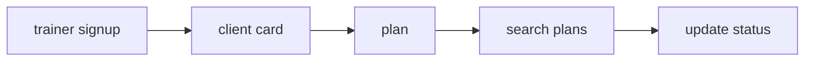
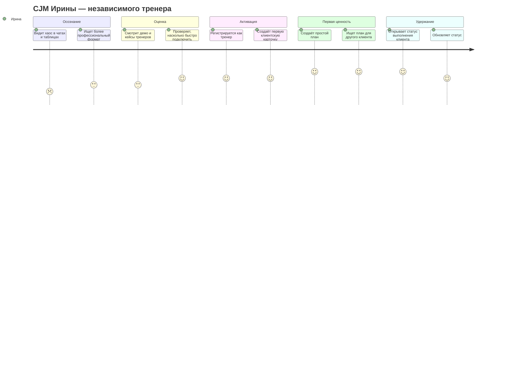
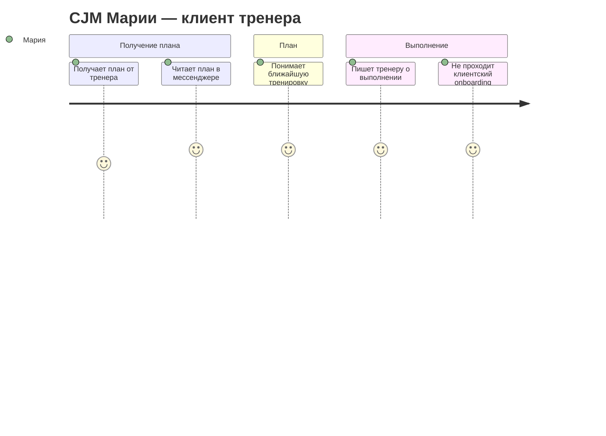

# Карта пути клиента (CJM)

Документ фиксирует пути ключевых персон FitBridge. Канонический объём MVP см. в [MVP_SCOPE_SUMMARY.md](MVP_SCOPE_SUMMARY.md) и [BR-001](BR/BR-001-training-diary.md). Подробно раскрыт выбранный MVP-путь: trainer-first сценарий дневника тренера. Client-owned, Solo-client, multi-specialist и командные сценарии оставлены как Phase 2 / стратегический резерв.

## UX-воронка MVP

UX-аналитика MVP оценивает только этот путь. Регистрация клиента, клиентский кабинет, `AccessGrant`, переносимость истории, multi-specialist и продвинутая аналитика не входят в текущий пользовательский путь и не должны появляться как скрытые шаги воронки.

### Риски интерпретации CJM-метрик

1. Если тренер не создает планы, причина может быть в привычке вести их в других местах, а не только в UX.
2. Если тренер не возвращается к планам, он может использовать продукт только как архив.
3. Если тренер не ищет клиентов, возможно у него их мало и поиск не нужен.
4. Запрос на клиентский кабинет фиксируется как Phase 2-сигнал, но не расширяет MVP.

## CJM P1: Ирина, независимый тренер

**Персона:** Ирина ведёт 15–25 клиентов в гибридном формате и хочет заменить чаты, заметки и таблицы единым рабочим контуром.

| Этап | Точки контакта | Эмоции | Боли | Возможности |
|---|---|---|---|---|
| Осознание | Telegram, рекомендации коллег, статьи | Усталость | Хаос в операционке и повторяющиеся вопросы клиентов | Коммуникация про экономию времени и порядок в сопровождении |
| Оценка | Лендинг, демо, кейсы тренеров | Скепсис | Страх сложного внедрения и потери текущего процесса | Показать настройку первого клиента менее чем за 15 минут |
| Активация | Регистрация тренера, создание клиентской карточки | Интерес | Риск бросить онбординг до первой ценности | Мастер «создать карточку + план» |
| Первая ценность | Карточка клиента, план, поиск | Облегчение | Нужно быстро увидеть, что сервис реально снижает ручную работу | Связка «клиентская карточка + план + поиск» |
| Удержание | Статусы выполнения, поиск планов | Уверенность | Вопрос цены и привычки тренера | Показ времени, сэкономленного на поиске |

### Выводы для P1

1. Главный момент истины — первая связка «клиентская карточка + план + поиск».
2. Продуктовая коммуникация должна обещать не «CRM вообще», а сокращение ручной тренерской операционки.
3. В MVP Ирине не нужны rich-media, шаблоны и сложная аналитика; они не должны мешать старту.

## CJM P2: Алексей, онлайн-коуч

**Персона:** Алексей работает удалённо с 35–50 клиентами и ищет способ масштабировать сопровождение без роста ручных check-in.

| Этап | Точки контакта | Эмоции | Боли | Возможности |
|---|---|---|---|---|
| Триггер | Собственная воронка, отзывы клиентов, контент | Напряжение | Слишком много ручных проверок статуса и переключения между сервисами | Сообщение «масштаб без хаоса» |
| Оценка | Сайт, страницы сравнения, демо | Рациональность | Сравнение с текущим стеком и страх миграции | Калькулятор окупаемости и инструкция миграции |
| Пилот | Пилот на части базы, ведение планов | Осторожный оптимизм | Риск сломать работающий процесс | Запуск на малой группе клиентов |
| Регулярное использование | Дашборд, карточка клиента, статусы выполнения | Контроль | Нужна надёжность и быстрый обзор | Недельная сводка через статусы pull-model в MVP |
| Расширение | Коммерческие условия, дополнения Phase 2 | Рост | Позже нужны более сильная автоматизация и аналитика | Дорожная карта Phase 2 без перегруза MVP |

### Выводы для P2

1. Алексей ценит масштабирование и обзор, но MVP должен доказать базовую управляемость без отдельного Notification API.
2. Для онлайн-коуча критичны статусы выполнения и история, а не медиа-галерея.
3. Phase 2 automation, отчёты и billing должны включаться только после подтверждения MVP-метрик.

## CJM P3: Мария, клиент тренера

**Персона:** Мария получает план от тренера в мессенджер, хочет быстро понять план и не тратить время на регистрацию.

| Этап | Точки контакта | Эмоции | Боли | Возможности |
|---|---|---|---|---|
| Получение плана | Сообщение от тренера в привычном канале | Доверие с осторожностью | Не хочет регистрироваться и ставить приложение | Тренер присылает понятный текст или скриншот |
| Просмотр плана | Чат с тренером | Мотивация | Нужно быстро понять, что делать сегодня | Понятный план от тренера |
| Выполнение | Сообщение тренеру | Уверенность | Не хочет писать длинный отчёт | Простое сообщение в чат |
| Завершение работы | Тренер перестает присылать планы | Нейтральность | - | - |

### Выводы для P3

1. Главный момент истины — клиент не взаимодействует с системой.
2. В MVP дневника тренера клиент не является пользователем системы.
3. Фото, rich-media, медданные и клиентская история не нужны для первой ценности и остаются вне MVP.

## Future CJM: клиентская client-owned модель

**Статус:** Phase 2 / future product, не MVP дневника тренера.

После подтверждения trainer-first ценности Мария может стать зарегистрированным клиентом: получить личный профиль, историю тренировок, переносимость данных между тренерами и управление доступами. Этот путь не должен расширять MVP до проверки метрик сценария дневника тренера.

## CJM P4: Никита, владелец микро-студии

**Статус:** Phase 2 / design-partner сценарий, не MVP.

Никита нуждается в стандартизации команды, ролях, общей клиентской базе и прозрачности adoption. Для Gate 1 достаточно сохранить этот путь как expansion-потенциал: командный сценарий не должен попадать в MVP как обязательная функция и должен включаться только после доказательства trainer-first пути дневника тренера.

Канонические источники деталей: [PRODUCT_ROADMAP.md](PRODUCT_ROADMAP.md), [BR-008-team-management.md](BR/BR-008-team-management.md), [CUSTOMER_PERSONAS.md](CUSTOMER_PERSONAS.md).

## CJM P5: Ольга, смежный специалист

**Статус:** Phase 2 / design reserve сценарий, не MVP.

Ольга подтверждает стратегическую дифференциацию multi-specialist collaboration: смежному специалисту нужен только минимально необходимый scope данных, без лишнего доступа и без медицинских обещаний. Перед включением сценария нужны granular permissions, privacy-модель и юридическая проверка health-adjacent данных.

Канонические источники деталей: [PRODUCT_ROADMAP.md](PRODUCT_ROADMAP.md), [BR-003-multi-specialist.md](BR/BR-003-multi-specialist.md), [BR-009-consent-privacy-deletion.md](BR/BR-009-consent-privacy-deletion.md), [DATA_CLASSIFICATION_MATRIX.md](../02-analysis/DATA_CLASSIFICATION_MATRIX.md).

## Общие выводы по CJM

1. Главный момент истины для тренера — первая клиентская карточка, простой план и поиск.
2. Главный момент истины для клиента — отсутствие необходимости взаимодействовать с системой.
3. Solo-client, client-owned профиль и переносимость истории не входят в MVP дневника тренера.
4. Командные и multi-specialist сценарии относятся к Phase 2 / design-partner пилотам и не должны расширять MVP scope.
5. Фото, видео, медданные и rich-media остаются вне MVP до отдельного решения по storage, privacy, стоимости и лимитам.

## Источники

1. Внутренний анализ продуктовых артефактов FitBridge.
2. `docs/01-business/MVP_SCOPE_SUMMARY.md`.
3. `docs/01-business/PRODUCT_ROADMAP.md`.
4. `docs/02-analysis/DATA_CLASSIFICATION_MATRIX.md`.
