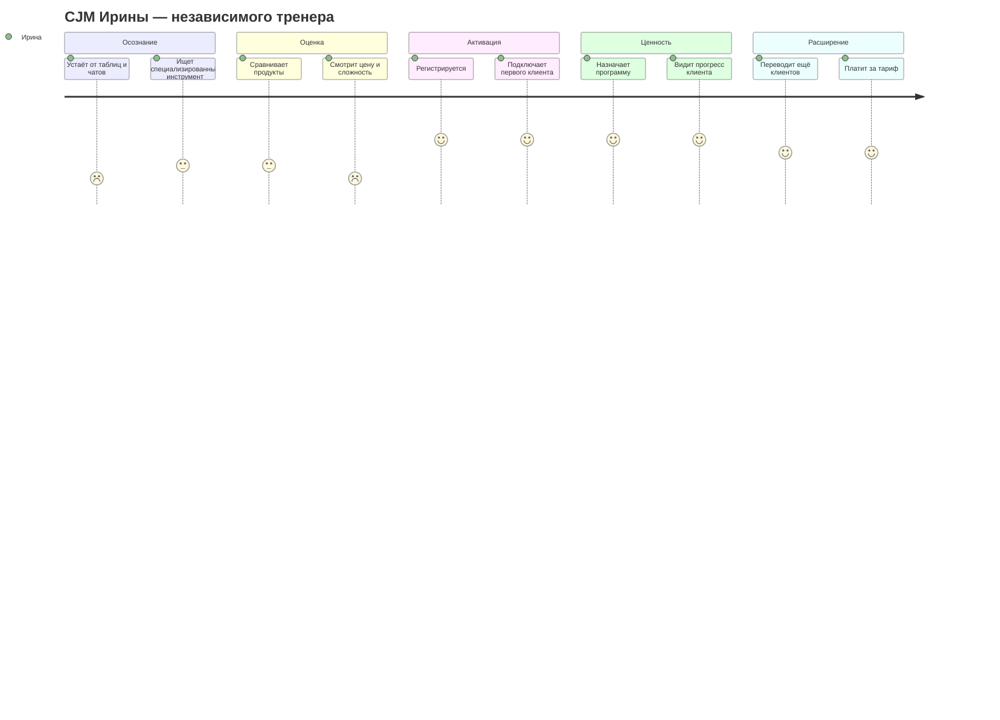
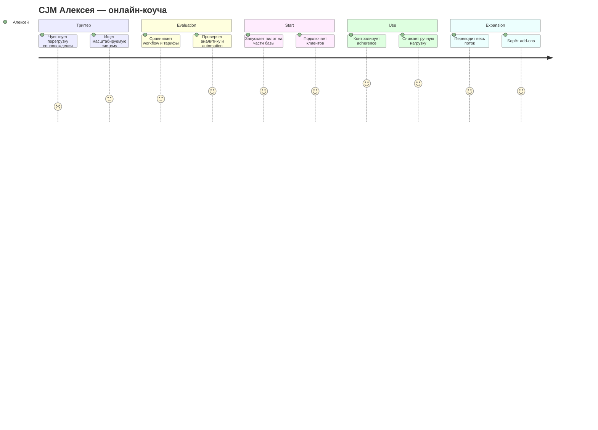
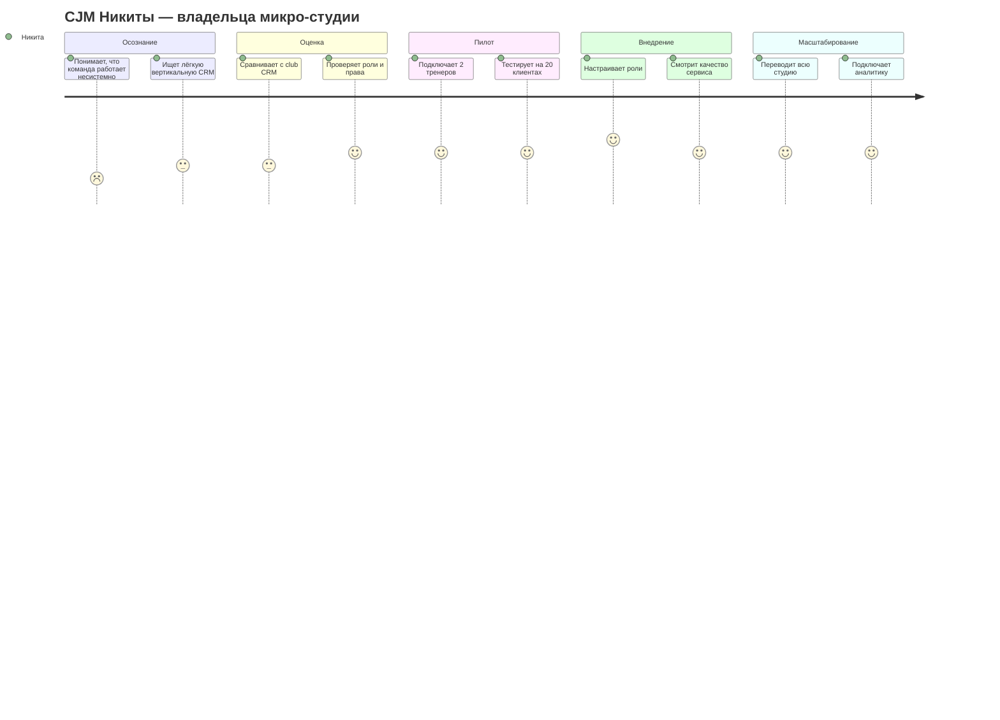
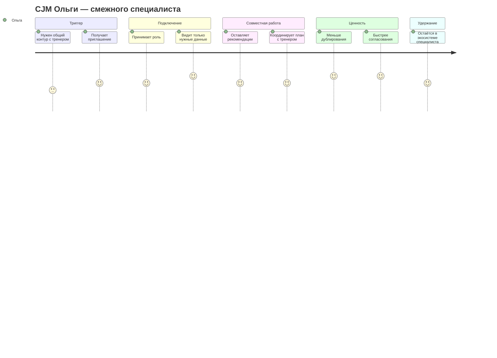

# Customer Journey Map

## CJM P1: Ирина, независимый тренер
| Этап | Touchpoints | Эмоции | Pain points | Opportunities |
|---|---|---|---|---|
| Осознание | Telegram, рекомендации коллег, статьи | усталость | хаос в операционке | контент про экономию времени |
| Оценка | лендинг, демо, кейсы | скепсис | страх сложного внедрения | показать setup < 15 минут |
| Активация | регистрация, импорт, приглашение клиента | интерес | риск брошенного онбординга | мастер первого клиента |
| Первая ценность | программа, трекинг, графики | облегчение | нужно быстро увидеть ROI | готовые шаблоны и отчёт |
| Удержание/апгрейд | лимиты, аналитика, add-ons | уверенность | вопрос цены | калькулятор времени и retention |

## CJM P2: Алексей, онлайн-коуч
| Этап | Touchpoints | Эмоции | Pain points | Opportunities |
|---|---|---|---|---|
| Триггер | собственная воронка, отзывы, контент | напряжение | слишком много ручных check-in | message: «масштаб без хаоса» |
| Оценка | сайт, comparison pages, демо | рациональность | сравнение с текущим стеком | ROI-калькулятор и migration guide |
| Пилот | sandbox, импорт клиентов | осторожный оптимизм | страх сломать процессы | запуск на 10 клиентах |
| Регулярное использование | dashboard, reminders, analytics | контроль | важна надёжность | weekly summary, churn alerts |
| Expansion | апгрейд, партнёрские модули | рост | нужен white-label/advanced BI | roadmap и add-ons |

## CJM P3: Мария, фитнес-клиент
| Этап | Touchpoints | Эмоции | Pain points | Opportunities |
|---|---|---|---|---|
| Осознание | рекомендация тренера, сторис, друзья | любопытство | не хочет лишних приложений | instant value от дневника |
| Старт | мобильная регистрация | нейтральность | длинный онбординг | очень короткий setup |
| Регулярное ведение | журнал, графики, фото | уверенность | привычка может не закрепиться | reminders и streaks |
| Работа со специалистами | управление доступом | контроль | страх за приватность | понятная матрица доступов |
| Смена тренера | отзыв/выдача доступа | облегчение | редкий, но критичный сценарий | сделать сценарий wow-моментом |

## CJM P4: Никита, владелец микро-студии
| Этап | Touchpoints | Эмоции | Pain points | Opportunities |
|---|---|---|---|---|
| Осознание | операционные сбои, churn, ручные процессы | беспокойство | нет стандарта сервиса | кейсы small-team внедрения |
| Оценка | демо, sales call, checklist | осторожность | страх переплатить | пакет для 3–10 тренеров |
| Пилот | sandbox, роли, миграция | сосредоточенность | сопротивление команды | champion-based rollout |
| Внедрение | обучение, роли, отчёты | контроль | нужна прозрачность adoption | admin dashboard |
| Масштабирование | командный тариф, add-ons | уверенность | нужна бизнес-отчётность | QBR и success-поддержка |

## CJM P5: Ольга, смежный специалист
| Этап | Touchpoints | Эмоции | Pain points | Opportunities |
|---|---|---|---|---|
| Триггер | приглашение от клиента/тренера | интерес | неясно, нужен ли новый кабинет | role-specific onboarding |
| Подключение | принятие доступа | осторожность | боится видеть лишние данные | granular permissions |
| Совместная работа | заметки, задачи, статусы | продуктивность | нужна координация без шума | shared timeline |
| Ценность | общий прогресс клиента | удовлетворение | нет привычки к совместной работе | шаблоны междисциплинарных сценариев |
| Удержание | повторное подключение к другим кейсам | лояльность | важно не усложнить практику | лёгкий role mode |

## Общие выводы по CJM
1. Главный момент истины для тренера — первый подключённый клиент и первое доказательство экономии времени.
2. Главный момент истины для клиента — сохранение истории при смене тренера.
3. Главный момент истины для студии — работа ролей и контролируемая передача клиента внутри команды.
4. Для смежных специалистов критично ограничение доступа по роли.

## Источники
1. Внутренний анализ артефактов FitBridge из текущего репозитория.
2. TAdviser, Fitness services (Russian market) — https://tadviser.com/index.php/Article:Fitness_services_(Russian_market)
