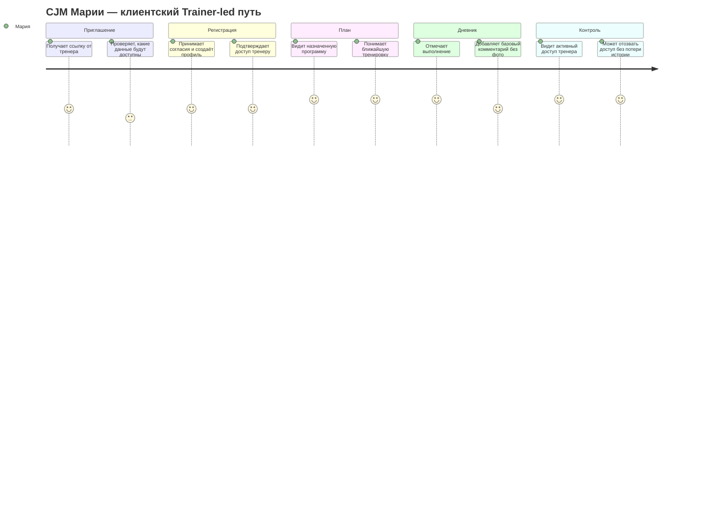

# Карта пути клиента (CJM)

Документ фиксирует пути ключевых персон FitBridge. Канонический объём MVP см. в [MVP_SCOPE_SUMMARY.md](MVP_SCOPE_SUMMARY.md). Подробно раскрыты только два MVP-пути: **Trainer-led** и **Solo-client**; персоны Phase 2 оставлены как краткие сводки со ссылкой на дорожную карту.

## CJM P1: Ирина, независимый тренер

**Персона:** Ирина ведёт 15–25 клиентов в гибридном формате и хочет заменить чаты, заметки и таблицы единым рабочим контуром.

| Этап | Точки контакта | Эмоции | Боли | Возможности |
|---|---|---|---|---|
| Осознание | Telegram, рекомендации коллег, статьи | Усталость | Хаос в операционке и повторяющиеся вопросы клиентов | Коммуникация про экономию времени и порядок в сопровождении |
| Оценка | Лендинг, демо, кейсы тренеров | Скепсис | Страх сложного внедрения и потери текущего процесса | Показать настройку первого клиента менее чем за 15 минут |
| Активация | Регистрация, создание профиля тренера, приглашение клиента | Интерес | Риск бросить онбординг до первой ценности | Мастер «пригласить первого клиента» |
| Первая ценность | Простой план, отметка выполнения, карточка клиента | Облегчение | Нужно быстро увидеть, что сервис реально снижает ручную работу | Связка «один клиент + один план + первая отметка выполнения» |
| Удержание | История клиента, статусы выполнения, управление доступом | Уверенность | Вопрос цены и привычки команды/клиентов | Показ времени, сэкономленного на сопровождении |

### Выводы для P1

1. Главный момент истины — первая связка «клиент + план + отметка выполнения».
2. Продуктовая коммуникация должна обещать не «CRM вообще», а сокращение ручной тренерской операционки.
3. В MVP Ирине не нужны rich-media, шаблоны и сложная аналитика; они не должны мешать старту.

## CJM P2: Алексей, онлайн-коуч

**Персона:** Алексей работает удалённо с 35–50 клиентами и ищет способ масштабировать сопровождение без роста ручных check-in.

| Этап | Точки контакта | Эмоции | Боли | Возможности |
|---|---|---|---|---|
| Триггер | Собственная воронка, отзывы клиентов, контент | Напряжение | Слишком много ручных проверок статуса и переключения между сервисами | Сообщение «масштаб без хаоса» |
| Оценка | Сайт, страницы сравнения, демо | Рациональность | Сравнение с текущим стеком и страх миграции | Калькулятор окупаемости и инструкция миграции |
| Пилот | Пилот на части базы, приглашения клиентов | Осторожный оптимизм | Риск сломать работающий процесс | Запуск на малой группе клиентов |
| Регулярное использование | Дашборд, карточка клиента, статусы выполнения | Контроль | Нужна надёжность и быстрый обзор | Недельная сводка через статусы pull-model в MVP |
| Расширение | Коммерческие условия, дополнения Phase 2 | Рост | Позже нужны более сильная автоматизация и аналитика | Дорожная карта Phase 2 без перегруза MVP |

### Выводы для P2

1. Алексей ценит масштабирование и обзор, но MVP должен доказать базовую управляемость без отдельного Notification API.
2. Для онлайн-коуча критичны статусы выполнения и история, а не медиа-галерея.
3. Phase 2 automation, отчёты и billing должны включаться только после подтверждения MVP-метрик.

## CJM P3A: Мария, фитнес-клиент в Trainer-led пути

**Персона:** Мария приходит по приглашению тренера, хочет быстро начать выполнять план и контролировать, кто видит её данные.

| Этап | Точки контакта | Эмоции | Боли | Возможности |
|---|---|---|---|---|
| Приглашение | Ссылка или код от тренера | Доверие с осторожностью | Не хочет лишних приложений и непонятного доступа | Объяснить, какие данные увидит тренер и как отозвать доступ |
| Регистрация | Mobile-first регистрация, согласия | Нейтральность | Длинный онбординг и юридическая непонятность | Короткая настройка и понятное информирование о согласиях |
| Старт плана | Назначенная программа, текущая неделя | Мотивация | Нужно понять, что делать сегодня | Простой экран текущего плана |
| Выполнение | Отметка тренировки, дневник, комментарий | Уверенность | Привычка может не закрепиться | Быстрая отметка выполнения и базовая история |
| Контроль данных | Экран доступов, отзыв доступа | Контроль | Страх потерять историю при смене тренера | История принадлежит клиенту; отзыв доступа без потери истории |

### Выводы для P3A

1. Главный момент истины — понятный доступ тренера и сохранение клиентской истории.
2. В Trainer-led пути MVP должен быть максимально mobile-first.
3. Фото и rich-media не нужны для первой ценности и остаются вне MVP.

## CJM P3B: Мария, фитнес-клиент в Solo-client пути

**Персона:** Мария начинает самостоятельно, ведёт дневник и простой личный план, а позже может пригласить тренера.

| Этап | Точки контакта | Эмоции | Боли | Возможности |
|---|---|---|---|---|
| Самостоятельный старт | Сторис, рекомендация друга, поиск | Любопытство | Сложно начать вести дневник без тренера | Первая запись дневника за несколько минут |
| Регистрация | Mobile-first профиль, согласия | Осторожность | Неясно, зачем нужны данные роста/целей | Объяснить ценность и чувствительность данных |
| Личный план | Создание простой программы себе | Мотивация | Сложно структурировать тренировки | Минимальный конструктор плана без шаблонов |
| Регулярное ведение | Дневник, история, статус выполнения | Уверенность | Привычка может сорваться | Накопление истории и быстрый обзор прогресса |
| Подключение тренера | Приглашение тренера, выдача доступа | Контроль | Боится открыть лишние данные | Детальные scope позже; в MVP — явное подтверждение и отзыв доступа |

### Выводы для P3B

1. Solo-client — полноценный MVP-путь, а не вспомогательный onboarding.
2. Первая ценность клиента — первая запись дневника и простой личный план без зависимости от тренера.
3. Позднее приглашение тренера должно усиливать ощущение контроля, а не отнимать владение историей.

## CJM P4: Никита, владелец микро-студии

**Статус:** Phase 2 / design-partner сценарий, не MVP.

Никита нуждается в стандартизации команды, ролях, общей клиентской базе и прозрачности adoption. Для Gate 1 достаточно сохранить этот путь как expansion-потенциал: командный сценарий не должен попадать в MVP как обязательная функция и должен включаться только после доказательства Trainer-led и Solo-client путей.

Канонические источники деталей: [PRODUCT_ROADMAP.md](PRODUCT_ROADMAP.md), [BR-008-team-management.md](BR/BR-008-team-management.md), [CUSTOMER_PERSONAS.md](CUSTOMER_PERSONAS.md).

## CJM P5: Ольга, смежный специалист

**Статус:** Phase 2 / design reserve сценарий, не MVP.

Ольга подтверждает стратегическую дифференциацию multi-specialist collaboration: смежному специалисту нужен только минимально необходимый scope данных, без лишнего доступа и без медицинских обещаний. Перед включением сценария нужны granular permissions, privacy-модель и юридическая проверка health-adjacent данных.

Канонические источники деталей: [PRODUCT_ROADMAP.md](PRODUCT_ROADMAP.md), [BR-003-multi-specialist.md](BR/BR-003-multi-specialist.md), [BR-009-consent-privacy-deletion.md](BR/BR-009-consent-privacy-deletion.md), [DATA_CLASSIFICATION_MATRIX.md](../02-analysis/DATA_CLASSIFICATION_MATRIX.md).

## Общие выводы по CJM

1. Главный момент истины для тренера — первый подключённый клиент, простой план и первая отметка выполнения.
2. Главный момент истины для клиента — контроль доступа и сохранение истории при смене тренера или самостоятельном старте.
3. Solo-client путь является полноценной частью MVP и должен иметь самостоятельную ценность до подключения тренера.
4. Командные и multi-specialist сценарии относятся к Phase 2 / design-partner пилотам и не должны расширять MVP scope.
5. Фото, видео и rich-media остаются вне MVP до отдельного решения по storage, privacy, стоимости и лимитам.

## Источники

1. Внутренний анализ продуктовых артефактов FitBridge.
2. `docs/01-business/MVP_SCOPE_SUMMARY.md`.
3. `docs/01-business/PRODUCT_ROADMAP.md`.
4. `docs/02-analysis/DATA_CLASSIFICATION_MATRIX.md`.
