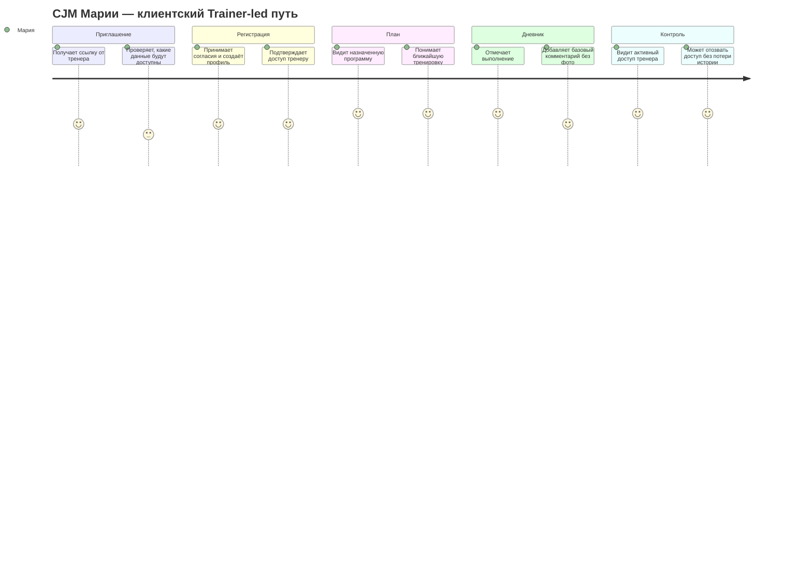
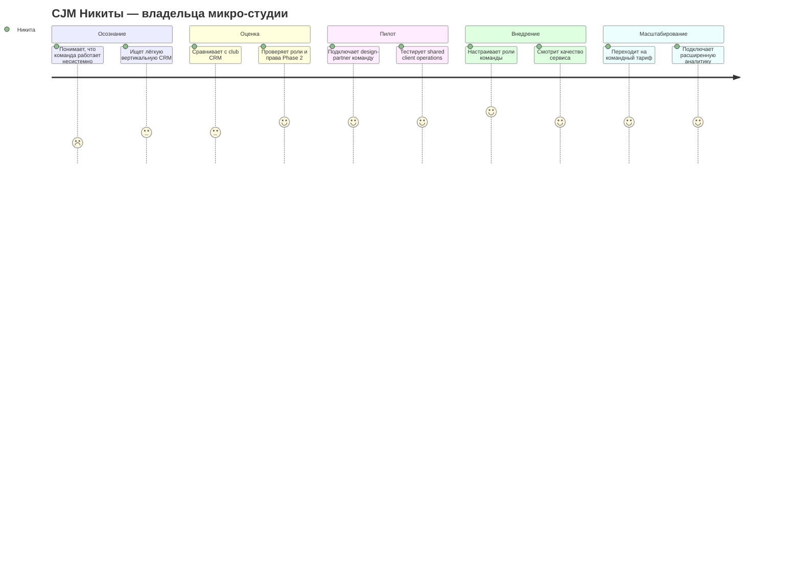
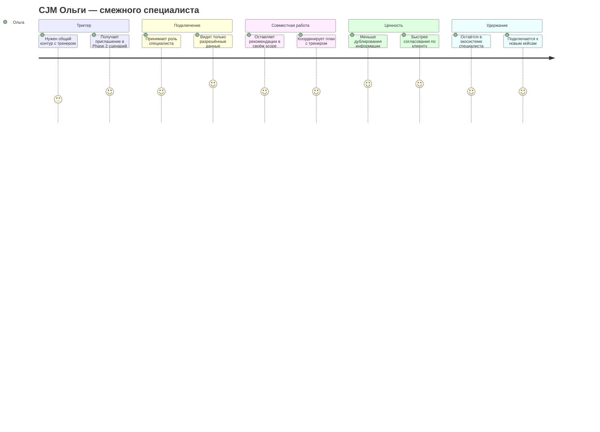

# Карта пути клиента (CJM)

Документ фиксирует пути ключевых персон FitBridge. Структура каждого блока единая: персона → таблица пути → соответствующая Mermaid journey → выводы. MVP включает два полноценных пути: **Trainer-led** и **Solo-client**. Фото, видео и rich-media не входят в MVP и рассматриваются только как Phase 2 / design reserve.

## CJM P1: Ирина, независимый тренер

**Персона:** Ирина ведёт 15–25 клиентов в гибридном формате и хочет заменить чаты, заметки и таблицы единым рабочим контуром.

| Этап | Точки контакта | Эмоции | Боли | Возможности |
|---|---|---|---|---|
| Осознание | Telegram, рекомендации коллег, статьи | Усталость | Хаос в операционке и повторяющиеся вопросы клиентов | Коммуникация про экономию времени и порядок в сопровождении |
| Оценка | Лендинг, демо, кейсы тренеров | Скепсис | Страх сложного внедрения и потери текущего процесса | Показать настройку первого клиента менее чем за 15 минут |
| Активация | Регистрация, создание профиля тренера, приглашение клиента | Интерес | Риск бросить онбординг до первой ценности | Мастер «пригласить первого клиента» |
| Первая ценность | Простой план, отметка выполнения, карточка клиента | Облегчение | Нужно быстро увидеть, что сервис реально снижает ручную работу | Связка «один клиент + один план + первая отметка выполнения» |
| Удержание | История клиента, статусы выполнения, управление доступом | Уверенность | Вопрос цены и привычки команды/клиентов | Показ времени, сэкономленного на сопровождении |

### Выводы для P1

1. Главный момент истины — первая связка «клиент + план + отметка выполнения».
2. Продуктовая коммуникация должна обещать не «CRM вообще», а сокращение ручной тренерской операционки.
3. В MVP Ирине не нужны rich-media, шаблоны и сложная аналитика; они не должны мешать старту.

## CJM P2: Алексей, онлайн-коуч

**Персона:** Алексей работает удалённо с 35–50 клиентами и ищет способ масштабировать сопровождение без роста ручных check-in.

| Этап | Точки контакта | Эмоции | Боли | Возможности |
|---|---|---|---|---|
| Триггер | Собственная воронка, отзывы клиентов, контент | Напряжение | Слишком много ручных проверок статуса и переключения между сервисами | Сообщение «масштаб без хаоса» |
| Оценка | Сайт, страницы сравнения, демо | Рациональность | Сравнение с текущим стеком и страх миграции | Калькулятор окупаемости и инструкция миграции |
| Пилот | Пилот на части базы, приглашения клиентов | Осторожный оптимизм | Риск сломать работающий процесс | Запуск на малой группе клиентов |
| Регулярное использование | Дашборд, карточка клиента, статусы выполнения | Контроль | Нужна надёжность и быстрый обзор | Недельная сводка через статусы pull-model в MVP |
| Расширение | Коммерческие условия, дополнения Phase 2 | Рост | Позже нужны более сильная автоматизация и аналитика | Дорожная карта Phase 2 без перегруза MVP |

### Выводы для P2

1. Алексей ценит масштабирование и обзор, но MVP должен доказать базовую управляемость без отдельного Notification API.
2. Для онлайн-коуча критичны статусы выполнения и история, а не медиа-галерея.
3. Phase 2 automation, отчёты и billing должны включаться только после подтверждения MVP-метрик.

## CJM P3A: Мария, фитнес-клиент в Trainer-led пути

**Персона:** Мария приходит по приглашению тренера, хочет быстро начать выполнять план и контролировать, кто видит её данные.

| Этап | Точки контакта | Эмоции | Боли | Возможности |
|---|---|---|---|---|
| Приглашение | Ссылка или код от тренера | Доверие с осторожностью | Не хочет лишних приложений и непонятного доступа | Объяснить, какие данные увидит тренер и как отозвать доступ |
| Регистрация | Mobile-first регистрация, согласия | Нейтральность | Длинный онбординг и юридическая непонятность | Короткая настройка и понятное информирование о согласиях |
| Старт плана | Назначенная программа, текущая неделя | Мотивация | Нужно понять, что делать сегодня | Простой экран текущего плана |
| Выполнение | Отметка тренировки, дневник, комментарий | Уверенность | Привычка может не закрепиться | Быстрая отметка выполнения и базовая история |
| Контроль данных | Экран доступов, отзыв доступа | Контроль | Страх потерять историю при смене тренера | История принадлежит клиенту; отзыв доступа без потери истории |

### Выводы для P3A

1. Главный момент истины — понятный доступ тренера и сохранение клиентской истории.
2. В Trainer-led пути MVP должен быть максимально mobile-first.
3. Фото и rich-media не нужны для первой ценности и остаются вне MVP.

## CJM P3B: Мария, фитнес-клиент в Solo-client пути

**Персона:** Мария начинает самостоятельно, ведёт дневник и простой личный план, а позже может пригласить тренера.

| Этап | Точки контакта | Эмоции | Боли | Возможности |
|---|---|---|---|---|
| Самостоятельный старт | Сторис, рекомендация друга, поиск | Любопытство | Сложно начать вести дневник без тренера | Первая запись дневника за несколько минут |
| Регистрация | Mobile-first профиль, согласия | Осторожность | Неясно, зачем нужны данные роста/целей | Объяснить ценность и чувствительность данных |
| Личный план | Создание простой программы себе | Мотивация | Сложно структурировать тренировки | Минимальный конструктор плана без шаблонов |
| Регулярное ведение | Дневник, история, статус выполнения | Уверенность | Привычка может сорваться | Накопление истории и быстрый обзор прогресса |
| Подключение тренера | Приглашение тренера, выдача доступа | Контроль | Боится открыть лишние данные | Детальные scope позже; в MVP — явное подтверждение и отзыв доступа |

### Выводы для P3B

1. Solo-client — полноценный MVP-путь, а не вспомогательный onboarding.
2. Первая ценность клиента — первая запись дневника и простой личный план без зависимости от тренера.
3. Позднее приглашение тренера должно усиливать ощущение контроля, а не отнимать владение историей.

## CJM P4: Никита, владелец микро-студии

**Персона:** Никита управляет небольшой командой и хочет стандартизировать клиентский сервис. Это Phase 2 / design-partner сценарий, не MVP.

| Этап | Точки контакта | Эмоции | Боли | Возможности |
|---|---|---|---|---|
| Осознание | Операционные сбои, churn, ручные процессы | Беспокойство | Нет стандарта сервиса внутри команды | Кейсы small-team внедрения |
| Оценка | Демо, sales call, checklist | Осторожность | Страх переплатить и усложнить процессы | Пакет для 3–10 тренеров в Phase 2 |
| Design-partner пилот | Роли, миграция части клиентов | Сосредоточенность | Сопротивление команды | Внедрение через внутреннего чемпиона |
| Внедрение Phase 2 | Обучение, роли, отчёты | Контроль | Нужна прозрачность adoption | Базовая админка small teams |
| Масштабирование | Командный тариф, дополнения | Уверенность | Нужна бизнес-отчётность | Квартальный бизнес-обзор и поддержка успеха клиента |

### Выводы для P4

1. Командный сценарий не должен попадать в MVP как обязательная функция.
2. Для Никиты нужен design-partner пилот после доказательства trainer-led и solo-client путей.
3. Главный риск Phase 2 — усложнить доступы и снизить доверие клиента.

## CJM P5: Ольга, смежный специалист

**Персона:** Ольга подключается к клиентскому кейсу как нутрициолог, реабилитолог или wellness-специалист. Это Phase 2 / design reserve сценарий, не MVP.

| Этап | Точки контакта | Эмоции | Боли | Возможности |
|---|---|---|---|---|
| Триггер | Приглашение от клиента или тренера | Интерес | Неясно, нужен ли отдельный кабинет | Ролевой онбординг Phase 2 |
| Подключение | Принятие роли, согласование scope | Осторожность | Боится видеть лишние данные или отвечать за лишнее | Детальные разрешения по типам данных |
| Совместная работа | Заметки, задачи, статусы | Продуктивность | Нужна координация без шума | Shared timeline только после подтверждения спроса |
| Ценность | Общий прогресс клиента | Удовлетворение | Нет привычки к совместной работе в одном контуре | Шаблоны междисциплинарных сценариев |
| Удержание | Повторное подключение к другим кейсам | Лояльность | Важно не усложнить практику | Лёгкий role mode |

### Выводы для P5

1. Multi-specialist — Phase 2 сценарий и должен строиться на granular consent/scopes.
2. Ольга не должна видеть больше данных, чем требуется её роли.
3. MVP должен только оставить design reserve, но не реализовывать полноценный контур смежных специалистов.

## Общие выводы по CJM

1. Главный момент истины для тренера — первый подключённый клиент, простой план и первая отметка выполнения.
2. Главный момент истины для клиента — контроль доступа и сохранение истории при смене тренера или самостоятельном старте.
3. Solo-client путь является полноценной частью MVP и должен иметь самостоятельную ценность до подключения тренера.
4. Командные и multi-specialist сценарии относятся к Phase 2 / design-partner пилотам и не должны расширять MVP scope.
5. Фото, видео и rich-media остаются вне MVP до отдельного решения по storage, privacy, стоимости и лимитам.

## Источники

1. Внутренний анализ артефактов FitBridge из текущего репозитория.
2. `docs/01-business/MVP_SCOPE_SUMMARY.md`.
3. `docs/01-business/PRODUCT_ROADMAP.md`.
4. `docs/02-analysis/DATA_CLASSIFICATION_MATRIX.md`.
