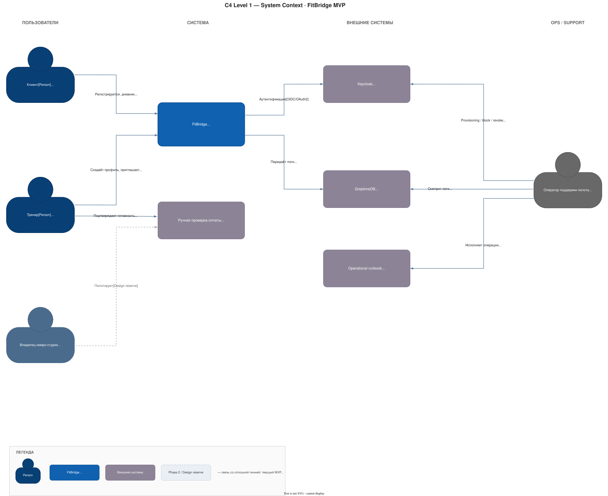
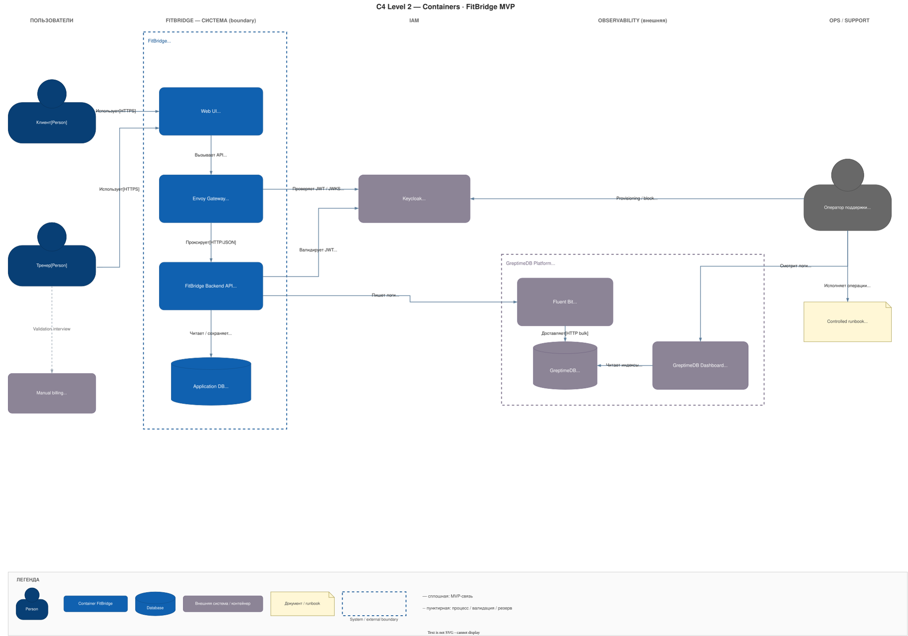
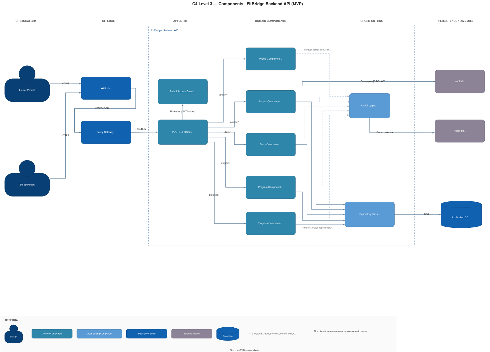

# Обзор архитектуры FitBridge

Документ является краткой картой архитектуры MVP **Trainer Diary**: управление клиентской базой тренера и тренировочными планами. Детали не дублируются: источником истины являются документы из таблицы ниже.

## Канонические источники

| Область | Источник |
|---|---|
| Business scope MVP | Новый scope: **Trainer Diary** — создать клиента, найти клиентов, создать план, найти планы; [MVP_SCOPE_SUMMARY](../01-business/MVP_SCOPE_SUMMARY.md), [PRODUCT_ROADMAP](../01-business/PRODUCT_ROADMAP.md) |
| Архитектурные решения | [ADR index](./01-adrs.md) и файлы каталога `ADR/` |
| C4-диаграммы | Исходники Draw.io: [Context](./c4/C4_CONTEXT.drawio), [Container](./c4/C4_CONTAINER.drawio), [Component](./c4/C4_COMPONENT.drawio); preview SVG перечислены ниже |
| Модель данных | [ERD.md](./ERD.md) |
| Security/access/privacy | [SECURITY_ARCHITECTURE.md](./SECURITY_ARCHITECTURE.md) |
| API index | [02-api.md](./02-api.md) |
| API entities/contracts/rules/limits | Файлы каталога `api/`, перечислены в [02-api.md](./02-api.md) |
| OpenAPI спецификации | [specs-profile-v1.yaml](../../fit-bridge-be/profile-service/specs/specs-profile-v1.yaml), [specs-training-v1.yaml](../../fit-bridge-be/training-service/specs/specs-training-v1.yaml) |
| Разделение на микросервисы | [04-microservices-plan.md](./04-microservices-plan.md) |
| Deployment/run guide | [../../deploy/README.md](../../deploy/README.md) |

## Карта продукта

FitBridge MVP **Trainer Diary** — инструмент для независимого тренера: вести базу клиентов и готовить тренировочные планы. Клиентский контур, сводные экраны и дневник выполнения исключены из MVP.

| Путь | Кратко | Канонический контракт |
|---|---|---|
| Управление клиентской базой | Тренер создаёт `ClientCard` и ищет/фильтрует свои карточки | [api/02](./api/02-mvp-entities.md), OpenAPI v1/v2 `/clientCard/create`, `/clientCard/search` |
| Управление планами | Тренер создаёт `TrainingPlan` для карточки клиента и ищет/фильтрует свои планы по клиенту, строке поиска и статусу | [api/04](./api/04-mvp-diary-plan-methods.md), OpenAPI v1/v2 `/trainingPlan/create`, `/trainingPlan/search` |

### Доменные концепты MVP

| Концепт | Назначение | Статус в MVP |
|---|---|---|
| `ClientCard` | Минимальная карточка клиента, созданная и управляемая тренером | Product entity MVP |
| `TrainingPlan` | Простой тренировочный план, связанный с `ClientCard` | Product entity MVP |

## Архитектурные принципы

- **Trainer-owned diary:** единственный зарегистрированный пользователь MVP — тренер; клиентская карточка и план принадлежат тренеру.
- **Минимальная доменная модель:** MVP опирается на `TrainerUser`/`TrainerProfile`, `ClientCard` и `TrainingPlan`.
- **Search-first operations:** списочные сценарии реализуются как `search`, а не отдельные агрегированные сводки: клиентские карточки и планы ищутся через фильтры и пагинацию.
- **Deny by default для приватного API:** все тренерские `/v1/*` и `/v2/*` методы проходят JWT validation и ownership-проверку тренера над `ClientCard`/`TrainingPlan`.
- **Per-entity repository rule:** repository ports/implementations находятся внутри соответствующей сущности, общего repo-layer на уровне сервиса нет.
- **MVP без клиентского контура:** share/access-сценарии, дневник выполнения и агрегированные сводки исключены до отдельного решения.

## Технологический контур

| Область | Решение | ADR/источник |
|---|---|---|
| Backend | Kotlin + Ktor | [ADR-004](./ADR/ADR-004-kotlin.md), [ADR-003](./ADR/ADR-003-ktor.md) |
| Identity | Keycloak/OIDC/JWT для тренера; публичный клиентский доступ отсутствует в MVP | [ADR-001](./ADR/ADR-001-use-keycloak.md), [SECURITY](./SECURITY_ARCHITECTURE.md) |
| API | POST Full, HTTPS/JSON; приватные `/v1/*` и `/v2/*` методы `clientCard.create/search`, `trainingPlan.create/search` | [ADR-002](./ADR/ADR-002-post-full-api.md), [02-api](./02-api.md), OpenAPI specs |
| Data | PostgreSQL; таблицы/агрегаты `FitBridgeUser`, `TrainerProfile`, `ClientCard`, `TrainingPlan` | [ADR-005](./ADR/ADR-005-use-postgresql.md), [ERD](./ERD.md) |
| Observability | GreptimeDB + Fluent Bit как внешний/platform-контур, masked logs без sensitive payload | [ADR-006](./ADR/ADR-006-use-greptimedb-fluent-bit-observability.md) |

## Высокоуровневая C4 / компонентная логика

### C4 Context

- `Trainer` — единственный зарегистрированный пользователь; работает через Web UI и Keycloak.
- `FitBridge` — система в фокусе: хранит клиентские карточки и тренировочные планы тренера.
- `Keycloak` — внешний Identity Server только для тренерского входа в MVP.
- `GreptimeDB Platform` — внешний observability-контур, получает только masked structured logs; просмотр выполняется через встроенный GreptimeDB Dashboard.

### C4 Container

- `Web UI` содержит приватный кабинет тренера для клиентской базы и планов.
- `Envoy Gateway` маршрутизирует приватные `/v1/*` и `/v2/*` контуры с JWT validation.
- `FitBridge Backend API` реализует POST Full handlers, ownership checks и search-фильтры для карточек/планов.
- `Application DB` хранит `FitBridgeUser/TrainerProfile`, `ClientCard` и `TrainingPlan`.

### C4 Component

- `Trainer Auth Guard` валидирует JWT тренера и ownership ресурсов.
- `ClientCard Component` создаёт карточки и выполняет поиск по `searchString`, статусу и пагинации.
- `TrainingPlan Component` создаёт планы и выполняет поиск по `clientCardId`, названию, статусу и пагинации.
- `Audit Logging` пишет только masked события без ФИО, содержимого плана и чувствительных payload.

## C4-диаграммы

Раздел содержит обзорные C4-представления. Они не переопределяют канонические документы выше: при расхождениях приоритет имеют ADR, API index, ERD и Security Architecture.

`.drawio` файлы являются каноническим редактируемым источником C4-диаграмм. `.svg` файлы — производные preview/export для чтения в Markdown и должны регенерироваться из соответствующего `.drawio` после правок диаграмм.

| Уровень | Назначение | Редактируемый источник | Preview/export |
|---|---|---|---|
| C4 Context | Границы FitBridge, тренер и внешние системы | [C4_CONTEXT.drawio](./c4/C4_CONTEXT.drawio) | [SVG](./c4/C4_CONTEXT.drawio.svg) |
| C4 Container | Контейнеры Trainer Diary MVP и внешние инфраструктурные зависимости | [C4_CONTAINER.drawio](./c4/C4_CONTAINER.drawio) | [SVG](./c4/C4_CONTAINER.drawio.svg) |
| C4 Component | Ключевые компоненты `FitBridge Backend API` для client/plan management | [C4_COMPONENT.drawio](./c4/C4_COMPONENT.drawio) | [SVG](./c4/C4_COMPONENT.drawio.svg) |

### C4 Context

### C4 Container

### C4 Component

## Lifecycle Trainer Diary MVP

1. Тренер проходит аутентификацию через Keycloak.
2. Тренер создаёт `ClientCard`.
3. Тренер ищет карточки через `/clientCard/search` с фильтрами `searchString`, `status`, `pageSize`, `pageNumber`.
4. Тренер создаёт `TrainingPlan`, связанный с карточкой клиента.
5. Тренер ищет планы через `/trainingPlan/search` с фильтрами `clientCardId`, `searchString`, `status`, `pageSize`, `pageNumber`.

## Решения MVP, которые не переопределяются в обзорных документах

- Нет регистрации клиента, клиентского кабинета, client-owned `ClientProfile`, `Invite` и `AccessGrant` в MVP.
- Нет публичных ссылок, access tokens, public endpoints и lifecycle открытия/закрытия ссылки.
- Нет клиентского дневника выполнения, чтения статуса выполнения и отдельного сводного экрана.
- Нет in-product `ADMIN`/support роли, support console и broad bypass.
- GreptimeDB остаётся external/platform observability, не частью application boundary; содержимое планов и sensitive payload в логи не пишутся.

## Путь эволюции

| Будущий концепт | Как подготовлен MVP | Когда включать |
|---|---|---|
| `ClientProfile` | `ClientCard` содержит минимум полей и может быть мигрирован/связан с будущим профилем | После решения о клиентской регистрации |
| `Invite` / публичная ссылка | Исключены из MVP и требуют нового ADR | При появлении клиентского аккаунта или share-сценариев |
| `AccessGrant` | Ownership trainer→card не смешан с будущими client-owned правами | Phase 2 granular permissions/client-owned model |
| Client-owned history / completion marks | Не создаются в MVP | После запуска клиентского кабинета и consent/deletion модели |

## Открытые решения

- UI framework.
- Production deployment platform.
- Retention/index lifecycle/secrets для observability и данных.
- Notification provider — только Phase 2.
