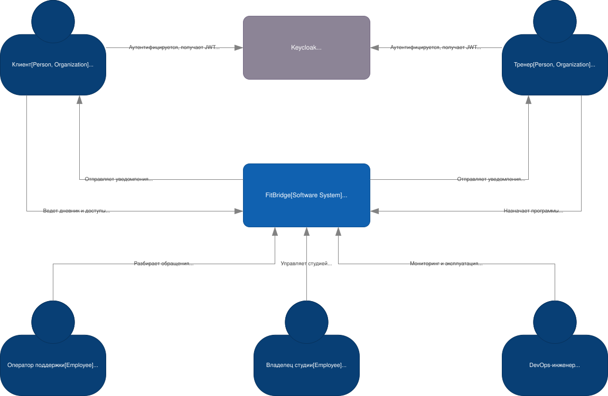
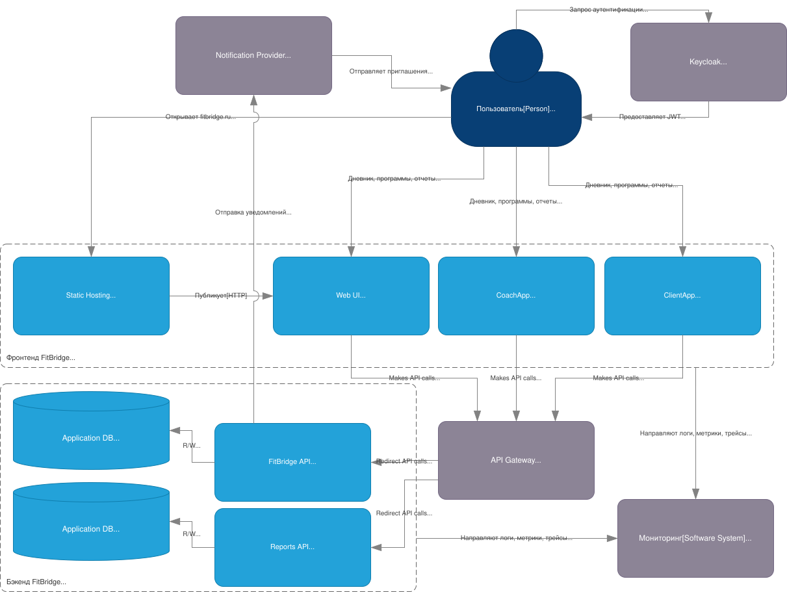
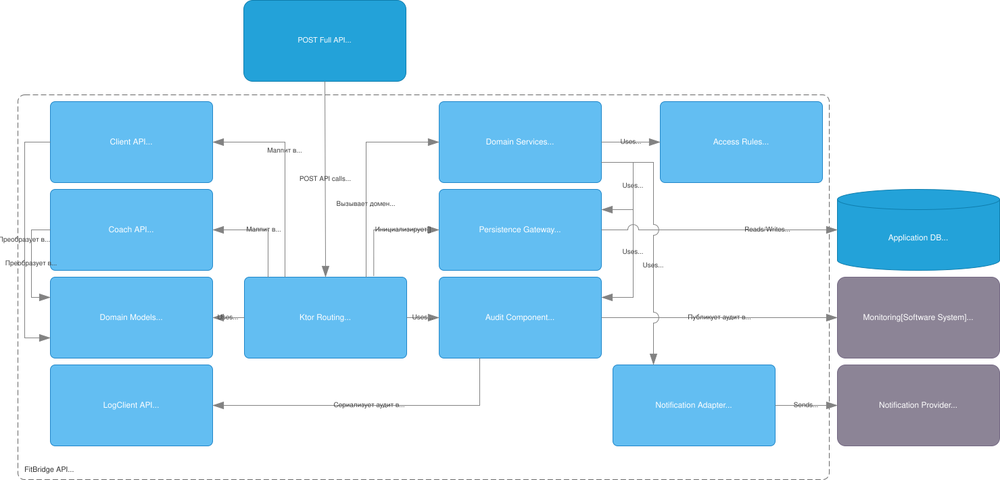
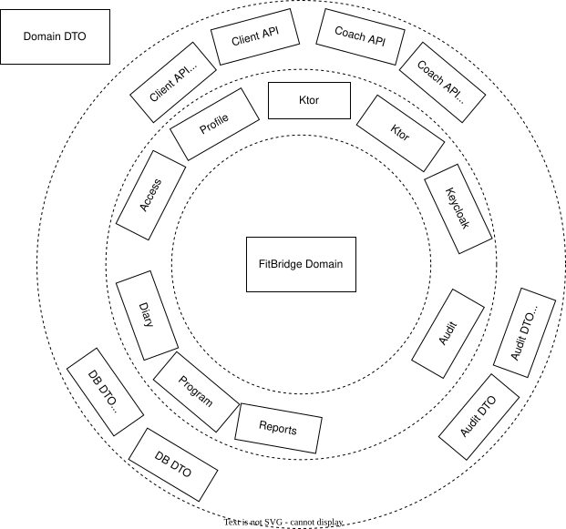

# Architecture Overview - FitBridge

## 1. Цель документа

Этот документ является индексом целевой архитектуры сокращённого MVP FitBridge: B2B2C SaaS-платформы для клиентов и независимых тренеров.

Архитектура отражает требования:

- клиент владеет историей тренировок и доступов;
- тренер работает только с явно разрешёнными клиентскими данными;
- аутентификация и базовая IAM-функция делегируются Keycloak;
- бизнес-операции API выполняются по подходу POST Full;
- проект развивается на Kotlin и Ktor без выбора дополнительных фреймворков на этом этапе.

## 2. Навигация

| Документ | Содержание |
|---|---|
| [ADR/](./ADR/) | Архитектурные решения ADR |

## 3. Диаграммы

### 3.1. Диаграмма контекста C4

### 3.2. Диаграмма контейнеров C4

### 3.3. Диаграмма компонентов C4

### 3.4. Упрощенная слоистая диаграмма компонентов

## 4. Контекст продукта

FitBridge закрывает разрыв между таблицами, чатами и тяжёлыми club-CRM. Сокращённый MVP фокусируется на одном проверяемом пути:

1. Тренер регистрируется.
2. Приглашает первого клиента.
3. Клиент принимает приглашение и подтверждает доступ.
4. Тренер назначает простой план.
5. Клиент отмечает выполнение.
6. Тренер видит историю и статус выполнения в карточке клиента.

## 5. Архитектурные принципы

- **Client-owned data:** история клиента не зависит от текущего тренера.
- **Privacy by design:** доступ к чувствительным данным проверяется на каждый запрос.
- **POST Full API:** все бизнес-операции проходят через `POST` с JSON-контрактами.
- **Identity externalization:** вход и токены делегируются Keycloak.
- **Модульность домена:** дневник, доступы, планы и история выполнения разделены внутри backend.
- **TBD без преждевременного выбора:** UI-фреймворк, СУБД, платформа деплоя и провайдеры остаются открытыми решениями.

## 6. Технологический контур

| Область | Решение |
|---|---|
| Язык backend | Kotlin |
| Backend framework | Ktor |
| Identity Server | Keycloak |
| API style | POST Full, HTTPS/JSON |
| UI | Web UI, конкретный фреймворк TBD |
| Хранилище приложения | DBMS TBD |
| Платежи | Вне MVP, провайдер TBD для Phase 2 |
| Уведомления | MVP: статус приглашения в продукте; внешние провайдеры TBD |

## 7. Доменные контуры MVP

- **Profile Context:** клиентские и тренерские профили.
- **Access Context:** приглашение, подтверждение и отзыв доступа одного активного тренера.
- **Diary Context:** тренировки и комментарии к тренировкам.
- **Program Context:** простые планы и назначения.
- **Progress Context:** история тренировок и статусы выполнения в карточке клиента.
- **Billing Context:** вне MVP; сохраняется как Phase 2 design reserve.
- **Audit Component:** журналирование действий с чувствительными данными.

## 8. Безопасность и данные

- Keycloak используется для аутентификации, выдачи токенов и базовых claims.
- FitBridge хранит доменные роли, связи клиент-тренер и статус доступов.
- Тренер не получает доступ к данным без активного разрешения клиента.
- Операции с доступами, дневником и планами журналируются.
- Данные о здоровье и замерах рассматриваются как чувствительные данные и не входят в обязательный MVP.

## 9. Нефункциональные ориентиры

- Дневник: сохранение записи менее 800 мс.
- Операции доступа: менее 1000 мс.
- Назначение простого плана: менее 1200 мс.
- Открытие истории клиента: менее 1000 мс.
- Доступность основных функций: не ниже 99,5%.
- Доступность контроля доступа: не ниже 99,9%.
- RPO клиентской истории: не более 24 часов.

## 10. ADR

- [ADR-001: Использовать Keycloak как Identity Server](./ADR/ADR-001-use-keycloak.md)
- [ADR-002: Использовать POST Full API](./ADR/ADR-002-post-full-api.md)
- [ADR-003: Использовать Ktor для backend](./ADR/ADR-003-ktor.md)
- [ADR-004: Использовать Kotlin как основной язык](./ADR/ADR-004-kotlin.md)

## 11. Открытые решения

- Выбор UI-фреймворка.
- Выбор СУБД и схемы хранения аудита.
- Выбор платформы деплоя.
- Выбор notification-провайдера.
- Выбор платёжного провайдера для Phase 2.
- Детализация API-контрактов POST Full.
