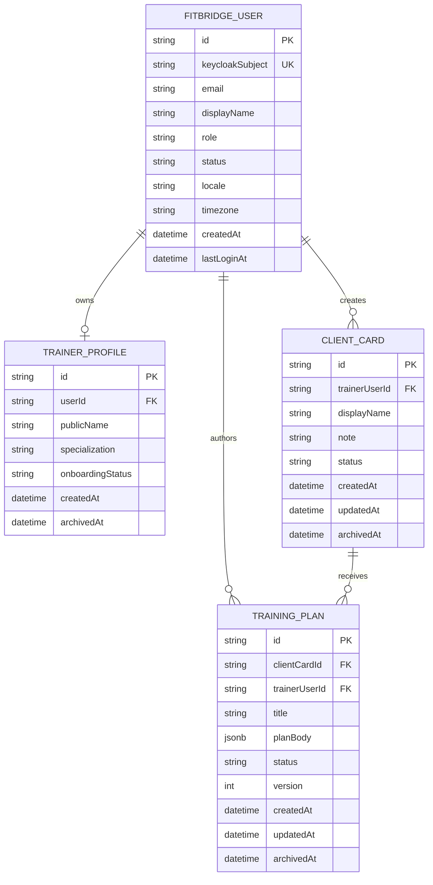

# ERD - FitBridge Trainer Diary MVP

Документ фиксирует модель данных MVP **Trainer Diary**: клиентская база тренера и тренировочные планы. Клиентский контур, сводные экраны и дневник выполнения исключены из текущего MVP. Источники scope: [MVP_SCOPE_SUMMARY](../01-business/MVP_SCOPE_SUMMARY.md), [GLOSSARY](../01-business/GLOSSARY.md).

## Статус

| Параметр | Значение |
|---|---|
| Статус | Updated for Trainer Diary MVP |
| Область | Клиентская база и тренировочные планы тренера |
| DBMS | PostgreSQL |
| Связанные решения | [SECURITY_ARCHITECTURE](./SECURITY_ARCHITECTURE.md) |

## ERD

## Ответственность сущностей

| Сущность | Назначение | Владение / доступ |
|---|---|---|
| `FITBRIDGE_USER` | Локальная проекция зарегистрированного пользователя Keycloak | В MVP только тренер; клиентская регистрация отсутствует |
| `TRAINER_PROFILE` | Минимальный профиль/онбординг тренера | Принадлежит `FITBRIDGE_USER`; используется для приватного кабинета тренера |
| `CLIENT_CARD` | Минимальная карточка клиента, созданная тренером | Владеет тренер; не является `ClientProfile` и не создаёт клиентский аккаунт |
| `TRAINING_PLAN` | Простой план для карточки клиента | Владеет тренер; доступен только через приватный API тренера |

## Почему публичный доступ и отметки не входят в ERD

Текущий MVP не реализует клиентский контур, share/access-состояния и дневник выполнения. Поэтому в модели данных отсутствуют:

- поля `publicAccessTokenHash`, `publicAccessStatus`, `publicAccessExpiresAt`, `publicAccessRevokedAt` у `TRAINING_PLAN`;
- таблица/объект `COMPLETION_MARK`;
- агрегаты сводных экранов;
- `Invite` и `AccessGrant`.

## Модели статусов

| Сущность / поле | Значения MVP | Правило |
|---|---|---|
| `FITBRIDGE_USER.status` | `ACTIVE`, `BLOCKED`, `DELETED` | Только `ACTIVE` может вызывать приватные trainer endpoints |
| `TRAINER_PROFILE.onboardingStatus` | `NEW`, `PROFILE_READY`, `FIRST_CLIENT_CREATED`, `FIRST_PLAN_CREATED`, `COMPLETED` | Gate-to-value: первая карточка + первый план |
| `CLIENT_CARD.status` | `ACTIVE`, `ARCHIVED` | Архивированная карточка не получает новые планы |
| `TRAINING_PLAN.status` | `DRAFT`, `ACTIVE`, `ARCHIVED` | Архивный план не участвует в активной выдаче search по умолчанию |

## Ключевые ограничения

| Ограничение | Правило |
|---|---|
| Только тренер зарегистрирован | `FITBRIDGE_USER.role = TRAINER`; роль/аккаунт `CLIENT` не требуются в MVP |
| Карточка не профиль | `CLIENT_CARD` не имеет `userId`, не является client-owned профилем и не даёт клиенту личный кабинет |
| Минимальный payload карточки | Не хранить медданные, фото/видео, body metrics, расширенные цели и чувствительные health-adjacent поля |
| Search по клиентам | `CLIENT_CARD.trainerUserId + status + displayName/searchString` должны поддерживать приватную выдачу карточек тренера |
| Search по планам | `TRAINING_PLAN.trainerUserId + clientCardId + status + title/searchString` должны поддерживать приватную выдачу планов тренера |
| Нет `AccessGrant` в MVP | Полноценные права, клиентское подтверждение и отзыв клиентом переносятся в Phase 2 |
| Нет `Invite` в MVP | Invite-flow переносится до появления клиентской регистрации |

## Sensitive Data Notes

| Area | Notes |
|---|---|
| ClientCard | `displayName` может быть псевдонимом; свободные заметки тренера считаются приватными данными тренера |
| TrainingPlan | Не хранить медданные, фото/видео, body metrics и rich-media в MVP-плане |
| Logs | Не логировать ФИО, email, текст заметок, содержимое плана и request body |
| Data classification | Медданные, фото/видео, body metrics, rich-media, отметки выполнения и расширенная история не входят в MVP Trainer Diary |

## Phase 2 / Out Of Scope Entities

| Entity | Reason |
|---|---|
| `ClientProfile` | Будущая client-owned модель после решения о клиентской регистрации |
| `AccessGrant` | Гранулярные права, подтверждение и отзыв клиентом — Phase 2 |
| `Invite` | Подключение клиента с аккаунтом и consent-flow — Phase 2 |
| Отметки выполнения, `TrainingEntry` / дневник | Отметки выполнения и полноценная история клиента не входят в MVP Trainer Diary |
| `ProgramAssignment` | В MVP план напрямую связан с `ClientCard`; отдельное назначение нужно при multi-plan/history модели |
| `Measurement`, `Report` | Замеры, аналитика и отчёты вынесены после MVP |
| `Notification`, `AuditEvent` | Product notification/audit API не входят; используются pull-model статусы и masked infrastructure logs |
| `Subscription` | Биллинг и тарифные лимиты вне продукта MVP |
| `Team`, `Studio`, `SpecialistRole` | Командный и multi-specialist production-сценарии вынесены за MVP |

## Evolution path к client-owned/access-grant модели

| MVP объект | Future объект | Правило миграции |
|---|---|---|
| `CLIENT_CARD` | `ClientProfile` | После регистрации клиента карточка может быть привязана или преобразована в профиль только с явным решением по consent |
| `TRAINING_PLAN` | `Program` / `ProgramAssignment` | План можно мигрировать в программу и назначение, сохранив snapshot/version |
| `TRAINING_PLAN` | `TrainingEntry` / completion event | Будущие отметки выполнения должны появиться только через новое решение и не смешиваться с MVP-планом |

## Открытые решения

| Decision | Impact |
|---|---|
| Нужны ли update/archive в строго минимальном MVP | OpenAPI сохраняет методы управления, но основной сценарий MVP — create/search |
| Индексы search | Нужно уточнить физические индексы под PostgreSQL после финализации полей поиска |
