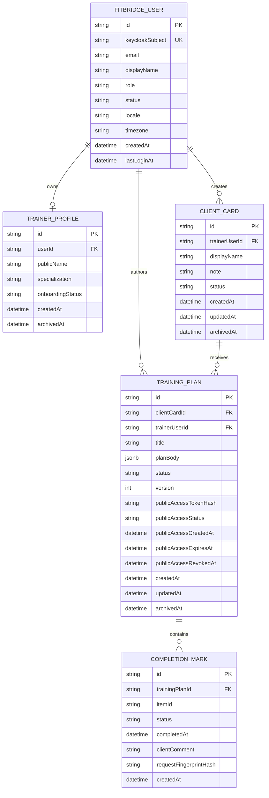

# ERD - FitBridge trainer-first MVP с публичной ссылкой

Документ фиксирует модель данных trainer-first MVP с публичной ссылкой на тренировочный план. Источники scope: [BR-010](../01-business/BR/BR-010-public-plan-link-mvp.md), [MVP_SCOPE_SUMMARY](../01-business/MVP_SCOPE_SUMMARY.md), [GLOSSARY](../01-business/GLOSSARY.md).

## Статус

| Параметр | Значение |
|---|---|
| Статус | Approved for trainer-first MVP с публичной ссылкой / Gate 1 |
| Область | Trainer-first public-link сценарий без регистрации клиента |
| DBMS | PostgreSQL |
| Связанные решения | [ADR-007 публичный доступ к плану](./ADR/ADR-007-public-plan-link-mvp.md), [SECURITY_ARCHITECTURE](./SECURITY_ARCHITECTURE.md) |

## ERD

## Ответственность сущностей

| Сущность | Назначение | Владение / доступ |
|---|---|---|
| `FITBRIDGE_USER` | Локальная проекция зарегистрированного пользователя Keycloak | В MVP только тренер; клиентская регистрация отсутствует |
| `TRAINER_PROFILE` | Минимальный профиль/онбординг тренера | Принадлежит `FITBRIDGE_USER`; используется для trainer dashboard |
| `CLIENT_CARD` | Минимальная карточка клиента, созданная тренером | Владеет тренер; не является `ClientProfile` и не создаёт клиентский аккаунт |
| `TRAINING_PLAN` | Простой план для карточки клиента | Владеет тренер; содержит technical public-access state для публичной ссылки |
| `COMPLETION_MARK` | Отметка выполнения клиентом по публичной ссылке | Дочерний объект `TrainingPlan`; на MVP допустимо хранить как value object/jsonb, отдельная таблица — техническая оптимизация |

## Почему публичная ссылка не выделена в ERD как product entity

Публичная ссылка в MVP — это не самостоятельная продуктовая сущность, а capability-token/public-access функция конкретного `TrainingPlan`.

Архитектурное правило:

- raw token генерируется и показывается тренеру только как часть public URL;
- в БД хранится только `publicAccessTokenHash` и технические поля lifecycle;
- публичный endpoint принимает только token, вычисляет hash и находит активный `TrainingPlan`;
- `clientId`, `clientCardId`, `planId` не передаются в публичном URL/API;
- закрытие ссылки меняет `publicAccessStatus`/`publicAccessRevokedAt`, а не создаёт/удаляет продуктовую сущность.

## Модели статусов

| Сущность / поле | Значения MVP | Правило |
|---|---|---|
| `FITBRIDGE_USER.status` | `ACTIVE`, `BLOCKED`, `DELETED` | Только `ACTIVE` может вызывать приватные trainer endpoints |
| `TRAINER_PROFILE.onboardingStatus` | `NEW`, `PROFILE_READY`, `FIRST_LINK_CREATED`, `COMPLETED` | Gate-to-value: первая карточка + план + public link |
| `CLIENT_CARD.status` | `ACTIVE`, `ARCHIVED` | Архивированная карточка не получает новые планы/ссылки |
| `TRAINING_PLAN.status` | `DRAFT`, `ACTIVE`, `ARCHIVED` | Публично показывается только активный план с активным public access |
| `TRAINING_PLAN.publicAccessStatus` | `NONE`, `ACTIVE`, `REVOKED`, `EXPIRED` | `REVOKED`/`EXPIRED` немедленно закрывает публичный просмотр и отметки |
| `COMPLETION_MARK.status` | `DONE`, `SKIPPED` | MVP хранит факт выполнения/пропуска без полноценного дневника |

## Ключевые ограничения

| Ограничение | Правило |
|---|---|
| Только тренер зарегистрирован | `FITBRIDGE_USER.role = TRAINER`; роль/аккаунт `CLIENT` не требуются в MVP |
| Карточка не профиль | `CLIENT_CARD` не имеет `userId`, не является client-owned профилем и не даёт клиенту личный кабинет |
| Минимальный payload карточки | Не хранить медданные, фото/видео, body metrics, расширенные цели и чувствительные health-adjacent поля |
| Один public access на план | Для MVP у `TRAINING_PLAN` один активный token lifecycle; повторная генерация должна инвалидировать прежний token либо явно фиксировать rotation policy |
| Token hash only | Raw token запрещено хранить в БД, логах, analytics и error traces |
| TTL обязателен | `publicAccessExpiresAt` должен быть заполнен; бессрочные публичные ссылки не допускаются для production/pilot baseline |
| Revoke обязателен | Тренер может закрыть ссылку; после revoke публичный endpoint возвращает только безопасную ошибку/сообщение |
| CompletionMark как value object | На MVP допустимо хранить отметки внутри `TrainingPlan.planBody`/`completionMarksJson`; отдельная таблица допустима для индексов, но не меняет продуктовую модель |
| Нет `AccessGrant` в MVP | Полноценные права, клиентское подтверждение и отзыв клиентом переносятся в Phase 2 |
| Нет `Invite` в MVP | Публичная ссылка заменяет invite-flow до появления клиентской регистрации |

## Sensitive Data Notes

| Area | Notes |
|---|---|
| Public payload | Возвращать только минимум: название плана, актуальные задания, безопасный текст тренера/сервиса, состояние доступности ссылки |
| ClientCard | `displayName` может быть псевдонимом; свободные заметки тренера не должны попадать в публичный payload без отдельного решения |
| CompletionMark | Свободный комментарий клиента ограничить по длине и не логировать raw value |
| Logs | Не логировать raw token, ФИО, email, текст заметок, содержимое плана, комментарии и request body |
| Data classification | Медданные, фото/видео, body metrics, rich-media и расширенная история не входят в MVP публичного доступа к плану |

## Phase 2 / Out Of Scope Entities

| Entity | Reason |
|---|---|
| `ClientProfile` | Будущая client-owned модель после проверки метрик публичной ссылки |
| `AccessGrant` | Гранулярные права, подтверждение и отзыв клиентом — Phase 2 |
| `Invite` | Подключение клиента с аккаунтом и consent-flow — Phase 2 |
| `TrainingEntry` / дневник | Полноценная история клиента не входит в MVP публичного доступа к плану |
| `ProgramAssignment` | В MVP план напрямую связан с `ClientCard`; отдельное назначение нужно при multi-plan/history модели |
| `Measurement`, `Report` | Замеры, аналитика и отчёты вынесены после MVP |
| `Notification`, `AuditEvent` | Product notification/audit API не входят; используются pull-model статусы и masked infrastructure logs |
| `Subscription` | Биллинг и тарифные лимиты вне продукта MVP |
| `Team`, `Studio`, `SpecialistRole` | Командный и multi-specialist production-сценарии вынесены за MVP |

## Evolution path к client-owned/access-grant модели

| MVP объект | Future объект | Правило миграции |
|---|---|---|
| `CLIENT_CARD` | `ClientProfile` | После регистрации клиента карточка может быть привязана или преобразована в профиль только с явным решением по consent |
| `TRAINING_PLAN` | `Program` / `ProgramAssignment` | План можно мигрировать в программу и назначение, сохранив snapshot/version |
| `COMPLETION_MARK` | `TrainingEntry` / completion event | Отметки могут стать исходными событиями истории клиента после принятия клиентом ownership-модели |
| `publicAccessTokenHash` | `Invite` / `AccessGrant` | Техническая ссылка не мигрирует в grant напрямую; future grant создаётся только через client-owned flow |

## Открытые решения

| Decision | Impact |
|---|---|
| Конкретный TTL публичной ссылки | Влияет на UX пилота и риск несанкционированного доступа |
| Rotation policy при повторной генерации ссылки | Нужно решить: инвалидировать предыдущую ссылку автоматически или показывать явное состояние |
| Value object vs отдельная таблица `COMPLETION_MARK` | Влияет на простоту MVP и будущую аналитику |
