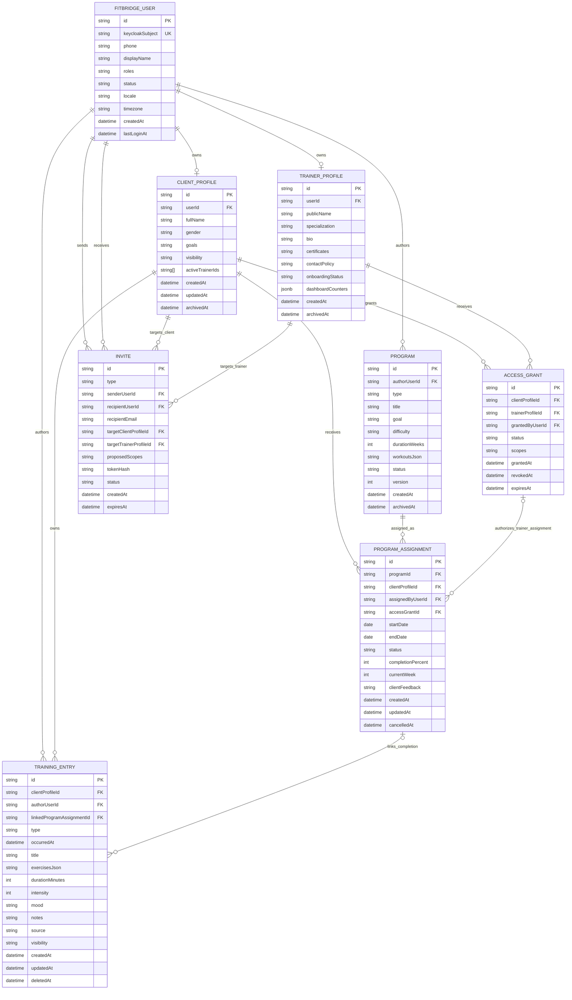

# ERD - FitBridge MVP

Документ фиксирует целевую модель данных MVP FitBridge для двух полноценных путей: `Trainer-led` и `Solo-client (PLG)`. ERD основан на MVP scope, API entities и traceability matrix.

## Статус

| Параметр | Значение |
|---|---|
| Статус | Approved for MVP / Reference — структура согласована для MVP; детали (типы, индексы, constraints) могут уточняться при детализации схемы |
| Область | MVP / Gate 1 |
| Источники | `docs/01-business/MVP_SCOPE_SUMMARY.md`, `docs/03-architecture/api/02-mvp-entities.md`, `docs/02-analysis/REQUIREMENTS_TRACEABILITY_MATRIX.md` |
| DBMS | PostgreSQL |

## ERD

## Ответственность сущностей

| Сущность | Назначение | Владение |
|---|---|---|
| `FITBRIDGE_USER` | Локальная проекция пользователя Keycloak и базовых доменных ролей | Связана с `keycloakSubject`; аутентификация остаётся в Keycloak |
| `CLIENT_PROFILE` | Клиентский профиль, владелец дневника, истории, доступов и назначений | Принадлежит клиенту через `userId` |
| `TRAINER_PROFILE` | Профессиональный профиль тренера и состояние минимального онбординга | Принадлежит пользователю-тренеру через `userId` |
| `ACCESS_GRANT` | Разрешение тренеру читать разрешённые поля профиля и работать с тренировочным процессом клиента | Создаётся только после явного подтверждения клиента; в MVP не содержит trainer `PROFILE_WRITE` для `ClientProfile` |
| `INVITE` | Одноразовое приглашение клиента тренером | Не является доступом до `acceptInvite` |
| `TRAINING_ENTRY` | Запись дневника клиента или факт выполнения тренировки | Всегда принадлежит `CLIENT_PROFILE`; автором может быть клиент или тренер со scope |
| `PROGRAM` | Простой тренировочный план | Автором может быть тренер или solo-клиент |
| `PROGRAM_ASSIGNMENT` | Назначение программы клиенту на период | Для trainer-led связано с `ACCESS_GRANT`; для solo-client `accessGrantId = null` |

## Модели статусов

| Сущность | Значения статуса | Правило |
|---|---|---|
| `INVITE` | `PENDING`, `ACCEPTED`, `DECLINED`, `EXPIRED`, `CANCELLED` | Описывает жизненный цикл одноразового приглашения; pending invite не даёт доступа |
| `ACCESS_GRANT` | `ACTIVE`, `REVOKED`, `EXPIRED` | Описывает действующее или историческое разрешение доступа; только `ACTIVE` может проходить owner/grant/scope policy |
| `FITBRIDGE_USER` | `ACTIVE`, `PENDING_EMAIL`, `BLOCKED`, `DELETED` | `BLOCKED` блокирует пользовательские операции и может быть эффектом controlled support-operation через Keycloak/runbook без добавления admin/support сущностей в MVP |

## Ключевые ограничения

| Ограничение | Правило |
|---|---|
| Один клиентский профиль MVP | `FITBRIDGE_USER` имеет не более одного основного `CLIENT_PROFILE` |
| Один тренерский профиль MVP | `FITBRIDGE_USER` имеет не более одного основного `TRAINER_PROFILE` |
| Optional профильные поля MVP | `CLIENT_PROFILE.gender` и `CLIENT_PROFILE.goals` nullable/optional; отсутствие значений не блокирует onboarding, создание профиля или базовое использование |
| Body metrics вне MVP | `heightCm` не моделируется как активное поле `CLIENT_PROFILE` в MVP; рост и связанные body metrics относятся к Phase 2 / later measurement scope |
| Один активный тренер MVP | У `CLIENT_PROFILE` не более одного `ACCESS_GRANT` в статусе `ACTIVE` |
| Приглашение не равно доступу | `INVITE.status = ACCEPTED` создаёт или активирует `ACCESS_GRANT.status = ACTIVE`; pending invite не даёт доступа |
| Deny by default | Все операции с клиентскими данными требуют владельца или активный `ACCESS_GRANT` с нужным scope |
| Нет trainer profile-write в MVP | `ACCESS_GRANT.scopes` MVP допускает `PROFILE_READ` для разрешённых полей профиля и training-domain scopes, но не trainer `PROFILE_WRITE` для `ClientProfile` |
| Нет admin/support сущностей MVP | Операционное сопровождение пилота не добавляет таблицы, роли или связи для admin/support; block/revoke/cancel invite effects фиксируются существующими статусами и masked logs |
| Solo-client assignment | `PROGRAM_ASSIGNMENT.accessGrantId` может быть `null`, если клиент назначил свою программу сам себе |
| Версионирование программ | Активное назначение должно ссылаться на фиксированную версию программы или snapshot структуры `workoutsJson` |
| Soft delete | Профили, дневниковые записи, программы и назначения архивируются/помечаются, а не удаляются физически в пользовательском сценарии |

## Sensitive Data Notes

| Area | Notes |
|---|---|
| Optional profile fields MVP | `gender` и `goals` входят в MVP как добровольные поля `CLIENT_PROFILE`; клиент-владелец может читать/изменять/очищать их, тренер читает только через активный `ACCESS_GRANT` + `PROFILE_READ`, значения не логируются |
| Health-adjacent fields MVP | `goals`, `intensity`, `mood`, `notes`, упражнения/вес/RPE требуют отдельной классификации данных и маскирования в логах |
| Body metrics Phase 2 | `heightCm` и связанные body metrics не входят в MVP ERD; добавление требует отдельного Phase 2 решения по consent, retention и доступам |
| Audit | В MVP `AuditEvent` API и отдельная audit entity/table не моделируются; критичные события логируются инфраструктурно через ADR-006 |
| Logs | Персональные и health-adjacent данные не должны попадать в логи без маскирования |
| Deletion | Полноценная модель consent/privacy/deletion требует отдельного `BR-009-consent-privacy-deletion.md` |

## Scope аудита и уведомлений MVP

| Контур | MVP модель данных | Phase 2 |
|---|---|---|
| Аудит | Нет таблицы `AuditEvent`; обязательные события пишутся как masked structured logs: accept/decline invite, grant/revoke access, profile delete/archive request, diary create/update/delete, program assign/update/cancel, complete workout, access denied for scope | Отдельная audit entity/API, продуктовый audit trail, расширенная retention/legal модель |
| Уведомления | Нет таблицы `Notification`; UI читает статусы приглашений, доступов, назначений и выполнения через MVP read endpoints/dashboard | Отдельный `Notification` API/provider, push/email/in-app notification center и lifecycle communications |

## Phase 2 / Out Of Scope Entities

| Entity | Reason |
|---|---|
| `Measurement` | Замеры и графики прогресса вынесены после MVP |
| `Report` | Отдельный отчётный модуль и экспорт отчётов не входят в MVP |
| `Subscription` | Встроенный биллинг, лимиты и автоплатежи не входят в MVP |
| `Notification` | Отдельный push/email `Notification` API/provider не входит в MVP; используется pull-model UI |
| `AuditEvent` | Продуктовый audit API и отдельная audit entity перенесены в Phase 2; MVP покрыт infrastructure audit-oriented logging |
| `Team`, `Studio`, `SpecialistRole` | Командный и multi-specialist production-сценарии вынесены за MVP |
| `ClientProfile.heightCm` / body metrics | Рост и показатели тела перенесены в Phase 2 / later measurement scope; в MVP не являются supported profile fields |

## Открытые решения

| Decision | Impact |
|---|---|
| Snapshot vs version link for assigned programs | Нужно решить, хранить ли полную копию программы в назначении или ссылку на версию |
| Retention policy | Нужны сроки хранения для профилей, soft-deleted записей, invites, access grants и инфраструктурных логов |
