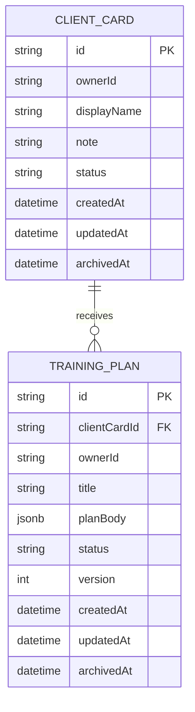

# ERD — FitBridge Trainer Diary MVP

Модель данных MVP содержит только trainer-owned рабочие сущности. Учётная запись и минимальный identity-профиль находятся в Keycloak и не дублируются в PostgreSQL.

## Статус

| Параметр | Значение |
|---|---|
| Статус | Updated after ADR-007 |
| Область | Клиентские карточки и тренировочные планы тренера |
| DBMS | PostgreSQL |
| Внешний owner | Keycloak subject (`JWT.sub`) |

## ERD

## Правила ownership

| Правило | Реализация |
|---|---|
| Канонический owner | `ownerId = JWT.sub` |
| Источник owner | Только серверный Auth Guard; owner не принимается из request payload |
| Чтение и поиск | Каждый запрос фильтруется по `ownerId` текущего principal |
| Изменение и архивирование | Допускаются только при совпадении `entity.ownerId == principal.userId` |
| Создание плана | `ClientCard.ownerId` должен совпадать с `principal.userId`; план получает тот же owner |
| Ссылка на пользователя | `ownerId` не является FK: Keycloak владеет lifecycle пользователя |

## Статусы MVP

| Сущность | Значения | Правило |
|---|---|---|
| `CLIENT_CARD.status` | `ACTIVE`, `ARCHIVED` | Архивированная карточка не получает новые планы |
| `TRAINING_PLAN.status` | `DRAFT`, `ACTIVE`, `ARCHIVED` | Архивный план исключается из активного поиска по умолчанию |

## Индексы

- `CLIENT_CARD(ownerId, status, displayName)` для приватного поиска карточек.
- `TRAINING_PLAN(ownerId, clientCardId, status, title)` для приватного поиска планов.
- Индекс/constraint на `TRAINING_PLAN.clientCardId`; совпадение owner проверяется приложением в одной транзакции.

## Границы данных

- Username, email, имя, credentials, роль и IAM-статус находятся в Keycloak.
- PostgreSQL не содержит локальной user projection или профессионального профиля тренера.
- `ClientCard` не является клиентским аккаунтом или `ClientProfile`.
- Медданные, body metrics, фото/видео, `AccessGrant`, `Invite` и дневник выполнения остаются вне MVP.
