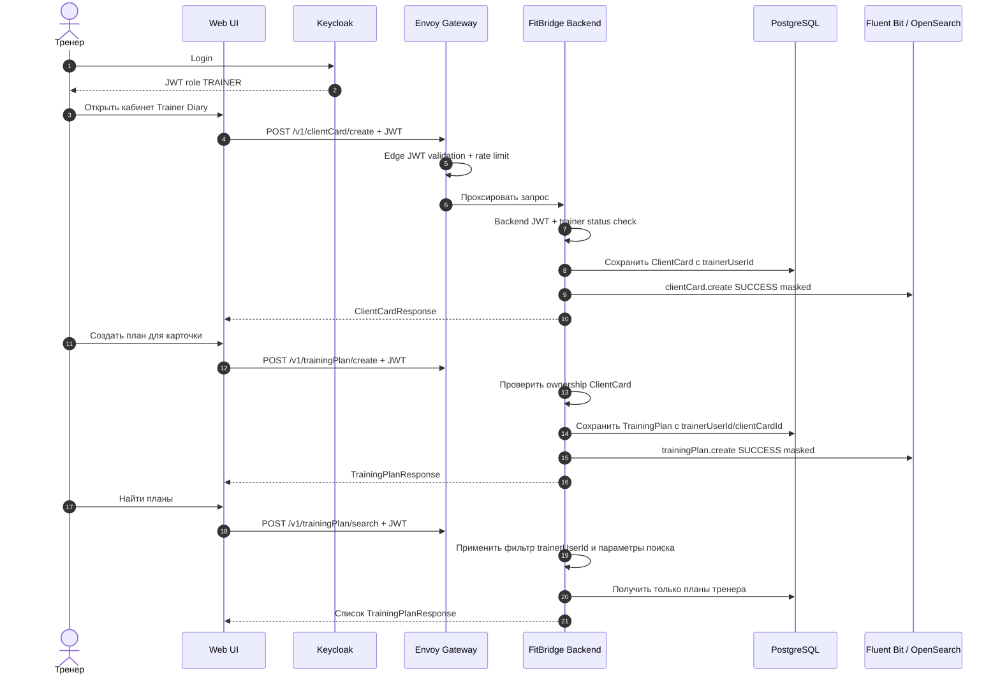

# Архитектура безопасности FitBridge Trainer Diary MVP

Документ фиксирует security baseline текущего MVP **Trainer Diary**: приватный кабинет тренера для ведения клиентских карточек и тренировочных планов. Публичный клиентский контур и клиентский кабинет не входят в область текущей реализации.

## 1. Статус и область действия

| Параметр | Значение |
|---|---|
| Статус | Целевой baseline безопасности Trainer Diary MVP |
| Область | Тренер как единственный зарегистрированный пользователь, `TrainerProfile`, `ClientCard`, `TrainingPlan`, приватные `/v1/*` и `/v2/*` API |
| Не входит в MVP | Регистрация клиента, клиентский кабинет, `ClientProfile`, `Invite`, `AccessGrant`, granular permissions, multi-specialist, product `AuditEvent`, product `Notification`, in-product `ADMIN`/support UI |
| Связанные решения | [ADR-001 Keycloak](./ADR/ADR-001-use-keycloak.md), [ADR-002 POST Full API](./ADR/ADR-002-post-full-api.md), [ADR-005 PostgreSQL](./ADR/ADR-005-use-postgresql.md), [ADR-006 Observability](./ADR/ADR-006-use-opensearch-fluent-bit-observability.md), [ADR-007 Rejected/Archived](./ADR/ADR-007-public-plan-link-mvp.md) |
| Архитектурные диаграммы | [C4 Context SVG](./c4/C4_CONTEXT.drawio.svg), [C4 Container SVG](./c4/C4_CONTAINER.drawio.svg), [C4 Component SVG](./c4/C4_COMPONENT.drawio.svg) |

Security scope MVP покрывает:

- аутентификацию тренера через Keycloak/OIDC;
- приватные trainer endpoints с edge и backend JWT validation;
- обязательную проверку ownership для `ClientCard` и `TrainingPlan`;
- минимизацию персональных и health-adjacent данных в доменной модели и логах;
- rate limiting приватных операций создания, чтения, изменения, архивирования и поиска;
- audit-oriented infrastructure logging без request body, содержимого плана, клиентских заметок и секретов.

## 2. Акторы и модель доверия

| Актор / система | Доверие | Основные действия | Заметки по безопасности |
|---|---|---|---|
| `Trainer` | Зарегистрированный пользователь продукта | Входит в систему, ведёт профиль, создаёт/читает/изменяет/архивирует `ClientCard`, создаёт/читает/изменяет/архивирует `TrainingPlan`, ищет карточки и планы | Доступ только к собственным ресурсам; JWT + backend ownership check |
| `Support/Ops operator` | Операционный актор вне product API | Controlled runbook для пилота: допуск/блокировка тренера, расследование технических инцидентов по masked logs | Не product role; не читает содержимое плана, клиентские заметки и health-adjacent payload |
| `Keycloak` | Доверенный Identity Provider | Login тренера, OIDC/JWT, JWKS | Не решает domain ownership и не владеет прикладными сущностями FitBridge |
| `FitBridge Backend` | Доверенная доменная система | POST Full API, JWT claims validation, ownership, business rules, запись данных | Единственное место доменных проверок trainer-owned ресурсов |
| `Envoy Gateway` | Инфраструктурный boundary | Маршрутизация приватных `/v1/*` и `/v2/*`, edge JWT validation, rate limiting | Не заменяет backend-проверки ownership и статусов пользователя |
| `PostgreSQL` | Доверенное прикладное хранилище | Хранит user/trainer/card/plan и технические статусы | Содержимое планов и заметок требует ограничений на размер и запрета логирования |
| `OpenSearch / Fluent Bit` | Внешний observability-контур | Доставка, хранение и поиск masked logs | Не является application boundary; не получает request body, план, заметки клиента и секреты |

## 3. Контуры доступа

### 3.1. Приватный trainer API

1. Тренер входит через Keycloak.
2. Web UI вызывает приватные `/v1/*` и `/v2/*` endpoints с `Authorization: Bearer <JWT>`.
3. Envoy проверяет JWT/JWKS на edge и применяет инфраструктурные лимиты.
4. Backend независимо валидирует JWT/claims, находит `FITBRIDGE_USER`, проверяет `role=TRAINER`, `status=ACTIVE`.
5. Для каждой операции backend проверяет ownership: `ClientCard.trainerUserId == caller.id`, `TrainingPlan.trainerUserId == caller.id`.
6. Операции support/admin не получают broad bypass к domain API.

Минимальные проверки backend для каждого приватного `/v1/*` и `/v2/*` POST Full endpoint:

- `iss`, `aud`, `exp`, `nbf`, `iat` валидны;
- `sub` присутствует и связан с активным `FITBRIDGE_USER`;
- пользователь имеет trainer capability/profile;
- target resource принадлежит тренеру;
- архивные ресурсы не допускают операций, запрещённых бизнес-правилами;
- raw payload не логируется.

### 3.2. Клиентский и внешний доступ

В текущем MVP клиент не регистрируется, не получает кабинет и не вызывает отдельный API. Все пользовательские действия выполняет тренер в приватном контуре.

Запрещено добавлять в MVP без нового ADR:

- endpoints вне приватного trainer API;
- параметры авторизации через `clientId`, `clientCardId`, `planId` или `trainerId` без проверки ownership;
- выдачу клиентских заметок, содержимого плана или внутренних идентификаторов за пределы приватного кабинета тренера;
- скрытые роли `CLIENT`, `ADMIN`, `SUPPORT` внутри domain API.

## 4. Роли и claims

| Роль | Статус MVP | Назначение | Требование к policy |
|---|---|---|---|
| `TRAINER` | Единственная зарегистрированная product role MVP | Профиль тренера, клиентские карточки, тренировочные планы | Роль из JWT — только предварительное условие; backend проверяет ownership ресурсов |
| `CLIENT` | Phase 2 / future | Клиентский аккаунт, client-owned профиль, управление доступами | Не требуется и не используется в MVP Trainer Diary |
| `ADMIN` / `SUPPORT` | Product role вне MVP | Полноценный product admin/support UI | Не используется в MVP domain API; эксплуатационные действия только через runbook без чтения sensitive payload |

## 5. Границы Keycloak и FitBridge Backend

| Область | Keycloak | FitBridge Backend |
|---|---|---|
| Регистрация и вход | Аутентифицирует тренера | Создаёт/связывает внутреннего trainer user |
| Claims и роли | Выпускает подписанный JWT | Независимо валидирует claims для `/v1/*` и `/v2/*` |
| Доменные ресурсы | Не владеет | Хранит `ClientCard` и `TrainingPlan`, проверяет trainer ownership |
| Статус пользователя | Может хранить IAM-статусы | Проверяет локальный `FITBRIDGE_USER.status` для business access |
| Аудит | IAM-события тренера | Masked business/security events по ADR-006 |

## 6. Минимизация данных

| Область | MVP правило |
|---|---|
| `TrainerProfile` | Минимальный профиль тренера; не хранить лишние персональные данные |
| `ClientCard` | Минимум: отображаемое имя/псевдоним, внутренняя заметка, технические статусы; без медданных, фото/видео, body metrics |
| `TrainingPlan` | Простой план с заданиями; без медданных, rich-media, body metrics и клиентской истории |
| Errors | Generic messages для auth/ownership отказов; не раскрывать существование чужих карточек или планов |
| Logs | Не писать request body, ФИО, email, заметки, содержимое плана, stacktrace с секретами |

## 7. Rate limiting и abuse controls

| Контур | Минимальное правило MVP |
|---|---|
| Приватные чтения и поиск | Лимит по trainer user и source IP; защита от перебора чужих id через uniform errors |
| Приватные записи | Лимит по trainer user; отдельные суточные лимиты на создание карточек и планов |
| Auth failures | Ограничение частоты неуспешных попыток на edge/IdP уровне |
| Архивация | Низкий latency target; состояние ресурса проверяется на каждом запросе |

## 8. Audit и observability

Security events связаны с [ADR-006](./ADR/ADR-006-use-opensearch-fluent-bit-observability.md). В MVP используется infrastructure audit-oriented logging, а не продуктовый `AuditEvent` API.

Обязательные события MVP Trainer Diary:

- `trainer.login` / `trainer.authFailed` на уровне IAM/edge без sensitive payload;
- `trainerProfile.createOrUpdate`, `trainerProfile.readOwn`;
- `clientCard.create`, `clientCard.read`, `clientCard.update`, `clientCard.archive`, `clientCard.search`;
- `trainingPlan.create`, `trainingPlan.read`, `trainingPlan.update`, `trainingPlan.archive`, `trainingPlan.search`;
- `access.denied` с reason code (`UNAUTHENTICATED`, `FORBIDDEN`, `NOT_FOUND`, `RATE_LIMITED`) без sensitive payload.

Минимальные поля: `timestamp`, `level`, `service`, `environment`, `requestId`, `actorType`, `trainerUserId` если есть, `action`, `entityType`, `entityId` или безопасный внутренний id, `result`, `reasonCode`, `durationMs`. Raw payload и секреты запрещены.

## 9. Критичный поток: создание клиента и плана

## 10. Модель угроз

| Угроза | Затронутые активы | Вероятность | Влияние | Митигация |
|---|---|---:|---:|---|
| IDOR через подстановку `planId`/`clientId` | Чужие планы/карточки | Medium | High | Централизованный ownership guard, отрицательные тесты, uniform errors |
| Broken trainer ownership | Доступ тренера к чужой карточке/плану | Medium | High | Фильтрация list/read/search по `trainerUserId`, проверка owner перед write/archive |
| Excessive payload в карточке или плане | PII/health-adjacent данные | Medium | High | Whitelist полей MVP, ограничения длины, запрет медданных/media/body metrics |
| Sensitive logs | Заметки клиента, план, персональные данные | Medium | High | Маскирование, запрет request body, ревью log statements, тесты на sensitive payload |
| Support/operator bypass | Раскрытие данных пилота | Low/Medium | High | Нет support domain API; runbook без чтения sensitive payload; masked logs only |
| OpenSearch exposure | Логи, технические id | Medium | High | Network isolation, auth, retention, запрет sensitive payload в логах |
| Abuse приватных create/search операций | Доступность и качество данных | Medium | Medium | Rate limits, суточные лимиты, мониторинг ошибок и всплесков |

## 11. Целевые требования безопасности MVP

| Требование | Риск, который закрывается | Целевое правило MVP |
|---|---|---|
| JWT для versioned private API | Неавторизованные trainer operations | Все приватные trainer endpoints (`/v1/*`, `/v2/*`) проходят edge и backend JWT validation |
| Ownership checks | IDOR и доступ к чужим данным | Каждая операция над `ClientCard`/`TrainingPlan` проверяет `trainerUserId == caller.id` |
| Minimal domain model | Утечка sensitive/health-adjacent данных | `ClientCard` и `TrainingPlan` содержат только поля, необходимые для Trainer Diary MVP |
| Masked logs | Утечка через observability | No request body, no plan body, no client note, no secrets |
| Uniform errors | Enumeration чужих ресурсов | Для forbidden/not found не раскрывать существование чужих объектов |
| Future isolation | Неверная модель прав | `AccessGrant`/client-owned concepts не смешиваются с trainer-owned MVP |

## 12. Последствия

**Положительные:**

- Security baseline согласован с текущим Trainer Diary MVP и не требует клиентской регистрации.
- Поверхность атаки ограничена приватным trainer API.
- Ownership guardrails зафиксированы до реализации.

**Отрицательные:**

- Полноценный client-owned контроль и `AccessGrant` сознательно откладываются после MVP.
- Support/Ops сценарии требуют внешнего runbook, так как product admin UI не входит в MVP.

**Риски:**

- Если реализация начнёт доверять только роли из JWT без ownership-проверок, появится IDOR-риск.
- Если логи будут использоваться для debugging raw payload, observability станет каналом утечки.
- Если MVP начнёт добавлять клиентский контур без нового ADR, модель прав станет противоречивой.
