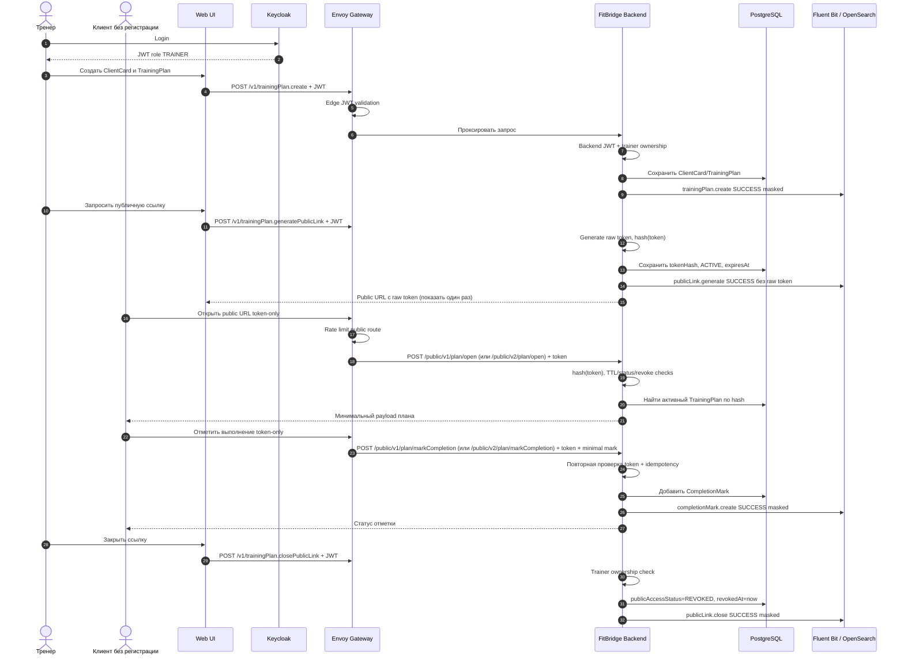

# Архитектура безопасности / модель угроз - FitBridge trainer-first MVP с публичной ссылкой

Документ фиксирует security baseline trainer-first MVP с публичной ссылкой на тренировочный план.

## 1. Статус и область действия

| Параметр | Значение |
|---|---|
| Статус | Целевой baseline безопасности MVP публичного доступа к плану |
| Область | Тренер как единственный зарегистрированный пользователь, `ClientCard`, `TrainingPlan`, public link, `CompletionMark`, закрытие ссылки |
| Не входит в MVP | Регистрация клиента, клиентский кабинет, `ClientProfile`, `Invite`, `AccessGrant`, granular permissions, multi-specialist, product `AuditEvent`, product `Notification`, in-product `ADMIN`/support UI |
| Связанные решения | [ADR-001 Keycloak](./ADR/ADR-001-use-keycloak.md), [ADR-002 POST Full API](./ADR/ADR-002-post-full-api.md), [ADR-005 PostgreSQL](./ADR/ADR-005-use-postgresql.md), [ADR-006 Observability](./ADR/ADR-006-use-opensearch-fluent-bit-observability.md), [ADR-007 публичный доступ к плану](./ADR/ADR-007-public-plan-link-mvp.md) |

Security scope MVP покрывает:

- аутентификацию тренера через Keycloak/OIDC;
- приватные trainer endpoints с JWT validation и проверкой ownership;
- публичные token-only endpoints для просмотра плана и отметки выполнения (`/public/v1/*` и `/public/v2/*`);
- lifecycle публичной ссылки: generate, hash-only storage, TTL, revoke/close, expired;
- защиту raw token, минимизацию публичного payload и masked logs;
- rate limiting публичных операций и безопасные generic errors;
- audit-oriented infrastructure logging без raw token и sensitive payload.

## 2. Акторы и модель доверия

| Актор / система | Доверие | Основные действия | Заметки по безопасности |
|---|---|---|---|
| `Trainer` | Зарегистрированный пользователь продукта | Создаёт `ClientCard`, `TrainingPlan`, генерирует/закрывает публичную ссылку, смотрит статус выполнения | Доступ только к собственным карточкам/планам; JWT + backend ownership check |
| `Client by public link` | Незарегистрированный внешний пользователь | Открывает публичную ссылку, видит минимальный план, оставляет `CompletionMark` | Нет аккаунта, JWT и `AccessGrant`; авторизация основана только на валидном capability-token |
| `Support/Ops operator` | Операционный актор вне продукта | Controlled runbook для пилота: допуск/блокировка тренера, расследование технических инцидентов по masked logs | Не product role; не читает raw token, содержимое плана, client notes или health-adjacent payload |
| `Keycloak` | Доверенный Identity Provider | Login тренера, OIDC/JWT | Не участвует в публичном клиентском доступе и не решает domain ownership |
| `FitBridge Backend` | Доверенная доменная система | POST Full API, token hash validation, ownership, запись данных | Единственный владелец public-link lifecycle и доменных проверок |
| `Envoy Gateway` | Инфраструктурный boundary | Маршрутизация приватного и публичного контуров, rate limiting, edge JWT для versioned private API (`/v1/*`, `/v2/*`) | Не заменяет backend-проверки token/ownership |
| `PostgreSQL` | Доверенное прикладное хранилище | Хранит user/trainer/card/plan/completion и token hash | Raw token не хранится |
| `OpenSearch / Dashboards` | Внешний observability-контур | Поиск masked logs | Не является application boundary; не получает raw token, URL с token, request body, план/комментарии |

## 3. Контуры доступа

### 3.1. Приватный trainer API

1. Тренер входит через Keycloak.
2. Web UI вызывает приватные `/v1/*` endpoints с `Authorization: Bearer <access_token>`.
3. Envoy проверяет JWT/JWKS на edge.
4. Backend независимо валидирует JWT/claims, находит `FITBRIDGE_USER`, проверяет `role=TRAINER`, `status=ACTIVE`.
5. Для каждой операции backend проверяет ownership: `ClientCard.trainerUserId == caller.id`, `TrainingPlan.trainerUserId == caller.id`.
6. Операции support/admin не получают broad bypass к domain API.

Минимальные проверки backend для каждого приватного `/v1/*` POST Full endpoint:

- `iss`, `aud`, `exp`, `nbf`, `iat` валидны;
- `sub` присутствует и связан с активным `FITBRIDGE_USER`;
- пользователь имеет trainer capability/profile;
- target resource принадлежит тренеру;
- raw payload не логируется.

### 3.2. Публичный API по ссылке

Публичный endpoint не требует JWT, но обязан быть token-only и deny-by-default:

1. Клиент открывает public URL с raw token.
2. Gateway применяет rate limiting до backend.
3. Backend не логирует URL/query/body с token.
4. Backend вычисляет hash token и ищет `TrainingPlan.publicAccessTokenHash`.
5. Backend проверяет `TrainingPlan.status=ACTIVE`, `publicAccessStatus=ACTIVE`, `publicAccessExpiresAt > now`, `publicAccessRevokedAt is null`.
6. Backend возвращает минимальный публичный payload без внутренних id и лишних данных карточки.
7. Для `CompletionMark` backend повторяет token validation, проверяет idempotency/rate limits и записывает отметку.

Запрещено для public endpoint:

- принимать `clientId`, `clientCardId`, `planId`, `trainerId` как параметры авторизации;
- возвращать внутренние id, заметки тренера, PII сверх минимального отображаемого имени/контекста;
- логировать raw token, полный URL, request body, комментарии клиента или содержимое плана.

## 4. Роли и claims

| Роль | Статус MVP | Назначение | Требование к policy |
|---|---|---|---|
| `TRAINER` | Единственная зарегистрированная product role MVP | Создание карточек, планов, ссылок и просмотр статусов | Роль из JWT — только предварительное условие; backend проверяет ownership ресурсов |
| `CLIENT` | Phase 2 / future | Клиентский аккаунт, client-owned профиль, управление доступами | Не требуется и не используется в MVP публичного доступа к плану |
| `ADMIN` / `SUPPORT` | Product role вне MVP | Полноценный product admin/support UI | Не используется в MVP domain API; эксплуатационные действия только через runbook без чтения sensitive payload |

## 5. Границы Keycloak и FitBridge Backend

| Область | Keycloak | FitBridge Backend |
|---|---|---|
| Регистрация и вход | Аутентифицирует тренера | Создаёт/связывает внутреннего trainer user |
| Клиент по ссылке | Не участвует | Проверяет capability-token hash/status/TTL/revoke |
| Токены тренера | Выпускает и подписывает JWT | Независимо валидирует claims для `/v1/*` |
| Public link token | Не владеет | Генерирует raw token, хранит hash, закрывает/истекает доступ |
| Доменные ресурсы | Не владеет | Хранит `ClientCard`, `TrainingPlan`, `CompletionMark` |
| Аудит | IAM-события тренера | Masked business/security events по ADR-006 |

## 6. Lifecycle публичной ссылки и security effects

| Событие | Security effect | Данные / доступы |
|---|---|---|
| `publicLink.generate` | Создаёт новый capability-token | Raw token возвращается тренеру один раз; в БД только hash, status, TTL |
| `publicPlan.open` | Проверяет capability-token | При успехе возвращает минимальный payload плана; при отказе generic unavailable/expired response |
| `publicPlan.markCompletion` | Проверяет token и записывает отметку | Создаёт `CompletionMark`; не создаёт клиентский аккаунт или grant |
| `publicLink.close` | Немедленно закрывает публичный доступ | `publicAccessStatus=REVOKED`, `publicAccessRevokedAt` заполнен; новые opens/marks запрещены |
| Истечение TTL | Закрывает публичный доступ по времени | `publicAccessStatus=EXPIRED` может выставляться lazy/job, но check обязан работать по timestamp |
| Архивация плана/карточки | Блокирует публичный доступ | Public endpoint не показывает архивные/удалённые ресурсы |

## 7. Минимизация данных и public payload

| Область | MVP правило |
|---|---|
| `ClientCard` | Минимум: отображаемое имя/псевдоним и технические статусы; без медданных, фото/видео, body metrics |
| `TrainingPlan` | Публично показывать только плановые задания, необходимые для выполнения; скрывать внутренние заметки и id |
| `CompletionMark` | Минимальный статус выполнения/пропуска, дата, опциональный короткий комментарий; raw comment не логируется |
| Token | Длинный random token; hash-only storage; raw token не писать в БД, логи, analytics, error traces |
| Errors | Generic messages: ссылка недоступна/истекла/закрыта; не раскрывать существование plan/card |

## 8. Rate limiting и abuse controls

| Контур | Минимальное правило MVP |
|---|---|
| Public open by token | Ограничение по IP/fingerprint и token hash; повышенные задержки/429 при подозрительном переборе |
| Public mark completion | Лимит частоты отметок по token hash и fingerprint; idempotency для повторного submit |
| Generate link | Лимит на trainer user, чтобы исключить массовую генерацию и случайные утечки |
| Close link | Низкий latency target; закрытие применяется на следующем запросе без кэша разрешения |

## 9. Audit и observability

Security events связаны с [ADR-006](./ADR/ADR-006-use-opensearch-fluent-bit-observability.md). В MVP используется infrastructure audit-oriented logging, а не продуктовый `AuditEvent` API.

Обязательные события MVP публичного доступа к плану:

- `trainer.login` / `trainer.authFailed` на уровне IAM/edge без sensitive payload;
- `clientCard.create`, `clientCard.update`, `clientCard.archive`;
- `trainingPlan.create`, `trainingPlan.update`, `trainingPlan.archive`;
- `publicLink.generate`, `publicLink.close`, `publicLink.expired`;
- `publicPlan.open` только агрегированно/masked; raw token и payload запрещены;
- `completionMark.create` без raw comment/plan content;
- `publicAccess.denied` с reason code (`EXPIRED`, `REVOKED`, `NOT_FOUND`, `RATE_LIMITED`) без token.

Минимальные поля: `timestamp`, `level`, `service`, `environment`, `requestId`, `actorType`, `trainerUserId` если есть, `action`, `entityType`, `entityId` или безопасный hash/id, `result`, `reasonCode`, `durationMs`. Raw payload и секреты запрещены.

## 10. Критичный поток: создание ссылки, открытие и закрытие

## 11. Модель угроз

| Угроза | Затронутые активы | Вероятность | Влияние | Митигация |
|---|---|---:|---:|---|
| Утечка raw public token через логи, analytics или referer | План клиента, отметки выполнения | Medium | High | Не логировать URL/query/body, hash-only storage, referrer-policy, masked logs |
| Brute force public token | Публичные планы | Low/Medium | High | Длинный random token, rate limiting, generic errors, мониторинг denied spikes |
| IDOR через подстановку `planId`/`clientId` | Чужие планы/карточки | Medium | High | Public endpoint token-only; приватные endpoints с ownership check |
| Ссылка остаётся доступной после revoke | План клиента | Medium | High | Проверять `publicAccessStatus`/`revokedAt` на каждый запрос; не кэшировать allow decision |
| Excessive public payload | PII/health-adjacent данные | Medium | High | Whitelist полей публичного ответа, запрет заметок/медданных/внутренних id |
| Duplicate completion submit | Искажённый статус выполнения | Medium | Medium | Idempotency key/fingerprint + ограничение повторов по token |
| Broken trainer ownership | Доступ тренера к чужой карточке/плану | Medium | High | Централизованный ownership guard, negative tests, фильтрация list/read по trainerUserId |
| Support/operator bypass | Раскрытие данных пилота | Low/Medium | High | Нет support domain API; runbook без чтения sensitive payload; masked logs only |
| OpenSearch exposure | Логи, технические id | Medium | High | Network isolation, auth, retention, запрет sensitive payload в логах |

## 12. Целевые требования безопасности MVP

| Требование | Риск, который закрывается | Целевое правило MVP |
|---|---|---|
| JWT для versioned private API | Неавторизованные trainer operations | Все приватные trainer endpoints (`/v1/*`, `/v2/*`) проходят edge и backend JWT validation |
| Token-only public API | IDOR и enumeration | Публичный контур принимает только raw token и не использует client/plan ids из запроса |
| Hash-only token storage | Утечка БД/логов | Raw token не хранится; в БД только hash и lifecycle metadata |
| TTL + revoke | Бессрочный доступ | Каждая ссылка имеет срок жизни и может быть закрыта тренером |
| Rate limiting | Перебор/abuse | Public open/mark ограничены по IP/fingerprint/token hash |
| Minimal payload | Утечка PII/health данных | Public response whitelist; no meddata/media/body metrics |
| Masked logs | Утечка через observability | No raw token, no plan body, no comment, no request body |
| Future isolation | Неверная модель прав | `AccessGrant`/client-owned concepts не смешиваются с public token MVP |

## 13. Последствия

**Positive:**

- Security baseline согласован с trainer-first MVP с публичной ссылкой и не требует клиентской регистрации.
- Capability-token модель явно ограничена техническим public access к плану.
- Guardrails raw token/hash/TTL/revoke/rate limit зафиксированы до реализации.

**Negative:**

- Public endpoint становится отдельным high-risk контуром и требует тщательных негативных тестов.
- Полноценный client-owned контроль и `AccessGrant` сознательно откладываются после MVP.

**Risks:**

- Если реализация начнёт передавать `planId` или `clientId` в публичный endpoint, появится IDOR-риск.
- Если логи будут использоваться для debugging raw payload, observability станет каналом утечки.
- Если TTL/revoke не будут проверяться на каждый public request, закрытие ссылки станет ненадёжным.
