# C4 Component - FitBridge Backend API

Диаграмма показывает целевое внутреннее устройство контейнера `FitBridge Backend API` для MVP. Компоненты отражают доменные контуры из требований и API-документации. Компонент ADMIN/support domain API в MVP отсутствует: пользовательские операции выполняют только `CLIENT` и `TRAINER`, а support/ops действия пилота остаются вне backend domain API. Блок repository ports на диаграмме является только визуальной группировкой per-entity портов; он не задаёт общий repository layer или общий repo-module на уровне сервиса.

```mermaid
C4Component
  title Диаграмма компонентов - FitBridge Backend API MVP

  Person(client, "Клиент", "Владелец профиля и истории")
  Person(trainer, "Тренер", "Работает с клиентом по разрешению")

  Container(webUi, "Web UI", "UI framework TBD", "Пользовательский интерфейс")
  Container(envoy, "Envoy Gateway", "Envoy", "Edge JWT validation для всех MVP /v1/* и маршрутизация")
  ContainerDb(appDb, "Application DB", "PostgreSQL", "Доменные данные MVP")
  System_Ext(keycloak, "Keycloak", "Identity Server")
  Container(logAgent, "Fluent Bit", "Fluent Bit", "Доставка логов")

  Container_Boundary(api, "FitBridge Backend API - Kotlin/Ktor") {
    Component(postFullRouter, "POST Full Router", "Ktor routing", "Единый вход для domain.action API")
    Component(authComponent, "Auth & Access Guard", "Ktor plugin / domain service", "Проверяет JWT, user context, роли CLIENT/TRAINER, AccessGrant и scopes; support bypass запрещён")
    Component(profileComponent, "Profile Component", "Kotlin service", "ClientProfile и TrainerProfile")
    Component(accessComponent, "Access Component", "Kotlin service", "Invite, AccessGrant, revoke, validateScope")
    Component(diaryComponent, "Diary Component", "Kotlin service", "TrainingEntry CRUD и поиск истории")
    Component(programComponent, "Program Component", "Kotlin service", "Program, Assignment, completeWorkout")
    Component(progressComponent, "Progress Component", "Kotlin service", "История клиента и статусы выполнения")
    Component(auditComponent, "Audit Logging Component", "Kotlin service", "Инфраструктурный аудит критичных событий")
    Component(repoPorts, "Per-entity Repository Ports (grouping only)", "Kotlin interfaces in each entities/{entity}/common", "Группировка портов конкретных сущностей; не общий repository layer")
  }

  Rel(client, webUi, "Работает с дневником, программами и доступами", "HTTPS")
  Rel(trainer, webUi, "Приглашает клиента и назначает планы", "HTTPS")
  Rel(webUi, envoy, "Отправляет POST Full запросы", "HTTPS/JSON")
  Rel(envoy, postFullRouter, "Проксирует /v1/* после edge JWT validation", "HTTP/JSON")
  Rel(postFullRouter, authComponent, "Проверяет пользователя и доступ независимо от Envoy", "JWT/scopes")
  Rel(authComponent, keycloak, "Валидирует JWT claims и user context", "OIDC/JWT")

  Rel(postFullRouter, profileComponent, "Вызывает profile.*")
  Rel(postFullRouter, accessComponent, "Вызывает access.*")
  Rel(postFullRouter, diaryComponent, "Вызывает diary.*")
  Rel(postFullRouter, programComponent, "Вызывает program.*")
  Rel(postFullRouter, progressComponent, "Вызывает dashboard/progress reads")

  Rel(profileComponent, repoPorts, "Вызывает per-entity порты профилей")
  Rel(accessComponent, repoPorts, "Вызывает per-entity порты invite/grant")
  Rel(diaryComponent, repoPorts, "Вызывает per-entity порты дневника")
  Rel(programComponent, repoPorts, "Вызывает per-entity порты программ")
  Rel(progressComponent, repoPorts, "Читает через per-entity порты истории и статусов")
  Rel(repoPorts, appDb, "Каждая реализация entities/{entity}/repo-pgjvm читает/пишет данные своей сущности", "JDBC/R2DBC TBD")

  Rel(profileComponent, auditComponent, "Логирует изменения профиля")
  Rel(accessComponent, auditComponent, "Логирует выдачу/отзыв доступа")
  Rel(diaryComponent, auditComponent, "Логирует изменения дневника")
  Rel(programComponent, auditComponent, "Логирует назначения и выполнения")
  Rel(auditComponent, logAgent, "Пишет маскированные события", "structured logs")

  UpdateLayoutConfig($c4ShapeInRow="3", $c4BoundaryInRow="1")
```

## Ответственность компонентов

| Компонент | Ответственность | Связь с RTM |
|---|---|---|
| POST Full Router | Маршрутизация `domain.action` endpoints, валидация request envelope и response envelope | `RTM-001`..`RTM-011` |
| Auth & Access Guard | Backend JWT/user-context validation, проверки ролей `CLIENT`/`TRAINER`, `AccessGrant`, scopes, deny by default и запрет support/admin broad bypass | `RTM-003`, `RTM-004`, `RTM-007`, `RTM-012`, `RTM-016` |
| Profile Component | Клиентские и тренерские профили, soft delete/archive, состояние онбординга | `RTM-001`, `RTM-002`, `RTM-012` |
| Access Component | Invites, accept/decline/revoke, active grant, list grants, validate scope | `RTM-003`, `RTM-004`, `RTM-011` |
| Diary Component | Записи дневника, soft delete, поиск и client-owned history | `RTM-005`, `RTM-008`, `RTM-010` |
| Program Component | Простые программы, назначения, self-assignment и отметка выполнения | `RTM-006`, `RTM-007`, `RTM-008` |
| Progress Component | Карточка клиента тренера, история клиента и проекции статусов выполнения | `RTM-009`, `RTM-010` |
| Audit Logging Component | Маскированные логи событий доступа, профилей, дневника и программ | `RTM-013` |
| Per-entity Repository Ports (grouping only) | Визуальная группировка repo-интерфейсов конкретных сущностей: каждый port/interface находится внутри соответствующего `entities/{entity}/common`; реализации размещаются только внутри того же контура сущности в `entities/{entity}/repo-*`, например `repo-pgjvm` или `repo-inmemory`; общего service-level repo-module/repository layer нет | `RTM-014` |

## Архитектурные ограничения MVP

- Диаграмма компонентов описывает целевое состояние Ktor backend для MVP.
- Репозитории моделируются только как per-entity ports/implementations: port/interface находится в `entities/{entity}/common`, реализации находятся в `entities/{entity}/repo-*`; общий repository layer на уровне сервиса отсутствует.
- Любой общий блок `Repository Ports` в C4 Component является только grouping/abstraction для читаемости диаграммы; проектировать по нему общий repo-layer, shared repository module или сервисный каталог `repo-*` запрещено.
- In-product ADMIN/support component, support console и granular operator roles не моделируются в MVP; controlled support operations выполняются через Keycloak/runbook вне domain API и не читают client profile/diary/training history/health-adjacent data.
- Продуктовый `AuditEvent` API остаётся Phase 2; MVP-компонент покрывает только infrastructure audit-oriented logging по ADR-006.
- Отдельный `Notification` API/provider не моделируется как MVP-компонент; статусы доступны через MVP pull-model read endpoints/dashboard.
