# C4 Component - FitBridge Backend API

Диаграмма показывает целевое внутреннее устройство контейнера `FitBridge Backend API` для MVP. Компоненты отражают доменные контуры из требований и API-документации; фактическая реализация backend-кода ещё не создана.

```mermaid
C4Component
  title Component Diagram - FitBridge Backend API MVP

  Person(client, "Клиент", "Владелец профиля и истории")
  Person(trainer, "Тренер", "Работает с клиентом по разрешению")

  Container(webUi, "Web UI", "HTML prototype now; UI framework TBD", "Пользовательский интерфейс")
  Container(envoy, "Envoy Gateway", "Envoy", "JWT-проверка и маршрутизация")
  ContainerDb(appDb, "Application DB", "PostgreSQL", "Доменные данные MVP")
  System_Ext(keycloak, "Keycloak", "Identity Server")
  Container(logAgent, "Fluent Bit", "Fluent Bit", "Доставка логов")

  Container_Boundary(api, "FitBridge Backend API - Kotlin/Ktor") {
    Component(postFullRouter, "POST Full Router", "Ktor routing", "Единый вход для domain.action API")
    Component(authComponent, "Auth & Access Guard", "Ktor plugin / domain service", "Проверяет JWT, роли, AccessGrant и scopes")
    Component(profileComponent, "Profile Component", "Kotlin service", "ClientProfile и TrainerProfile")
    Component(accessComponent, "Access Component", "Kotlin service", "Invite, AccessGrant, revoke, validateScope")
    Component(diaryComponent, "Diary Component", "Kotlin service", "TrainingEntry CRUD и поиск истории")
    Component(programComponent, "Program Component", "Kotlin service", "Program, Assignment, completeWorkout")
    Component(progressComponent, "Progress Component", "Kotlin service", "История клиента и статусы выполнения")
    Component(auditComponent, "Audit Logging Component", "Kotlin service", "Инфраструктурный аудит критичных событий")
    Component(repoPorts, "Repository Ports", "Kotlin interfaces", "Абстракции хранения доменных сущностей")
  }

  Rel(client, webUi, "Работает с дневником, программами и доступами", "HTTPS")
  Rel(trainer, webUi, "Приглашает клиента и назначает планы", "HTTPS")
  Rel(webUi, envoy, "Отправляет POST Full запросы", "HTTPS/JSON")
  Rel(envoy, postFullRouter, "Проксирует API", "HTTP/JSON")
  Rel(postFullRouter, authComponent, "Проверяет пользователя и доступ", "JWT/scopes")
  Rel(authComponent, keycloak, "Использует JWT claims", "OIDC/JWT")

  Rel(postFullRouter, profileComponent, "Вызывает profile.*")
  Rel(postFullRouter, accessComponent, "Вызывает access.*")
  Rel(postFullRouter, diaryComponent, "Вызывает diary.*")
  Rel(postFullRouter, programComponent, "Вызывает program.*")
  Rel(postFullRouter, progressComponent, "Вызывает dashboard/progress reads")

  Rel(profileComponent, repoPorts, "Сохраняет профили")
  Rel(accessComponent, repoPorts, "Сохраняет invite/grant")
  Rel(diaryComponent, repoPorts, "Сохраняет записи дневника")
  Rel(programComponent, repoPorts, "Сохраняет программы и назначения")
  Rel(progressComponent, repoPorts, "Читает историю и статусы")
  Rel(repoPorts, appDb, "Читает/пишет", "JDBC/R2DBC TBD")

  Rel(profileComponent, auditComponent, "Логирует изменения профиля")
  Rel(accessComponent, auditComponent, "Логирует выдачу/отзыв доступа")
  Rel(diaryComponent, auditComponent, "Логирует изменения дневника")
  Rel(programComponent, auditComponent, "Логирует назначения и выполнения")
  Rel(auditComponent, logAgent, "Пишет маскированные события", "structured logs")

  UpdateLayoutConfig($c4ShapeInRow="3", $c4BoundaryInRow="1")
```

## Component Responsibilities

| Component | Responsibilities | Related RTM |
|---|---|---|
| POST Full Router | `domain.action` endpoint routing, request validation envelope, response envelope | `RTM-001`..`RTM-011` |
| Auth & Access Guard | JWT extraction, role checks, `AccessGrant` and scope checks, deny by default | `RTM-003`, `RTM-004`, `RTM-007`, `RTM-012` |
| Profile Component | Client/trainer profiles, soft delete/archive, onboarding profile state | `RTM-001`, `RTM-002`, `RTM-012` |
| Access Component | Invites, accept/decline/revoke, active grant, list grants, validate scope | `RTM-003`, `RTM-004`, `RTM-011` |
| Diary Component | Training entries, soft delete, search and client-owned history | `RTM-005`, `RTM-008`, `RTM-010` |
| Program Component | Simple programs, assignments, self-assignment, workout completion | `RTM-006`, `RTM-007`, `RTM-008` |
| Progress Component | Trainer client card, client history, completion status projections | `RTM-009`, `RTM-010` |
| Audit Logging Component | Masked logs for access, profile, diary and program events | `RTM-013` |
| Repository Ports | Persistence abstractions for PostgreSQL-backed repositories | `RTM-014` |

## Заметки по реализации

- Диаграмма компонентов описывает целевое состояние и направляет будущую реализацию Ktor backend.
- Продуктовый `AuditEvent` API остаётся Phase 2; MVP-компонент покрывает только infrastructure audit-oriented logging по ADR-006.
- Отдельный `Notification` API/provider не моделируется как MVP-компонент; статусы доступны через pull-model read endpoints/dashboard.
