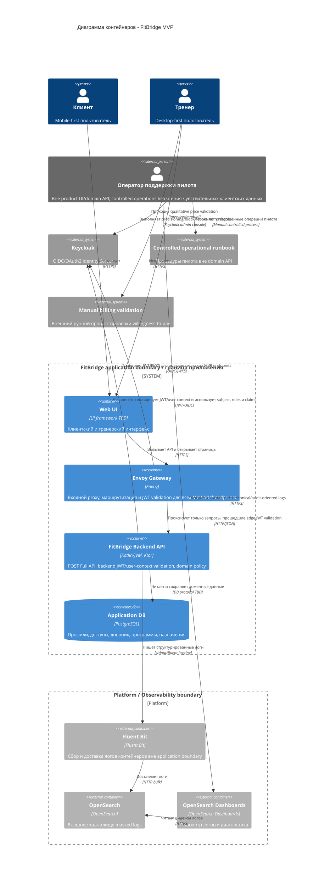

# C4 Container / Контейнеры - FitBridge

Диаграмма показывает контейнеры MVP и границы ответственности. Политики безопасности, API-контракты и ERD описаны в канонических документах: [Security](../SECURITY_ARCHITECTURE.md), [API](../02-api.md), [ERD](../ERD.md).

## Ответственность контейнеров

| Контейнер | Целевая ответственность MVP |
|---|---|
| Web UI | Пользовательский интерфейс клиента и тренера; ADMIN/support UI отсутствует |
| Envoy Gateway | Маршрутизация всех MVP `/v1/*` endpoints и обязательная JWT validation на edge/proxy layer |
| FitBridge Backend API | Ktor backend с Profile, Access, Diary, Program, Progress, Auth и Audit Logging; независимо проверяет JWT/user context и owner/grant/scope policy |
| Application DB | PostgreSQL storage для доменных данных MVP |
| Keycloak | Identity provider для пользователей, ролей и JWT |
| Controlled operational runbook | Внешний процесс пилота без доступа к domain API и sensitive payload |
| Fluent Bit / OpenSearch / Dashboards | Platform/observability-контур вне application boundary; принимает только masked structured logs |

## Канонические ссылки

| Тема | Источник |
|---|---|
| JWT, roles, support boundary, threat model | [SECURITY_ARCHITECTURE.md](../SECURITY_ARCHITECTURE.md) |
| Модель данных и ограничения | [ERD.md](../ERD.md) |
| API-поверхность и лимиты | [02-api.md](../02-api.md), [api/06](../api/06-metrics-and-limits.md) |
| Observability-стек | [ADR-006](../ADR/ADR-006-use-opensearch-fluent-bit-observability.md) |

## Открытые решения

- UI framework.
- API contract format beyond markdown: OpenAPI/JSON Schema/error model.
- Production deployment platform.
