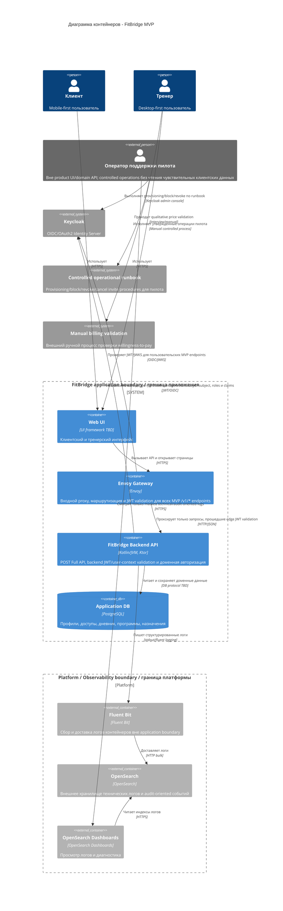

# C4 Container - FitBridge

Диаграмма показывает целевой контейнерный состав MVP FitBridge и явно разделяет application boundary, platform/observability boundary и операционное сопровождение пилота. OpenSearch используется FitBridge для логов, но не является частью приложения FitBridge. In-product `ADMIN`/support UI и support domain API не входят в MVP.

## Целевые обязанности контейнеров

| Container | Целевая ответственность MVP |
|---|---|
| Web UI | Пользовательский интерфейс клиента и тренера; in-product ADMIN/support UI в MVP отсутствует |
| Envoy Gateway | Маршрутизация всех MVP `/v1/*` endpoints и обязательная JWT validation на edge/proxy layer |
| FitBridge Backend API | Ktor backend с Profile, Access, Diary, Program, Progress, Auth и Audit Logging capability; независимо проверяет JWT/user context и owner/grant/scope policy |
| Application DB | PostgreSQL storage для доменных данных MVP |
| Keycloak | Identity provider для пользователей, ролей и JWT |
| Controlled operational runbook | Внешний процесс пилота для provisioning/block/revoke/cancel invite действий без доступа к domain API и sensitive payload |
| Fluent Bit / OpenSearch / Dashboards | Platform/observability-контур вне application boundary; принимает только masked structured logs |

## Открытые решения

- UI framework.
- API contract format beyond markdown: OpenAPI/JSON Schema/error model.
- Production deployment platform.
