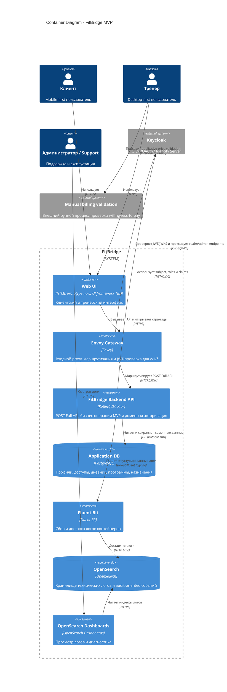

# C4 Container - FitBridge

Диаграмма показывает целевой контейнерный состав MVP и текущий transition-state. В репозитории уже есть локальный стенд `deploy/docker-compose.yml` со статическим Nginx-прототипом, Envoy, Keycloak, OpenSearch, Dashboards и Fluent Bit. Ktor backend и прикладное хранилище пока являются целевой частью архитектуры и требуют реализации.

## Container Status

| Container | Current state | Target MVP state |
|---|---|---|
| Web UI | Static HTML prototype under `deploy/volumes/nginx/html` | Product UI, framework TBD |
| Envoy Gateway | Present in `deploy/volumes/envoy/envoy.yaml` | Routes all MVP `/v1/*` POST Full endpoints and validates JWT |
| FitBridge Backend API | Placeholder `fit-bridge-be-tmp` prints `Hello` | Ktor backend with Profile, Access, Diary, Program and Progress capabilities |
| Application DB | Target-state | PostgreSQL storage for MVP domain data |
| Keycloak | Present in local compose with imported realm | Identity provider for users, roles and JWT |
| Fluent Bit / OpenSearch / Dashboards | Present in local compose | Observability and infrastructure audit-oriented logging |

## Open Decisions

- UI framework.
- API contract format beyond markdown: OpenAPI/JSON Schema/error model.
- Production deployment platform.
