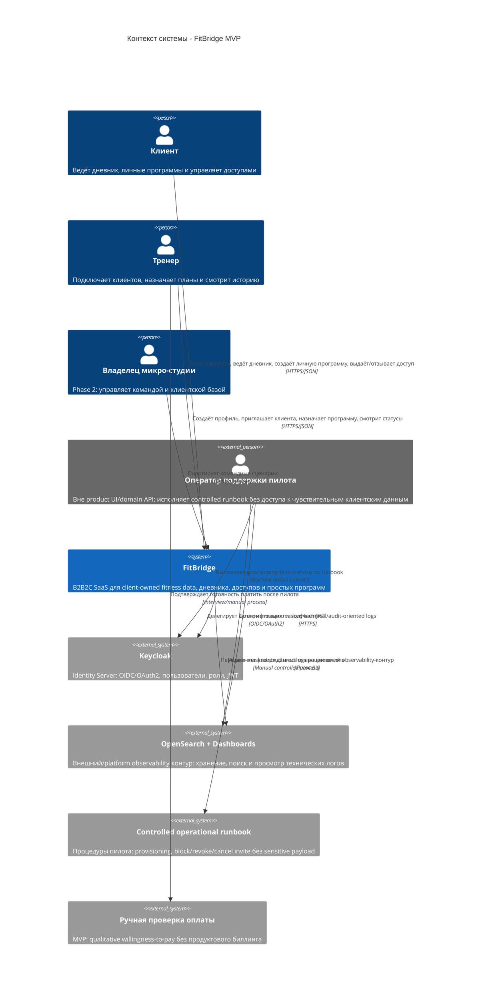

# C4 Context - FitBridge

Диаграмма показывает FitBridge как приложение в окружении пользователей, IAM, внешних бизнес-процессов, операционного сопровождения пилота и платформенного observability-контура. Уровень отражает целевой MVP: два полноценных пути `Trainer-led` и `Solo-client (PLG)`; in-product `ADMIN`/support роль и support console не входят в MVP.

## Scope

| Входит в MVP | За пределами MVP |
|---|---|
| Регистрация клиента и тренера | Полноценный multi-specialist production-сценарий |
| Solo-client дневник и личная программа | Командный тариф студии |
| Trainer-led приглашение, доступ, назначение плана | Встроенный биллинг и автоплатежи |
| Controlled operational runbook/provisioning пилота через Keycloak без product ADMIN роли | In-product ADMIN/support UI, support console, granular operator roles |
| Базовая история, статусы выполнения и pull-model UI статусы | Отдельный `Notification` API/provider для Phase 2 |
| Инфраструктурное логирование критичных событий через ADR-006 | Продуктовый `AuditEvent` API для Phase 2 |

## Notes

- Keycloak отвечает за IAM, но доменная авторизация доступа к клиентским данным остаётся внутри FitBridge.
- Domain API FitBridge остаётся `CLIENT`/`TRAINER` only; support/operator не является участником MVP domain API и не получает broad bypass.
- Операционные действия пилота (`block user`, revoke/cancel invite edge cases, privacy/deletion support actions) выполняются через Keycloak + runbook и логируются без client profile/diary/training history/health-adjacent payload.
- OpenSearch используется FitBridge как внешний/platform observability-контур и не входит в application boundary FitBridge.
- Отдельный notification-контур не входит в MVP: статусы читаются из MVP endpoints/dashboard.
- Ручная проверка оплаты относится к бизнес-процессу MVP и не требует backend API.
