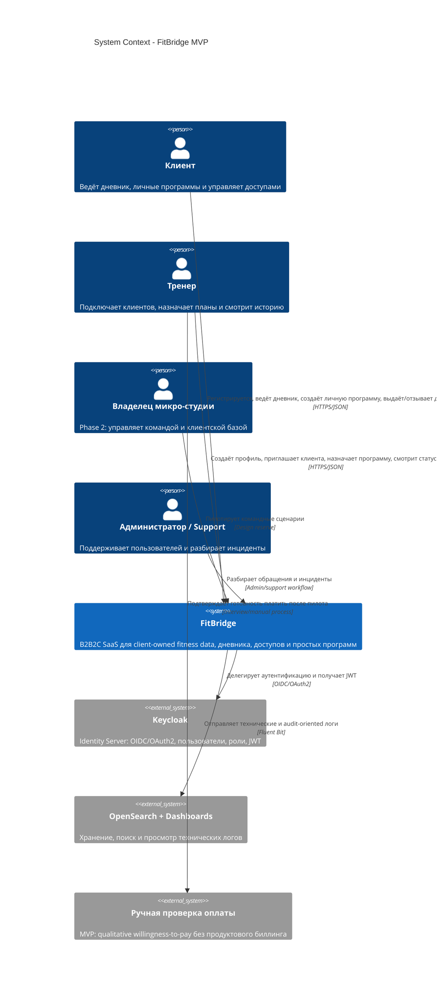

# C4 Context - FitBridge

Диаграмма показывает FitBridge как систему в окружении пользователей и внешних инфраструктурных сервисов. Уровень отражает целевой MVP: два полноценных пути `Trainer-led` и `Solo-client (PLG)`.

## Scope

| Входит в MVP | За пределами MVP |
|---|---|
| Регистрация клиента и тренера | Полноценный multi-specialist production-сценарий |
| Solo-client дневник и личная программа | Командный тариф студии |
| Trainer-led приглашение, доступ, назначение плана | Встроенный биллинг и автоплатежи |
| Базовая история и статусы выполнения | Отдельный Notification API |
| Инфраструктурное логирование критичных событий | Расширенный AuditEvent API |

## Notes

- Keycloak отвечает за IAM, но доменная авторизация доступа к клиентским данным остаётся внутри FitBridge.
- OpenSearch используется как инфраструктурный контур логирования; продуктовый аудит `AuditEvent` перенесён в Phase 2.
- Ручная проверка оплаты относится к бизнес-процессу MVP и не требует backend API.
