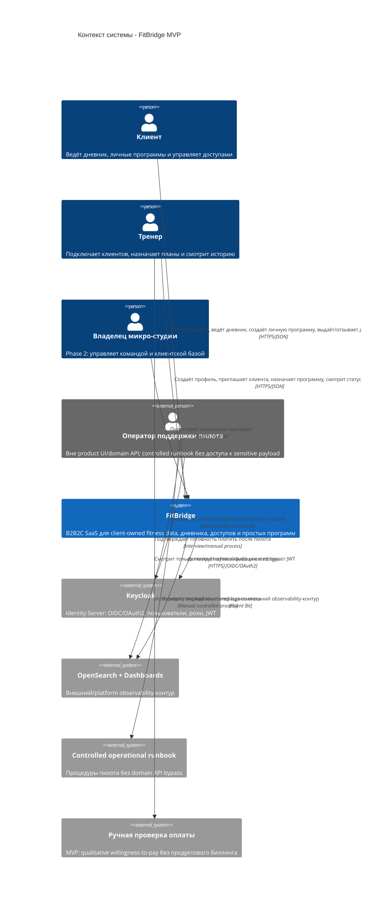

# C4 Context / Контекст системы - FitBridge

Диаграмма фиксирует границы системы и внешних акторов MVP. Подробные правила доступа, данных и аудита не дублируются здесь: см. [Security Architecture](../SECURITY_ARCHITECTURE.md), [ERD](../ERD.md), [API index](../02-api.md) и [ADR-006](../ADR/ADR-006-use-opensearch-fluent-bit-observability.md).

## Scope MVP

| Входит в MVP | За пределами MVP |
|---|---|
| Регистрация клиента и тренера | Полноценный multi-specialist production-сценарий |
| Solo-client дневник и личная программа | Командный тариф студии |
| Trainer-led приглашение, доступ, назначение плана | Встроенный биллинг и автоплатежи |
| Controlled operational runbook через Keycloak без product `ADMIN` роли | In-product ADMIN/support UI, support console, granular operator roles |
| Базовая история, статусы выполнения и pull-model UI статусы | Отдельный `Notification` API/provider для Phase 2 |
| Инфраструктурное логирование критичных событий через ADR-006 | Продуктовый `AuditEvent` API |

## Ответственность и ссылки

| Тема | Канонический источник |
|---|---|
| Политика доступа, роли, JWT, граница support | [SECURITY_ARCHITECTURE.md](../SECURITY_ARCHITECTURE.md) |
| Данные и статусы `Invite`/`AccessGrant` | [ERD.md](../ERD.md) |
| API MVP и pull-model статусы | [../02-api.md](../02-api.md) |
| Внешний/platform observability-контур | [ADR-006](../ADR/ADR-006-use-opensearch-fluent-bit-observability.md) |
