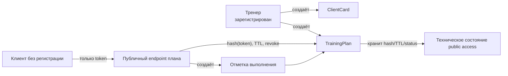

# Вариант A: Публичный доступ к плану через capability-token

> **Статус: DEFERRED / Phase 2 proposal.** Возможность не входит в текущий trainer-only MVP, не является утверждённым ADR и не должна присутствовать в runtime или OpenAPI до отдельного решения по scope и threat model.

## Архитектура

## Реализация

- Приватный trainer API остаётся под `/v1/*`, JWT validation и ownership check тренера.
- Публичный endpoint принимает только raw token из ссылки; `clientId`, `planId`, `clientCardId` не передаются в URL/API.
- Backend вычисляет hash token, ищет активный `TrainingPlan`, проверяет `publicAccessStatus`, TTL, revoke и rate limits.
- В БД хранится только `publicAccessTokenHash`; raw token показывается тренеру один раз при генерации ссылки и запрещён в логах.
- Публичный payload минимален: только данные плана, необходимые для выполнения, и безопасный статус доступности.
- Отметка выполнения записывается как дочерний объект/value object `TrainingPlan`; при необходимости отдельная таблица остаётся технической оптимизацией.

## Параметры для ADR

| Параметр | Значение | Источник |
|-----------|-------|--------|
| Регистрация клиента | Не требуется для этого варианта | Future scope decision |
| Хранение token | Только hash | Security guardrail BR-009 |
| Идентификаторы public URL | Только token, без `clientId`/`planId` | Требование proposal |
| Lifecycle доступа | `ACTIVE`, `REVOKED`, `EXPIRED` внутри `TrainingPlan` public-access state | ERD |
| Payload scope | Минимальный план + форма отметки | BR-009 |
| Future compatibility | Путь к `ClientProfile`/`Invite`/`AccessGrant` сохранён | PRODUCT_ROADMAP |

## Плюсы

- Максимально короткий time-to-first-plan-link для тренера.
- Клиент открывает план без регистрации и установки приложения.
- Не требует преждевременно строить `AccessGrant`, client-owned профиль и кабинет клиента.
- Capability-token модель может сократить friction будущего пилота клиентского доступа и сохраняет понятный revoke/TTL lifecycle.
- Может стать отдельным экспериментом только после проверки trainer-only B2B-ценности.

## Минусы

- Клиент не владеет историей и не управляет доступами в MVP.
- Публичная ссылка требует строгих guardrails: hash-only, TTL, revoke, rate limiting, no raw token logs.
- Нужно ограничить payload, иначе public-link контур станет каналом утечки данных.
- Позже потребуется отдельная миграция к client-owned модели, а не прямое расширение token в grant.
