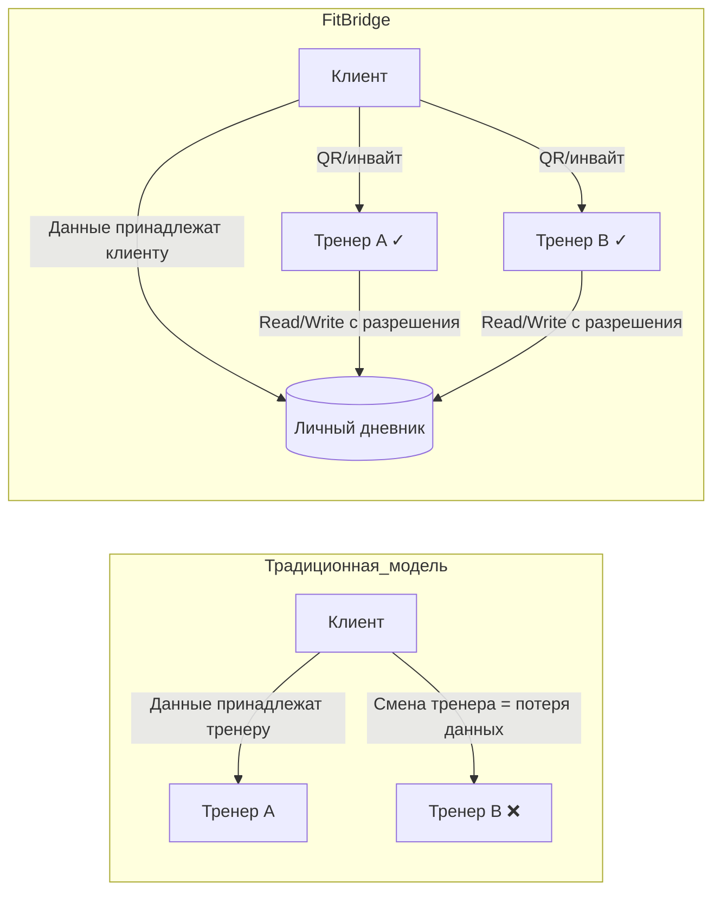

# FitBridge Business Vision Document

## 1. Product Overview

**FitBridge** — вертикальная CRM-платформа для независимых фитнес-тренеров и их клиентов, построенная на базе экосистемы Kotlin.

### Проблема

Независимые персональные тренеры и их клиенты застряли между двумя радикально разными мирами:

1. **Клиентские fitness-приложения** (MyFitnessPal, Strong, Hevy) — отличные для записи тренировок, но полностью изолированы от тренера. Тренер не видит данные клиента, не может анализировать прогресс, не может скорректировать программу удалённо.

2. **Тренерские платформы** (Trainerize, TrueCoach, PTminder) — дают тренеру пульт управления, но клиентский опыт вторичен. Клиент обязан работать в «песочнице» тренера, все данные привязаны к конкретному специалисту. При смене тренера — теряется история.

3. **Нет ownership данных у клиента** — это фундаментальная проблема индустрии. Клиент инвестирует месяцы и годы в заполнение тренировочного дневника, а при смене тренера или платформы — все данные исчезают.

### Решение

FitBridge решает проблему через **двойную архитектуру**:

| Аспект | Для клиента (Free) | Для тренера (Subscription) |
|--------|-------------------|---------------------------|
| Ядро | Личный дневник тренировок | Пульт управления клиентами |
| Данные | Принадлежат пользователю | Доступ по разрешению клиента |
| Модель | Product-Led Growth | SaaS-подписка |
| Ключевое действие | Записать тренировку | Получить доступ к данным клиента |

### Ценностное предложение (Value Proposition)

**Для клиента:**
> «Твой тренировочный дневник — навсегда. Твои данные — тебе. Тренер видит только то, что ты разрешишь. Один профиль — сколько угодно тренеров.»

**Для тренера:**
> «Профессиональный пульт управления клиентами в одном окне. Клиенты приходят к вам уже с историей — вы не начинаете с нуля. Smart-уведомления помогут не пропустить проблемы.»

### Уникальный дифференциатор

---

## 2. Business Goals

### Стратегические цели (3 года)

| # | Цель | Метрика успеха | Срок |
|---|------|---------------|------|
| G1 | Запуск MVP и валидация PLG-модели | 10 000 бесплатных пользователей за 6 месяцев | Q4 2026 |
| G2 | Конверсия free → paid тренеров | 8% конверсия в платные аккаунты | Q2 2027 |
| G3 | Выход на операционную безубыточность | MRR покрывает операционные расходы | Q4 2027 |
| G4 | Масштабирование на целевые рынки | Выход на 3+ рынка (RU, EU, SEA) | Q2 2028 |

### Тактические цели (1 год)

| # | Цель | KPI | Срок |
|---|------|-----|------|
| T1 | Запуск beta-версии с фичей Smart Log | 1 000 активных клиентов за 1 месяц | Q3 2026 |
| T2 | Привлечение первых платящих тренеров | 100 платящих тренеров | Q4 2026 |
| T3 | Валидация viral loop (клиент → тренер) | 70% тренеров приходят от клиентов | Q1 2027 |

---

## 3. Market Size

### TAM (Total Addressable Market)

**Глобальный рынок fitness-приложений:** $14.7 млрд (2023) → прогноз $30+ млрд к 2030 году (CAGR ~14.2%).

- Источник: Grand View Research, MarketsandMarkets, Fortune Business Insights
- Включает все fitness/wellness-приложения, включая B2C (дневники тренировок), B2B (CRM для тренеров), и гибридные решения

### SAM (Serviceable Addressable Market)

**Рынок CRM/управленческих платформ для фитнес-тренеров:** ~$2.0–2.5 млрд (2024).

- Оценка: сегмент fitness-приложений, нацеленных на профессиональных тренеров и small studios
- Ключевые игроки: Trainerize (принадлежит Xplor Technologies), TrueCoach (входит в Xplor), PTminder (входит в Xplor), Everfit, Zen Planner, Mindbody
- Рынок растёт со скоростью CAGR 15–18%

### SOM (Serviceable Obtainable Market)

**Независимые персональные тренеры (solo trainers) в целевых регионах:** ~$50–80 млн ARR (к 3-му году).

| Параметр | Оценка |
|----------|--------|
| Количество независимых тренеров в мире | ~8–10 млн (BLS: ~350 000 в США, ~1.5 млн в ЕС, ~5+ млн в Азии/ЛА) |
| Доля использующих софт для управления клиентами | ~15–25% (рост с 2020) |
| Средний ARPU тренера | $30–60/мес (по данным конкурентов) |
| Целевой охват (3 года) | 50 000 платящих тренеров |
| Целевой ARPU | $35/мес |
| Расчётный SOM | 50 000 × $35 × 12 = **$21 млн ARR** |

---

## 4. Key Metrics

### Северная звёздочка (North Star Metric)

**Количество завершённых тренировок клиентами, связанные с платящим тренером**

Эта метрика отражает:
- Активность клиентов (product engagement)
- Ценность для тренера (кому он платит)
- Сетевой эффект (больше клиентов → больше тренеров → больше ценности)

### Ключевые метрики по этапам

#### Phase 1: Launch (Месяцы 1–6)

| Метрика | Цель | Метод отслеживания |
|---------|------|-------------------|
| MAU клиентов | 10 000 | Аналитика приложения |
| Регистрации тренеров | 500 | CRM-панель |
| DAU/MAU (липкость) | > 25% | Cohort анализ |
| Среднее количество тренировок на пользователя в неделю | > 3 | Аналитика |
| Конверсия Free → Trainer View | > 5% | Воронка |

#### Phase 2: Growth (Месяцы 7–18)

| Метрика | Цель | Метод отслеживания |
|---------|------|-------------------|
| Платящие тренеры | 2 000 | Stripe/billing |
| MRR | $70K | Финансовая отчётность |
| Churn rate тренеров (monthly) | < 5% | Billing analytics |
| Количество клиентов на тренера | > 8 | CRM-аналитика |
| Viral coefficient (клиент приглашает тренера) | > 0.3 | Реферальный трекинг |

#### Phase 3: Scale (Месяцы 19–36)

| Метрика | Цель | Метод отслеживания |
|---------|------|-------------------|
| Платящие тренеры | 50 000 | Billing |
| ARR | $21M | Финансовая отчётность |
| LTV/CAC | > 3:1 | Unit economics |
| Net Revenue Retention | > 100% | Subscription analytics |
| NPS тренеров | > 50 | Опросы |

---

## 5. Стратегические риски и митигация

| Риск | Вероятность | Влияние | Митигация |
|------|------------|---------|-----------|
| Trainerize/TrueCoach добавляют client-side данные | Высокая | Критичное | Конкурировать на UX дизайна дневника и data ownership; первый ход → преимущество |
| Низкая конверсия free → paid | Средняя | Критичное | A/B тесты onboarding; ценностная стена (аналитика — только для платящих) |
| Сложность viral loop (клиент → тренер) | Средняя | Высокое | Геймификация инвайт-механики; шаблоны программ от инфлюенсеров |
| Регуляторные требования (GDPR, HIPAA) | Средняя | Высокое | Privacy by design с первого дня |
| Техническая сложность двухсторонней платформы | Средняя | Высокое | Kotlin Multiplatform для единой кодовой базы; итеративная разработка |

---

## 6. Ключевые гипотезы для валидации

| # | Гипотеза | Способ валидации | Критерий успеха |
|---|----------|-----------------|----------------|
| H1 | Клиенты хотят владеть своими данными и готовы менять платформу | Лендинг + waitlist; интервью 50+ фитнес-энтузиастов | > 30% подписываются на waitlist |
| H2 | Тренеры готовы платить $30-50/мес за доступ к данным клиентов | Пресейл; интервью 30+ тренеров | > 20% готовы предзаказать |
| H3 | Клиенты будут приглашать своих тренеров на платформу | A/B тест реферального флоу | Viral coefficient > 0.3 |
| H4 | Smart Analytics (уведомления о пропусках/плато) — killer feature для тренеров | Фичер-флаг + когортный анализ | > 60% тренеров используют аналитику еженедельно |

---

_Документ создан: 2026-04-29 | Использован шаблон: .opencode/templates-docs/BUSINESS_VISION-template.md_
