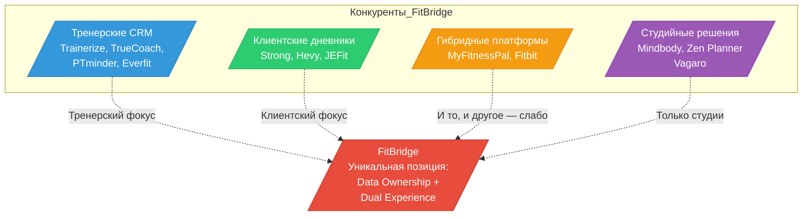
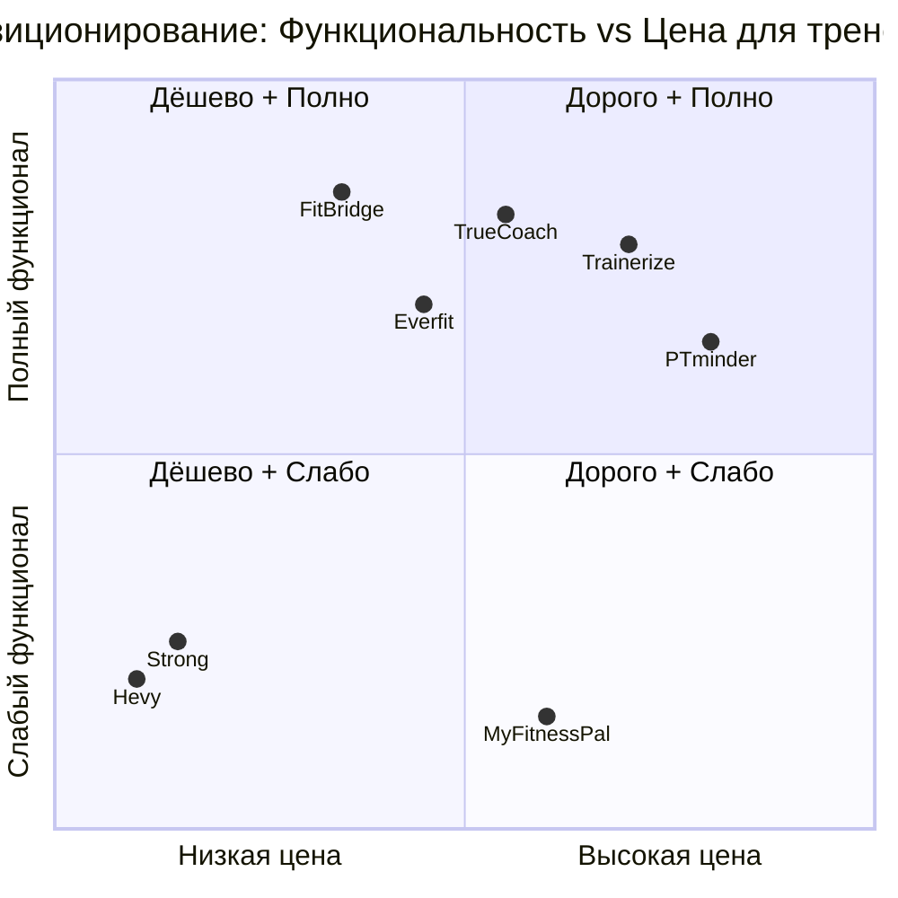
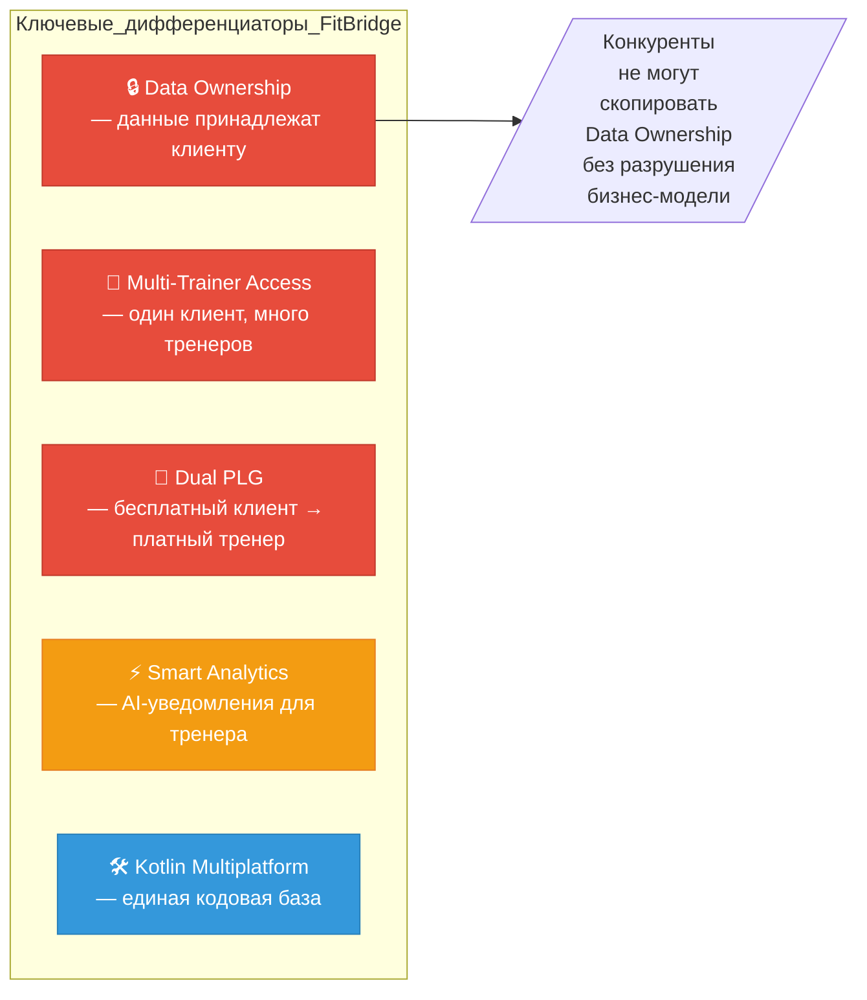

# FitBridge — Конкурентный анализ (Competitive Analysis)

## 1. Обзор конкурентов

### 1.1 Категории конкурентов

---

## 2. Детальный анализ конкурентов

### 2.1 Trainerize

| Параметр | Описание |
|----------|----------|
| **Компания** | Xplor Technologies (acquired 2020) |
| **Штаб-квартира** | Ванкувер, Канада |
| **Целевая аудитория** | Персональные тренеры, small studios, online-коучи |
| **Ценообразование** | Free (1 клиент) → $5/мес (до 2 кл.) → $15/мес (до 5 кл.) → $39/мес (до 15 кл.) → $99/мес (до 50 кл.) → $200/мес (до 200 кл.) |
| **Ключевые фичи** | Program Builder, Habit Tracking, Messaging, Automated Payments, Branded App, Wearables |
| **Сильные стороны** | Широкая функциональность; брендированное приложение; большой video library; интеграция Stripe; часть экосистемы Xplor |
| **Слабые стороны** | Устаревший UI; данные принадлежат тренеру; клиент не может использовать приложение без тренера; сложный onboarding |
| **Пользователи** | ~100 000 тренеров (оценка) |
| **Рейтинг G2** | 4.5/5 |

### 2.2 TrueCoach (бывш. Fitbot)

| Параметр | Описание |
|----------|----------|
| **Компания** | Xplor Technologies (acquired 2020) |
| **Штаб-квартира** | Остин, Техас, США |
| **Целевая аудитория** | Силовые тренеры, CrossFit-коучи, online-коучи |
| **Ценообразование** | Starter $26/мес (5 кл.) → Standard $58/мес (20 кл.) → Pro $137/мес (50 кл.) |
| **Ключевые фичи** | Program Builder, Video Library (3000+), Nutrition/Habit Tracking, Client Dashboard, Automated Payments, Public Coach Profiles, Custom Branded App, Wearables |
| **Сильные стороны** | Хороший UX; Public Coach Profiles (SEO); wearables integration; Zapier automations |
| **Слабые стороны** | Данные принадлежат тренеру; ограниченная кастомизация; нет полноценного дневника для клиента (без тренера) |
| **Пользователи** | ~30 000 тренеров (оценка) |
| **Рейтинг G2** | 4.7/5 |

### 2.3 PTminder

| Параметр | Описание |
|----------|----------|
| **Компания** | Xplor Technologies (acquired 2019) |
| **Штаб-квартира** | Австралия |
| **Целевая аудитория** | Персональные тренеры (offline-фокус) |
| **Ценообразование** | $59/мес (50 кл.) → $89/мес (100 кл.) → $119/мес (150 кл.) → $149/мес (200 кл.) → $209/мес (Unlimited) |
| **Ключевые фичи** | Calendar/Scheduling, Client Management, Workout & Nutrition Planner, Payments & Invoicing, Reporting, Branded App ($40/мес) |
| **Сильные стороны** | Сильный оффлайн-фокус; бронирование и расписание; интеграция с несколькими платёжными системами |
| **Слабые стороны** | Устаревший интерфейс; слабая analytics; нет client-side дневника; высокая минимальная цена ($59/мес) |
| **Пользователи** | ~20 000 тренеров (оценка) |
| **Рейтинг G2** | 4.3/5 |

### 2.4 Everfit

| Параметр | Описание |
|----------|----------|
| **Компания** | Независимая (Гонконг/США) |
| **Целевая аудитория** | Online-коучи, функциональный фитнес |
| **Ценообразование** | Starter $20/мес (5 кл.) → Pro $40/мес (15 кл.) → Premium $80/мес (40 кл.) → Elite $180/мес (100 кл.) |
| **Ключевые фичи** | Program Builder, Video Library, Progress Tracking, Messaging, Habit Tracking, Billing, Custom Branding |
| **Сильные стороны** | Конкурентная цена; хороший mobile UX; гибкие планы |
| **Слабые стороны** | Меньшая библиотека упражнений; ограниченная интеграция с wearables; нет client-side standalone |
| **Пользователи** | ~10 000 тренеров (оценка) |
| **Рейтинг Capterra** | 4.6/5 |

### 2.5 Strong (дневник тренировок)

| Параметр | Описание |
|----------|----------|
| **Компания** | Независимая (Канада) |
| **Целевая аудитория** | Фитнес-энтузиасты (B2C) |
| **Ценообразование** | Freemium: Free (ограниченно) → Pro $5/мес или $35/год |
| **Ключевые фичи** | Workout Logger, Progress Graphs, 1RM Calculator, Exercise Library, RPE tracking, Super Sets |
| **Сильные стороны** | Отличный UX; быстрый ввод данных; мощная аналитика для клиента; App Store rating 4.8 |
| **Слабые стороны** | Нет тренерского функционала; нет связи с тренером; только сила/кроссфит; нет nutrition |
| **Пользователи** | ~5 млн загрузок (оценка) |
| **Рейтинг App Store** | 4.8/5 |

### 2.6 Hevy (дневник тренировок)

| Параметр | Описание |
|----------|----------|
| **Компания** | Независимая |
| **Целевая аудитория** | Фитнес-энтузиасты, power lifters (B2C) |
| **Ценообразование** | Freemium: Free → Pro $6/мес |
| **Ключевые фичи** | Workout Logger, Social Feed, Progress Charts, Program Templates, RPE |
| **Сильные стороны** | Социальная лента; программа тренировок; чистый UI |
| **Слабые стороны** | Нет тренерского функционала; ограниченная кастомизация |
| **Пользователи** | ~3 млн загрузок (оценка) |
| **Рейтинг App Store** | 4.8/5 |

### 2.7 MyFitnessPal (дневник питания)

| Параметр | Описание |
|----------|----------|
| **Компания** | Francisco Partners (ранее Under Armour) |
| **Целевая аудитория** | Широкая B2C (питание + фитнес) |
| **Ценообразование** | Free → Premium $20/мес или $80/год |
| **Ключевые фичи** | Calorie Tracking, Barcode Scanner, Recipe Import, Exercise Logging, Integrations |
| **Сильные стороны** | Крупнейшая база продуктов (14+ млн); огромное сообщество; интеграция с тренерскими платформами |
| **Слабые стороны** | Слабый тренировочный дневник; нет тренерского фокуса; privacy scandal 2018 |
| **Пользователи** | ~200 млн зарегистрированных |
| **Рейтинг App Store** | 4.5/5 |

---

## 3. Сравнительная таблица фич

| Фича | FitBridge | Trainerize | TrueCoach | PTminder | Everfit | Strong | Hevy |
|------|-----------|-----------|-----------|----------|---------|--------|------|
| **Клиентский дневник (standalone)** | ✅ Полный | ❌ Нет | ❌ Нет | ❌ Нет | ❌ Нет | ✅ Полный | ✅ Полный |
| **Data Ownership (клиент)** | ✅ Да | ❌ Нет | ❌ Нет | ❌ Нет | ❌ Нет | ✅ Да | ✅ Да |
| **Мульти-тренер доступ** | ✅ Да | ❌ Нет | ❌ Нет | ❌ Нет | ❌ Нет | ❌ Нет | ❌ Нет |
| **QR/инвайт доступ** | ✅ Да | ❌ Нет | ❌ Нет | ❌ Нет | ❌ Нет | ❌ Нет | ❌ Нет |
| **Smart Log** | ✅ Да | ⚠️ Базовый | ⚠️ Базовый | ⚠️ Базовый | ⚠️ Базовый | ✅ Да | ✅ Да |
| **Progress Tracking** | ✅ Графики + 1ПМ | ✅ Базовый | ✅ Базовый | ✅ Базовый | ✅ Базовый | ✅ Полный | ✅ Полный |
| **Program Builder** | ✅ Да | ✅ Да | ✅ Да | ✅ Да | ✅ Да | ⚠️ Шаблоны | ⚠️ Шаблоны |
| **Client Dashboard** | ✅ Полный | ✅ Полный | ✅ Полный | ✅ Полный | ✅ Полный | ❌ Нет | ❌ Нет |
| **Smart Analytics** | ✅ Уведомления | ⚠️ Базовые | ⚠️ Базовые | ❌ Нет | ✅ Да | ⚠️ Графики | ⚠️ Графики |
| **Billing Management** | ✅ Stripe | ✅ Stripe | ✅ Stripe | ✅ Multi | ✅ Stripe | ❌ Нет | ❌ Нет |
| **Branded App** | ⚠️ Дорожная карта | ✅ Да | ✅ Да | ✅ $40/мес | ✅ Да | ❌ Нет | ❌ Нет |
| **Wearables** | ⚠️ Дорожная карта | ✅ Apple, Garmin, WHOOP | ✅ Apple, Garmin, WHOOP | ✅ Apple | ✅ Apple | ✅ Apple | ✅ Apple |
| **Nutrition Tracking** | ⚠️ Дорожная карта | ✅ MyFitnessPal | ✅ MyFitnessPal | ✅ Базовый | ✅ Базовый | ❌ Нет | ❌ Нет |
| **Messaging** | ✅ Встроенный | ✅ Да | ✅ Да | ❌ Нет | ✅ Да | ❌ Нет | ✅ Social |
| **Kotlin Multiplatform** | ✅ Да | ❌ Нет | ❌ Нет | ❌ Нет | ❌ Нет | ❌ Нет | ❌ Нет |

**Легенда:** ✅ Полная поддержка | ⚠️ Частичная/дорожная карта | ❌ Нет

---

## 4. SWOT-анализ FitBridge

### Strengths (Сильные стороны)

| # | Сильная сторона | Обоснование |
|---|----------------|-------------|
| S1 | **Data Ownership** — уникальное УТП на рынке | Ни один конкурент не предлагает полноценный клиентский дневник с возможностью мульти-тренерного доступа |
| S2 | **Dual-sided PLG** — клиент приходит бесплатно, приводит тренера | Viral loop, который не может воспроизвести ни один конкурент |
| S3 | **Kotlin Multiplatform** — единая кодовая база | Снижает стоимость разработки на 30–40% по сравнению с отдельными нативными приложениями |
| S4 | **Мульти-тренерная модель** | Решает реальную боль: один клиент → несколько специалистов |
| S5 | **Против консолидации** | Xplor замедлил инновации в Trainerize/TrueCoach/PTminder — рынок ищет альтернативу |

### Weaknesses (Слабые стороны)

| # | Слабая сторона | Митигация |
|---|---------------|-----------|
| W1 | **Нет бренда / узнаваемости** | Инвестиции в контент-маркетинг; партнёрства с инфлюенсерами |
| W2 | **Старт с нуля — нет пользовательской базы** | PLG: клиент → тренер; гостевые посты в фитнес-сообществах |
| W3 | **Отсутствие branded app на старте** | MVP: Progressive Web App; branded app на Roadmap Phase 2 |
| W4 | **Ограниченные ресурсы** | Kotlin Multiplatform снижает стоимость; фокус на core-фичах |
| W5 | **Отсутствие wearables на старте** | Приоритезация: Smart Log + Trainer Access → Wearables Phase 2 |

### Opportunities (Возможности)

| # | Возможность | Потенциал |
|---|------------|-----------|
| O1 | **40% тренеров недовольны текущим софтом** | Конверсия из Trainerize/TrueCoach |
| O2 | **Российский/CIS рынок не охвачен** | Локализованное решение для 150K+ тренеров |
| O3 | **AI-генерация программ** | Дифференциатор: автоматическая корректировка программ на основе данных клиента |
| O4 | **Корпоративный wellness** | B2B2C: компании закупают подписки для сотрудников |
| O5 | **Marketplace тренеров** | Клиенты ищут тренера → тренеры получают лиды |

### Threats (Угрозы)

| # | Угроза | Вероятность | Влияние |
|---|--------|------------|---------|
| T1 | Trainerize/TrueCoach добавляют client-side data ownership | Средне-высокая | Высокое — разрушает уникальное УТП |
| T2 | Strong/Hevy добавляют trainer-функционал | Низкая | Высокое — другой business model |
| T3 | Новый well-funded конкурент | Низкая | Среднее |
| T4 | Apple/Google ограничения (in-app purchases) | Средняя | Среднее — обход через web-биллинг |
| T5 | Экономический спад → тренеры экономят на софте | Средняя | Среднее — ценовая война |

---

## 5. Positional Map

### 5.1 Карта позиционирования: Функциональность vs Цена

### 5.2 Карта дифференциации

---

## 6. Конкурентные преимущества и защитный ров (Moat)

| Элемент рва | Описание | Время на копирование |
|-------------|----------|---------------------|
| **Data Ownership** | Философия и архитектура: данные клиента — неприкосновенны. Конкуренты, зависящие от тренера, не могут скопировать без разрушения модели | 12–18 месяцев |
| **Network Effect** | Каждый клиент на платформе — потенциальный канал привлечения тренера. Каждый тренер — магнит для новых клиентов | Усиливается со временем |
| **Dual PLG Loop** | Клиент приходит бесплатно → испытывает ценность → приглашает тренера → тренер платит | Трудно воспроизвести |
| **Kotlin Multiplatform** | Единая кодовая база для Android, iOS, Backend, Web → быстрее итерации → ниже стоимость разработки | Техническое преимущество |
| **Контент / Data Network** | Чем больше тренировочных данных — тем лучше аналитика → тем ценнее продукт для тренера | Усиливается со временем |

---

## 7. Ценовой бенчмарк конкурентов

| Продукт | Min/мес | Mid/мес | Max/мес | Модель |
|---------|---------|---------|---------|--------|
| Trainerize | $5 | $39 | $200 | По количеству клиентов |
| TrueCoach | $26 | $58 | $137 | По количеству клиентов |
| PTminder | $59 | $89 | $209 | По количеству клиентов |
| Everfit | $20 | $40 | $180 | По количеству клиентов |
| Zen Planner | $99 | $149 | $249 | Flat per location |
| Mindbody | $59 | $179 | $349 | По функциональности |
| **FitBridge (целевая)** | **$19** | **$39** | **$79** | **По количеству клиентов** |

**Ключевой вывод:** FitBridge может конкурировать на 15–20% ниже среднерыночной цены за счёт PLG-модели (деньги от тренера, а не от клиента) и сниженных затрат на привлечение (viral loop).

---

_Документ создан: 2026-04-29 | Источники: Официальные сайты конкурентов, G2, Capterra, App Store, Product Hunt_