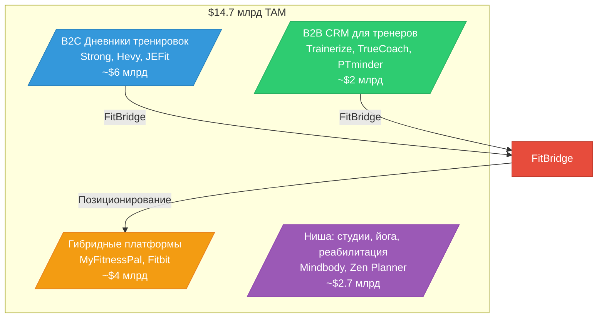
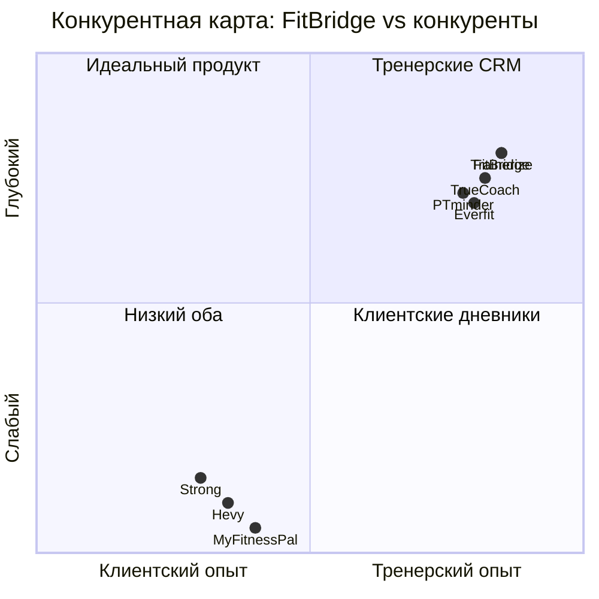

# FitBridge — Исследование рынка (Market Research)

## 1. Обзор рынка фитнес-приложений

### 1.1 Глобальный размер рынка

| Метрика | Значение | Источник |
|---------|----------|----------|
| Глобальный рынок fitness-приложений (2023) | $14.7 млрд | Grand View Research |
| Прогноз рынка (2030) | $30+ млрд | Fortune Business Insights |
| CAGR (2024–2030) | 14–17% | Grand View Research, MarketsandMarkets |
| Количество fitness-приложений (2023) | 100 000+ | AppBrain, Statista |
| Количество пользователей fitness-приложений (2023) | 850 млн+ | Statista Digital Market Outlook |
| Доля мобильного трафика в fitness | > 70% | Sensor Tower |

### 1.2 Ключевые драйверы роста

1. **Пост-COVID**: Гибридная модель тренировок (офлайн + онлайн) стала нормой. В 2020–2021 наблюдался взрывной рост (~50% за год), и тренд сохраняется
2. **Носимые устройства**: Apple Watch, Garmin, WHOOP, Oura — интеграция с фитнес-приложениями усиливает engagement
3. **Product-Led Growth (PLG)**: Потребительские SaaS-продукты (Notion, Figma, Calendly) доказали модель; fitness-индустрия перенимает подход
4. **Персонализация и AI**: GPT и компьютерное зрение позволяют создавать адаптивные тренировочные программы
5. **Демография**: Millennials и Gen Z — digital-first поколение, предпочитает приложения традиционным журналам

### 1.3 Сегментация рынка

---

## 2. TAM / SAM / SOM

### 2.1 TAM — Total Addressable Market

**$14.7 млрд** — весь глобальный рынок фитнес-приложений.

Включает:
- B2C fitness & wellness приложения (дневники, трекеры, диетические приложения)
- B2B платформы для тренеров и студий
- Гибридные решения (корпоративные wellness-программы)

### 2.2 SAM — Serviceable Addressable Market

**$2.0–2.5 млрд** — рынок CRM/управленческих платформ для фитнес-тренеров и small studios.

Оценка основана на:
- Рынок fitness-software (без студий/корпораций): ~15–17% от TAM
- Оценка по выручке ключевых игроков (консолидированная): Trainerize/TrueCoach/PTminder (входит в Xplor Technologies) + Mindbody + Zen Planner + Everfit + другие = совокупная выручка ~$400–500 млн, что при 20–25% проникновении даёт SAM ~$2 млрд
- CAGR данного сегмента: 15–18%

### 2.3 SOM — Serviceable Obtainable Market

**$21 млн ARR** (к 3-му году) — достижимый объём выручки.

| Параметр | Расчёт |
|----------|--------|
| Целевое количество тренеров (платящих) | 50 000 |
| Средний ARPU | $35/мес |
| Средний клиентский период (lifetime) | 24 месяца |
| ARR | 50 000 × $35 × 12 = $21 млн |
| Доля от SAM | ~1% |

### Пошаговая SOM-модель (3 года)

| Год | Платящие тренеры | ARPU/мес | ARR | Примечание |
|-----|-----------------|----------|-----|------------|
| Год 1 | 2 000 | $25 | $600K | Launch + ранний рост |
| Год 2 | 15 000 | $30 | $5.4M | Масштабирование |
| Год 3 | 50 000 | $35 | $21M | Выход на операционную безубыточность |

---

## 3. Конкурентный ландшафт

### 3.1 Карта конкурентов

По осям: **Клиентский опыт (ось X)** vs **Тренерский опыт (ось Y)**

### 3.2 Сравнительная таблица конкурентов

| Параметр | Trainerize | TrueCoach | PTminder | Everfit | Strong | MyFitnessPal |
|----------|-----------|-----------|----------|---------|--------|-------------|
| **Модель** | B2B SaaS | B2B SaaS | B2B SaaS | B2B SaaS | B2C Freemium | B2C Freemium |
| **Цена тренера** | $5–200/мес | $26–137/мес | $59–209/мес | $20–180/мес | N/A | N/A |
| **Цена клиента** | Бесплатно | Бесплатно | Бесплатно | Бесплатно | $0–7/мес | $0–20/мес |
| **Клиентский дневник** | Ограниченный | Ограниченный | Базовый | Базовый | Полный | Питание фокус |
| **Data ownership клиента** | ❌ Нет | ❌ Нет | ❌ Нет | ❌ Нет | ✅ Да | ✅ Да |
| **Тренерский доступ** | ✅ Полный | ✅ Полный | ✅ Полный | ✅ Полный | ❌ Нет | ❌ Нет |
| **Мульти-тренер** | ❌ Нет | ❌ Нет | ❌ Нет | ❌ Нет | ❌ Нет | ❌ Нет |
| **QR/инвайт доступ** | ❌ Нет | ❌ Нет | ❌ Нет | ❌ Нет | ❌ Нет | ❌ Нет |
| **Smart аналитика** | ✅ Базовая | ✅ Базовая | ❌ Нет | ✅ Продвинутая | ✅ Графики | ✅ Базовая |
| **Program Builder** | ✅ Да | ✅ Да | ✅ Да | ✅ Да | ✅ Шаблоны | ❌ Нет |
| **Billing** | ✅ Stripe | ✅ Stripe | ✅ Мультивендр | ✅ Stripe | ❌ Нет | ❌ Нет |
| **Wearables** | ✅ Apple, Garmin, WHOOP | ✅ Apple, Garmin, WHOOP | ✅ Apple | ✅ Apple | ✅ Apple | ✅ Apple |
| **Брендированное приложение** | ✅ $100+/мес | ✅ В Pro | ✅ $40/мес | ✅ В Premium | ❌ Нет | ❌ Нет |
| **Kotlin-экосистема** | ❌ Нет | ❌ Нет | ❌ Нет | ❌ Нет | ❌ Нет | ❌ Нет |

### 3.3 Консолидация рынка

Важный тренд: **Xplor Technologies** (Австралия) приобрела ряд fitness-платформ:
- **Trainerize** — acquired 2020
- **TrueCoach** (ранее Fitbot) — acquired 2020
- **PTminder** — acquired 2019

Все три продукта теперь принадлежат одной компании. Это создаёт возможность для FitBridge:
- ✅ Рынок голоден до независимой альтернативы
- ✅ Консолидация замедляет инновации (shared roadmap)
- ❌ Xplor имеет значительные ресурсы для ценовой войны

---

## 4. Целевая аудитория — рынок тренеров

### 4.1 Количество персональных тренеров в мире

| Регион | Количество PT | Источник |
|--------|--------------|----------|
| США | ~350 000 | BLS, ACSM, IBISWorld |
| Великобритания | ~100 000 | CIMSPA, ukactive |
| ЕС (остальное) | ~600 000 | EuropeActive |
| Австралия/НЗ | ~50 000 | Fitness Australia |
| Россия | ~150 000 | Национальная ассоциация |
| Азия (Китай, Индия, SEA) | ~3 000 000+ | Оценка по IHRSA |
| Латинская Америка | ~500 000 | Оценка |
| **ИТОГО** | **~8–10 млн** | — |

### 4.2 Проникновение софта

| Метрика | Значение | Источник |
|---------|----------|----------|
| % PT, использующих софт для управления клиентами (США) | ~25–30% | ACSM, ACE surveys |
| % PT, использующих софт (мир) | ~15–20% | Оценка по G2, Capterra |
| Средний monthly spend на софт | $30–60 | TrueCoach, PTminder pricing |
| % PT, недовольных текущим софтом | ~40% | G2 reviews, Reddit |

### 4.3 Размер рынка услуг персонального тренинга

| Метрика | США | Мир |
|---------|-----|-----|
| Размер рынка PT-услуг | $13 млрд | $45+ млрд |
| Средний доход PT (USA) | $45–70K/год | — |
| Средний доход solo PT | $35–55K/год | — |
| % PT, работающих независимо (solo) | ~70% | ~75% |

---

## 5. Тренды рынка

### 5.1 Product-Led Growth в Fitness Tech

| Тренд | Описание | Влияние на FitBridge |
|-------|----------|---------------------|
| Freemium → Paid | Ключевой тренд SaaS; Calendly, Slack, Notion показали модель | FitBridge использует free-дневник как магнит |
| Bottom-up adoption | Пользователь начинает бесплатно, затем «протаскивает» продукт в организацию | Клиент → Тренер = естественный viral loop |
| Влияние инфлюенсеров | Фитнес-инфлюенсеры рекомендуют софт подписчикам | Партнёрская программа для инфлюенсеров |
| Community-driven growth | Сообщества (Discord, Telegram) вокруг продукта | Встроенный social layer |

### 5.2 Мобильные тренды

| Тренд | Данные |
|-------|--------|
| Мобильный трафик в fitness | > 70% сессий — мобильные |
| Время в fitness-приложениях | Рост на 40% с 2020 |
| Удержание за 30 дней | В среднем 15–25% (зависит от категории) |
| Средний DAU/MAU | 10–20% для fitness-приложений |

### 5.3 AI и автоматизация

| Тренд | Применение |
|-------|-----------|
| AI-генерация программ | Автоматическое создание тренировочных планов на основе истории |
| Computer Vision | Анализ техники упражнений через камеру |
| Predictive analytics | Предсказание риска травм, остановки прогресса |
| Chatbot-ассистенты | 24/7 мотивационный и информационный ассистент |

---

## 6. Регуляторная среда

| Аспект | Требования | Влияние на FitBridge |
|--------|-----------|---------------------|
| GDPR (ЕС) | Хранение/обработка персональных данных | Privacy by design; согласие на доступ тренера |
| HIPAA (США) | Медицинские данные | FitBridge не хранит мед. данные → не подпадает |
| ФЗ-152 (Россия) | Персональные данные граждан РФ | Серверы в РФ для российских пользователей |
| Apple App Store | 30% комиссия на in-app покупки | Внешний биллинг для тренеров; бесплатное приложение |
| Google Play | 15–30% комиссия | Аналогично Apple |

---

## 7. Барьеры входа и возможности

### Барьеры

1. **Сетевой эффект**: Trainerize/TrueCoach имеют миллионы пользователей
2. **Инерция переключения**: Данные клиентов привязаны к текущей платформе
3. **Двухсторонняя marketplace**: Нужно привлекать одновременно клиентов и тренеров
4. **Комиссии магазинов приложений**: 30% на in-app покупки

### Возможности

1. **Разрушение data lock-in**: FitBridge делает данные собственностью клиента — это мощный мотиватор для миграции
2. **Низкая удовлетворённость**: ~40% тренеров недовольны текущим софтом (G2 reviews)
3. **Корпоративная консолидация**: Xplor владеет 3 продуктами → замедляет инновации → opportunity для нишевого игрока
4. **Kotlin-экосистема**: Техническое преимущество — единая кодовая база для Android, iOS, Backend, Web
5. **Российский/CIS рынок**: Практически нет локализованных решений; российские тренеры вынуждены использовать неадаптированные зарубежные продукты

---

_Документ создан: 2026-04-29 | Источники: Grand View Research, MarketsandMarkets, BLS, ACSM, EuropeActive, G2, Capterra, данные конкурентов_
