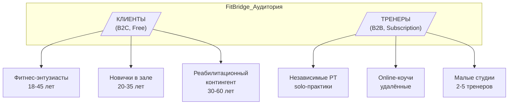
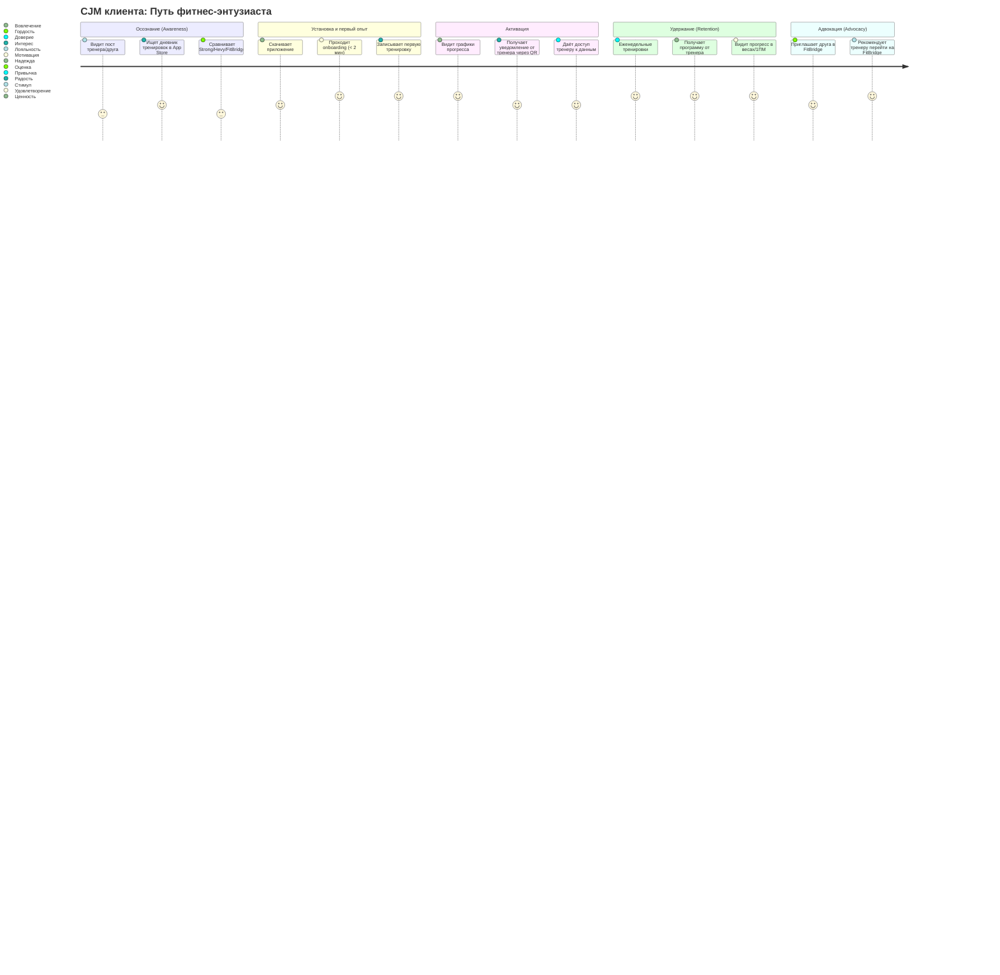
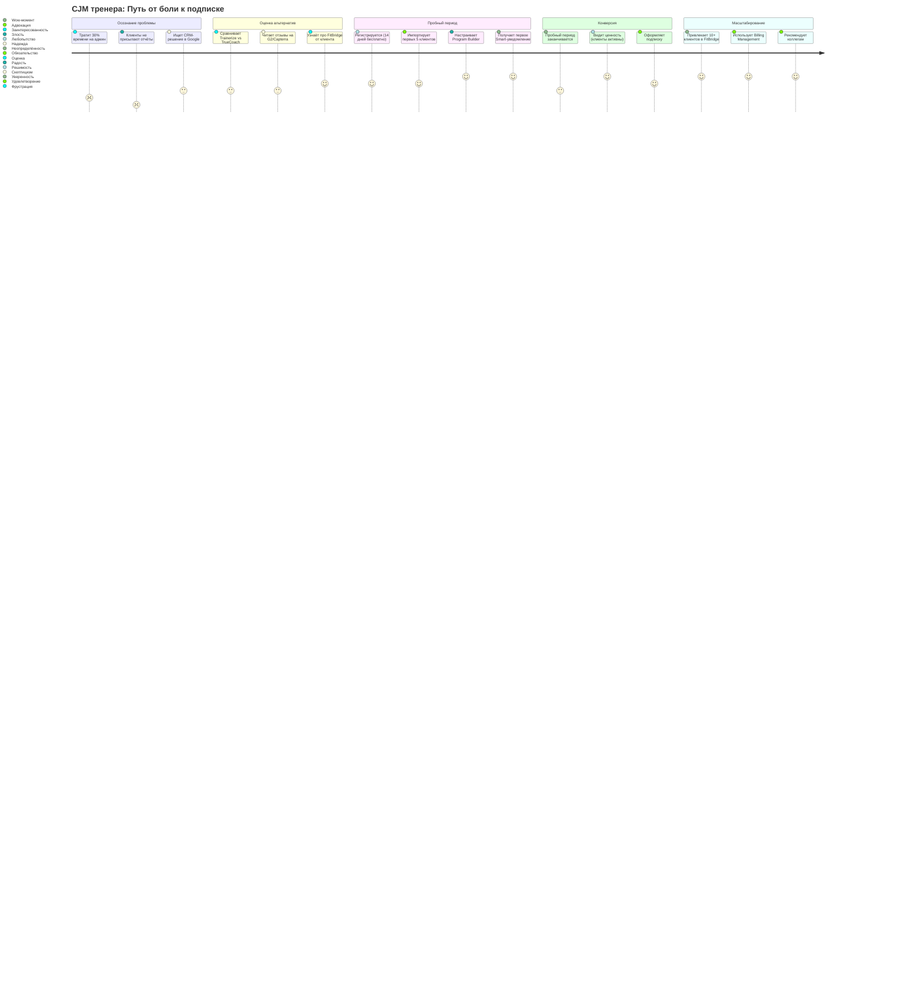

# FitBridge — Целевая аудитория (Target Audience)

## 1. Сегментация целевой аудитории

FitBridge — двухсторонняя платформа с двумя принципиально разными сегментами пользователей.

---

## 2. Персоны клиентов

### Persona C1: Фитнес-энтузиаст «Алексей»

| Параметр | Значение |
|----------|----------|
| **Возраст** | 25–35 |
| **Пол** | Мужской / Женский |
| **Доход** | Средний+ |
| **Опыт тренировок** | 2+ года |
| **Приложение** | Использует Strong / Hevy / JEFit |
| **Тренировок в неделю** | 4–6 |
| **Уровень вовлечённости** | Высокий |
| **Боль** | «Когда я меняю тренера — теряю всю историю. Когда тренер уходит с платформы — я теряю данные» |
| **Мотивация** | Следить за прогрессом; видеть реальную динамику в весах/повторениях |
| **JTBD** | «Я хочу, чтобы мой тренировочный дневник принадлежал мне, а не тренеру или приложению» |
| **Как использует FitBridge** | Free-дневник → приглашает тренера через QR → получает персональные программы |
| **Каналы привлечения** | Organic (ASO), Reddit fitness, Telegram-чаты, рекомендации тренера |

### Persona C2: Новичок «Мария»

| Параметр | Значение |
|----------|----------|
| **Возраст** | 20–35 |
| **Опыт тренировок** | < 1 года |
| **Приложение** | Не использует или пробовала MyFitnessPal |
| **Тренировок в неделю** | 1–3 |
| **Боль** | «Не знаю, правильно ли делаю упражнения; нужно руководство тренера» |
| **Мотивация** | Не потерять мотивацию; видеть прогресс даже минимальный |
| **JTBD** | «Я хочу начать тренироваться правильно и иметь поддержку тренера без привязки к конкретному залу» |
| **Как использует FitBridge** | Тренер отправляет QR/инвайт → Мария начинает записывать → видит графики прогресса |
| **Каналы привлечения** | Instagram/TikTok фитнес-контент, рекомендации друзей |

### Persona C3: Восстановление «Олег»

| Параметр | Значение |
|----------|----------|
| **Возраст** | 35–60 |
| **Опыт** | После травмы / операции |
| **Приложение** | Не использует |
| **Тренировок в неделю** | 2–3 (по программе реабилитолога) |
| **Боль** | «Нужно точно следовать программе, но переключение между реабилитологом и фитнес-тренером — хаос» |
| **JTBD** | «Хочу, чтобы все мои специалисты видели мою историю тренировок и договаривались между собой» |
| **Как использует FitBridge** | Даёт доступ нескольким специалистам одновременно (фитнес-тренер + реабилитолог) |
| **Каналы привлечения** | Направление от врача/реабилитолога |

---

## 3. Персоны тренеров

### Persona T1: Независимый PT «Дмитрий»

| Параметр | Значение |
|----------|----------|
| **Возраст** | 25–40 |
| **Опыт работы** | 2+ года |
| **Клиентов** | 8–20 активных |
| **Доход** | $2–4K/мес |
| **Текущий софт** | Excel/Google Sheets + WhatsApp |
| **Боль** | «Клиенты не присылают отчёты; я трачу 30% времени на админ, а не на тренинг» |
| **Мотивация** | Автоматизировать рутину; увеличить доход за счёт online-клиентов |
| **JTBD** | «Хочу единый пульт управления всеми клиентами, чтобы видеть кто тренируется, а кто — нет» |
| **Готовность платить** | $25–50/мес |
| **Как использует FitBridge** | Подписка Smart → Client Dashboard → Program Builder → Smart Analytics |
| **Каналы привлечения** | Instagram, фитнес-форумы, рекомендации коллег, переход из бесплатного функционала клиента |

### Persona T2: Online-коуч «Екатерина»

| Параметр | Значение |
|----------|----------|
| **Возраст** | 22–35 |
| **Опыт** | 1–3 года |
| **Клиентов** | 20–50 активных |
| **Доход** | $3–8K/мес |
| **Текущий софт** | Trainerize / TrueCoach |
| **Боль** | «Мои клиенты ненавидят интерфейс тренерских приложений; переходный период ужасен» |
| **Мотивация** | Улучшить клиентский опыт; масштабировать до 100+ клиентов |
| **JTBD** | «Хочу, чтобы клиенты хотели использовать приложение, а не заставлял их» |
| **Готовность платить** | $40–80/мес |
| **Как использует FitBridge** | Pro-подписка → Billing Management → Program Builder → Branded Profile |
| **Каналы привлечения** | Переход из конкурентов, YouTube-обзоры, Telegram-каналы для коучей |

### Persona T3: Малая студия «FitLab»

| Параметр | Значение |
|----------|----------|
| **Размер** | 2–5 тренеров |
| **Клиентов** | 50–200 |
| **Доход студии** | $10–30K/мес |
| **Текущий софт** | Mindbody / Zen Planner / Excel |
| **Боль** | «Дорого, сложно, все платят за per-seat лицензии; нет гибкости» |
| **Мотивация** | Управление тренерским составом; единая CRM для всей студии |
| **JTBD** | «Нужна простая CRM, где каждый тренер видит своих клиентов, а я вижу всю студию» |
| **Готовность платить** | $100–300/мес |
| **Как использует FitBridge** | Team-подписка → Multi-trainer Dashboard → Billing → Analytics |
| **Каналы привлечения** | Прямые продажи, индустриальные конференции, партнёрства |

---

## 4. Customer Journey Map (CJM)

### 4.1 CJM клиента — от установки до активного использования

### 4.2 CJM тренера — от проблемы до оплаты

---

## 5. Jobs To Be Done (JTBD)

### 5.1 Клиентские JTBD

| # | Job Story | Приоритет | Фичи FitBridge |
|---|-----------|-----------|----------------|
| JTBD-C1 | Когда я тренируюсь, я хочу быстро записать подходы и веса, чтобы не терять время между подходами | P0 | Smart Log |
| JTBD-C2 | Когда я вижу прогресс в весах, я хочу понять расту ли я или стою на месте, чтобы скорректировать программу | P0 | Progress Tracking + 1ПМ |
| JTBD-C3 | Когда я меняю тренера, я хочу сохранить всю историю тренировок, чтобы начать с ним с того же места | P0 | Data Ownership |
| JTBD-C4 | Когда я работаю с тренером, я хочу давать ему доступ к моим данным, чтобы он видел мой прогресс | P1 | Trainer Access (QR/инвайт) |
| JTBD-C5 | Когда я работаю с несколькими специалистами, я хочу чтобы каждый видел только своё, чтобы не было путаницы | P1 | Multi-trainer access |
| JTBD-C6 | Когда мне скучно, я хочу видеть красивые графики и ачивки, чтобы мотивация не падала | P2 | Gamification |

### 5.2 Тренерские JTBD

| # | Job Story | Приоритет | Фичи FitBridge |
|---|-----------|-----------|----------------|
| JTBD-T1 | Когда я управляю клиентами, я хочу видеть всех в одном окне, чтобы не переключаться между 5 приложениями | P0 | Client Dashboard |
| JTBD-T2 | Когда я пишу программу, я хочу использовать конструктор, чтобы не создавать с нуля каждый раз | P0 | Program Builder |
| JTBD-T3 | Когда клиент пропускает тренировку, я хочу узнать об этом сразу, чтобы вовремя intervene | P0 | Smart Analytics |
| JTBD-T4 | Когда я получаю нового клиента через FitBridge, я хочу видеть его историю, чтобы не начинать с нуля | P1 | Client History (благодаря Data Ownership) |
| JTBD-T5 | Когда я масштабируюсь, я хочу автоматизировать платежи, чтобы не тратить время на инвойсы | P1 | Billing Management |
| JTBD-T6 | Когда я хочу расти, я хочу привлекать клиентов через свой профиль, чтобы получать органический трафик | P2 | Public Trainer Profile |

---

## 6. Приоритизация сегментов

| Сегмент | Размер | Готовность платить | Лёгкость привлечения | Приоритет |
|---------|--------|-------------------|---------------------|-----------|
| Независимые PT (solo) | ~8 млн | $25–50/мес | Средняя | **P0 — Launch** |
| Online-коучи | ~500K | $40–80/мес | Высокая | **P0 — Launch** |
| Малые студии (2–5) | ~200K | $100–300/мес | Низкая (долгий цикл) | **P1 — Growth** |
| Фитнес-энтузиасты | ~50 млн+ | $0 (free) | Высокая | **P0 — но платит тренер** |
| Новички | ~100 млн+ | $0 (free) | Средняя | **P1 — Growth** |
| Реабилитационные | ~10 млн | $0 (free) | Низкая | **P2 — Scale** |

---

## 7. Каналы привлечения

### 7.1 Клиенты (Free, B2C)

| Канал | Стратегия | Ожидаемый CAC |
|-------|-----------|---------------|
| ASO (App Store Optimization) | Ключевые слова: «дневник тренировок», «workout log» | $0.50–1 |
| Органический (тренер → клиент) | Тренер приглашает через QR/инвайт | $0 |
| Социальные сети | Короткие видео (TikTok, Reels) с демонстрацией Smart Log | $1–3 |
| SEO / Контент | Статьи: «как рассчитать 1ПМ», «лучший дневник тренировок» | $0.30–0.50 |
| Реферальная программа | «Пригласи друга — получи премиум-аналитику на 1 месяц» | $0.50 |

### 7.2 Тренеры (Paid, B2B)

| Канал | Стратегия | Ожидаемый CAC |
|-------|-----------|---------------|
| Viral (клиент → тренер) | Клиент показывает FitBridge тренеру | $0 |
| Контент-маркетинг | YouTube-туториалы, Telegram-канал для PT | $5–10 |
| Партнёрская программа | Фитнес-инфлюенсеры получают 30% с первой оплаты | $20–30 |
| Instagram Ads | Таргетинг на сертифицированных PT | $30–50 |
| Фитнес-сертификации | Партнёрство с ACSM, ACE, NASM | $15–25 |

---

_Документ создан: 2026-04-29 | Использован шаблон: .opencode/templates-docs/CUSTOMER_PERSONAS-template.md + .opencode/templates-docs/CJM-template.md_
